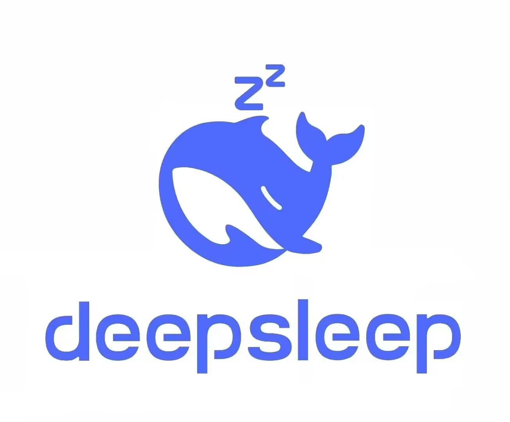

# StreamCream

武汉大学2024级软件工程专业2025年小学期实训项目，基于Live2D与GPT-SoVITS的全自动一站式AI虚拟主播直播方案。

           

|  |  |
| --- | --- |
|  |  |

## 项目成员

- [陈广隰](https://github.com/Enchograph)
- [茯苓](https://github.com/wofiporia)
- [Qinyre](https://github.com/qinyre)
- [Bigmuffin](https://github.com/Bigmuffin2005)

## 〇、项目概览

此项目是一个全流程由 AI 控制的虚拟主播/ vtuber 的直播方案。包含有 AI 生成的文案、 AI 基础的实时语音转换、 AI 文案基础的 Live 2D 模型实时口型适配、 AI 控制的 Live 2D 模型表情、动作等等。

具体技术请参见

## 一、注册、登录、偏好保存与账户安全

[茯苓](https://github.com/wofiporia)

> "No Privacy, No Identity."

- 通过邮箱对账号注册进行限制、普遍的解决方案。
- 通过Werkzeug的`bcrypt`算法,、基于`pbkdf2:sha256`对密码进行迭代加密。
- 采取了JWT令牌与黑名单机制。
- 实现了SQL注入过滤、XSS防护、动态CORS与严格的CSP头配置。

## 二、直播推流模块：网络抓包、推流码获取、直播协议转换

任逸青、冯博文、陈宏宇

> "Every Millisecond Matters."
> —— Arvind Jain, Google

- 从零实现了 WebRTC 直播协议到 RTMP 直播协议的低延迟转换。
- 在网站内嵌入了 BiliBili 等直播平台的推流码在线获取工具。

## 三、虚拟主播模块：Live2D Web引擎、基于语音学的口型实时适配、AI 控制的模型表情、动作的变化

解佶睿、陈宏宇、冯博文

> "No One Reveals Himself as He Is; We All Wear the Masks."
> —— Arthur Schopenhauer

- 实现了 Live 2D 的 Web 端实现，支持从 Cubism core 2.1 到 Cubism core 4.0 的多模型版本，支持用户手动上传 Zip 模型文件。
- 基于语音学原理，通过分拆元音音素，结合汉语使用者发音习惯实现了实时的 Live 2D 模型口型适配，使得 AI 控制的 vtuber 更加拟真。
- 基于对于直播文案的 Embedding 、与各类情感的语义向量相似度匹配，实现了由 AI 控制的 Live 2D 模型表情、动作的变化。

## 四、LLM 直播文案生成模块：人类的可控性，多服务商适配与完全即时性的优化

任逸青、冯博文、陈宏宇

> "Can Machines Think?"
> —— Alan Turing

- 覆盖了全球主流AI服务提供商：OpenAI、Anthropic、Google、硅基流动、火山方舟、腾讯云、DeepSeek、SORUX等，也支持用户自定义API的接入。
- 对世界各族模型均有良好的适配： GPT 系列、 Claude 系列、 Gemini 系列、 Deepseek 系列、 Grok 系列等。
- 实现了人类可控的 AI 直播文案生成模式，确保内容质量与人类的可控性，直播文案的生成分三个步骤：
  - **主题输入**: 用户设定直播核心主题。
  - **大纲确定**: AI或用户基于主题确定直播章节大纲。
  - **具体内容**: AI生成具体文案，用户随时调整大纲与内容，掌控全局。

## 五、TTS语音转换模块：推理、训练与开发者 API

陈宏宇

> "Stop Trying to Reinvent the Wheel."

- 基于开源项目 GPT-SoVITS 进行开发，实现了多版本（V1\~V4）语音模型的实时转换。
- 用户可以自己上传语音转换模型使用。
- 用户可以在线训练新的语音转换模型。
- 由 AI 控制的语音转换的语气情感控制。
  - 原理类似上文所提表情控制：通过分析当前直播文本匹配情感，选择相应情感的参考音频进行语音转换。
  - 目前对用户自定义模型效果不佳（未实现）。
  - 后续思路是让用户在上传示例语音时手动选择对应情感的音频，或者通过某种语音算法匹配用户上传的示例语音的情感。
- 语音转换性能优化：在念前一句时加载后一句的语音转换流程、以章节为单位加载转化队列、通过分句算法分割段落为长短大致均等的句子。

## 六、用户友好特质开发

解佶睿、任逸青

> "全球化是社会生产力和科学技术发展的客观要求和必然结果。"
> —— 江泽民

- 对中、英、日三语全面适配，满足国际化需求。
- 全面兼容了非拉丁字符集。
- 用户可以根据自己的偏好选择系统的主题样式，支持多种颜色主题与组件样式。
- 提供了在线帮助、文档、常见问题解答。

## 七、鸣谢使用到的开源项目

## 八、项目展示
