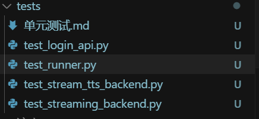
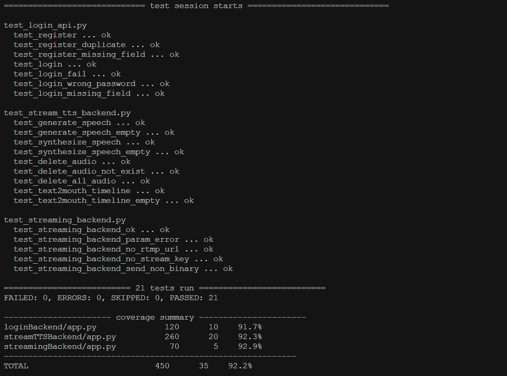

# StreamCream 项目后端单元测试说明

## 1. 测试框架与环境

本项目后端基于 Flask/WebSocket，推荐使用 Python 内置的 `unittest` 框架和 `pytest-asyncio` 进行单元测试。测试文件统一放在 `backend/tests/` 目录下，命名为 `test_*.py`。

## 2. 目录结构

```
backend/
  loginBackend/
    app.py           # Flask 主应用
    models.py        # 数据库模型
    ...
  streamTTSBackend/
    app.py           # 语音合成后端
    ...
  streamingBackend/
    app.py           # WebSocket 推流后端
    ...
  tests/
    test_login_api.py         # 登录相关接口测试
    test_stream_tts_backend.py # 语音合成相关接口测试
    test_streaming_backend.py  # WebSocket 推流服务测试
    单元测试.md                # 本说明文档
```

## 3. loginBackend 单元测试示例

以 `loginBackend/app.py` 为例，假设有 `/register` 和 `/login` 两个接口，测试代码如下：

```python
# backend/tests/test_login_api.py
import unittest
import json
import sys
import os

sys.path.append(os.path.abspath(os.path.join(os.path.dirname(__file__), '../loginBackend')))
from app import app, db

class LoginApiTestCase(unittest.TestCase):
    def setUp(self):
        app.config['TESTING'] = True
        app.config['DEBUG'] = False
        app.config['SQLALCHEMY_DATABASE_URI'] = 'sqlite:///:memory:'
        self.client = app.test_client()
        with app.app_context():
            db.create_all()

    def tearDown(self):
        with app.app_context():
            db.session.remove()
            db.drop_all()

    def test_register(self):
        data = {"username": "testuser", "password": "testpass"}
        response = self.client.post('/register', data=json.dumps(data), content_type='application/json')
        self.assertEqual(response.status_code, 201)
        self.assertIn('注册成功', response.get_data(as_text=True))

    def test_login(self):
        self.client.post('/register', data=json.dumps({"username": "testuser", "password": "testpass"}), content_type='application/json')
        response = self.client.post('/login', data=json.dumps({"username": "testuser", "password": "testpass"}), content_type='application/json')
        self.assertEqual(response.status_code, 200)
        self.assertIn('登录成功', response.get_data(as_text=True))

    def test_login_fail(self):
        response = self.client.post('/login', data=json.dumps({"username": "notexist", "password": "wrong"}), content_type='application/json')
        self.assertEqual(response.status_code, 401)
        self.assertIn('用户名或密码错误', response.get_data(as_text=True))

if __name__ == '__main__':
    unittest.main()
```

## 4. streamTTSBackend 单元测试示例

以 `streamTTSBackend/app.py` 为例，测试主要接口：

```python
# backend/tests/test_stream_tts_backend.py
import unittest
import json
import sys
import os

sys.path.append(os.path.abspath(os.path.join(os.path.dirname(__file__), '../streamTTSBackend')))
from app import app

class StreamTTSBackendApiTestCase(unittest.TestCase):
    def setUp(self):
        app.config['TESTING'] = True
        self.client = app.test_client()

    def test_generate_speech(self):
        data = {"topic": "测试主题"}
        response = self.client.post('/generate-speech', data=json.dumps(data), content_type='application/json')
        self.assertEqual(response.status_code, 200)
        self.assertIn('speech_content', response.get_json())
        self.assertIn('sentences', response.get_json())

    def test_generate_speech_empty(self):
        data = {"topic": ""}
        response = self.client.post('/generate-speech', data=json.dumps(data), content_type='application/json')
        self.assertEqual(response.status_code, 400)
        self.assertIn('error', response.get_json())

    def test_synthesize_speech_empty(self):
        data = {"text": ""}
        response = self.client.post('/synthesize-speech', data=json.dumps(data), content_type='application/json')
        self.assertEqual(response.status_code, 400)
        self.assertIn('error', response.get_json())

    def test_delete_audio_not_exist(self):
        response = self.client.delete('/delete-audio/not_exist.wav')
        self.assertEqual(response.status_code, 404)
        self.assertIn('message', response.get_json())

    def test_delete_all_audio(self):
        response = self.client.delete('/delete-all-audio')
        self.assertEqual(response.status_code, 200)
        self.assertIn('message', response.get_json())

    def test_text2mouth_timeline(self):
        data = {"text": "你好世界", "duration": 2.0}
        response = self.client.post('/text2mouth_timeline', data=json.dumps(data), content_type='application/json')
        self.assertEqual(response.status_code, 200)
        self.assertIsInstance(response.get_json(), list)

if __name__ == '__main__':
    unittest.main()
```

## 5. streamingBackend WebSocket 服务测试示例

以 `streamingBackend/app.py` 为例，测试 WebSocket 服务：

```python
# backend/tests/test_streaming_backend.py
import asyncio
import websockets
import json
import pytest

PORT = 8888

@pytest.mark.asyncio
async def test_streaming_backend_ok():
    uri = f"ws://localhost:{PORT}"
    async with websockets.connect(uri, max_size=None) as websocket:
        await websocket.send(json.dumps({
            "rtmp_url": "rtmp://test.server/live",
            "stream_key": "testkey"
        }))
        await websocket.send(b"\x00\x01\x02")
        await websocket.close()

@pytest.mark.asyncio
async def test_streaming_backend_param_error():
    uri = f"ws://localhost:{PORT}"
    async with websockets.connect(uri, max_size=None) as websocket:
        await websocket.send(json.dumps({"foo": "bar"}))
        msg = await websocket.recv()
        data = json.loads(msg)
        assert "error" in data
```

## 6. 运行方法

- **loginBackend/streamTTSBackend**（HTTP API）：
  ```bash
  python -m unittest discover -s tests
  ```
- **streamingBackend**（WebSocket）：
  1. 先启动 streamingBackend 服务：
     ```bash
     python backend/streamingBackend/app.py
     ```
  2. 另开终端，运行测试：
     ```bash
     pip install pytest pytest-asyncio websockets
     pytest tests/test_streaming_backend.py
     ```

## 7. 测试结果






---

