我已基于项目分析创建了StreamCream的原型设计文档，参考了现有技术文档示例。以下是主要内容框架：

# StreamCream原型设计

## 核心功能模块

* `直播配置`: 用户设置直播参数和偏好
* `文案生成`: 用户输入或自动生成直播文案
* `语音合成`: 将文案转换为AI语音
* `Live2D驱动`: 配置和驱动Live2D虚拟形象
* `直播推流`: 开始/停止直播推流

## 详细设计

### 注册界面
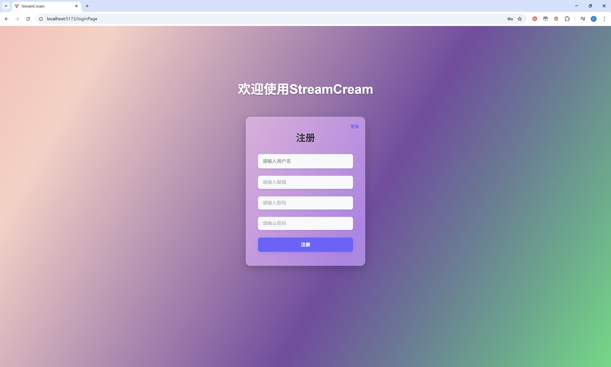

### 登录界面

### 直播控制台
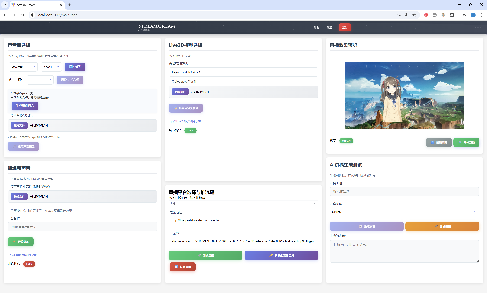

### 语音模型训练界面
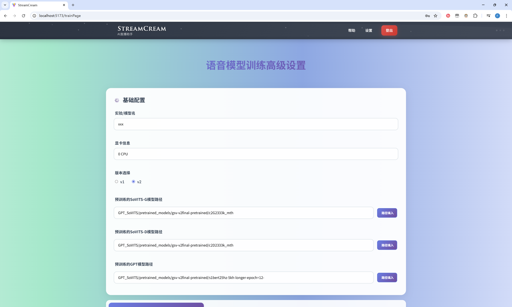
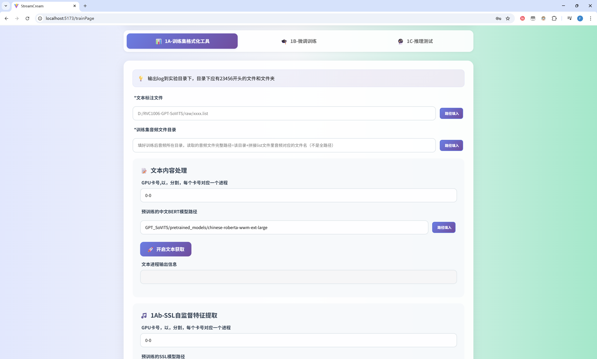
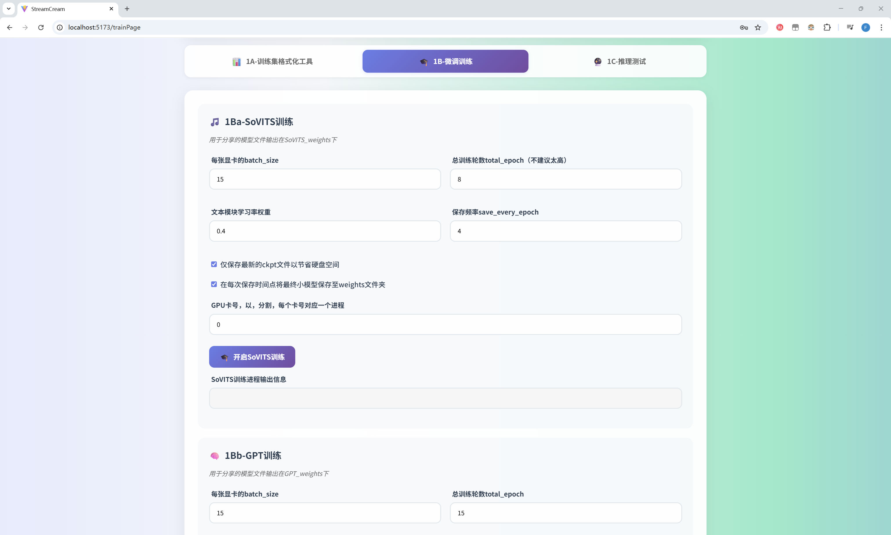
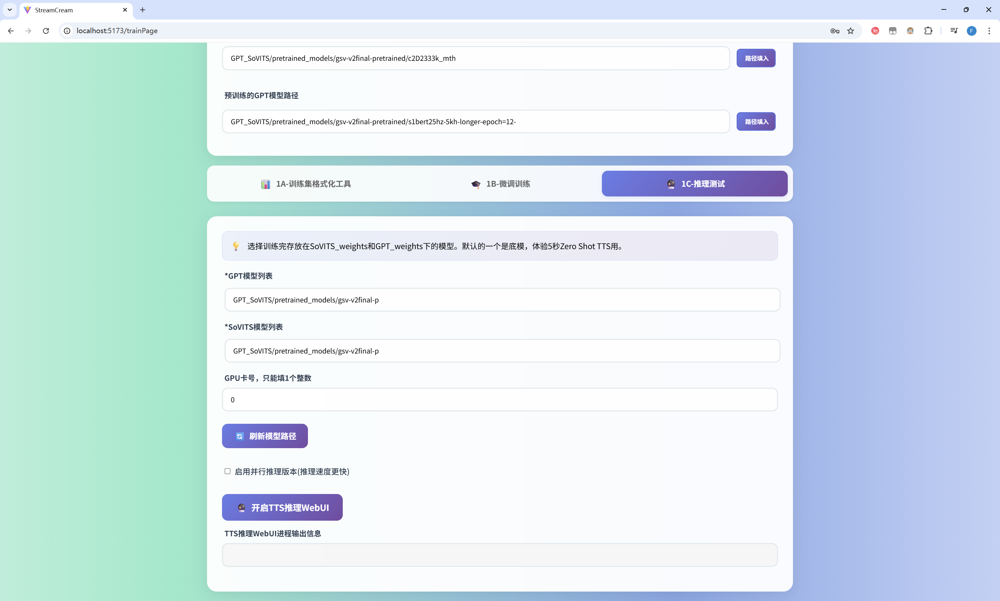

### 设置页
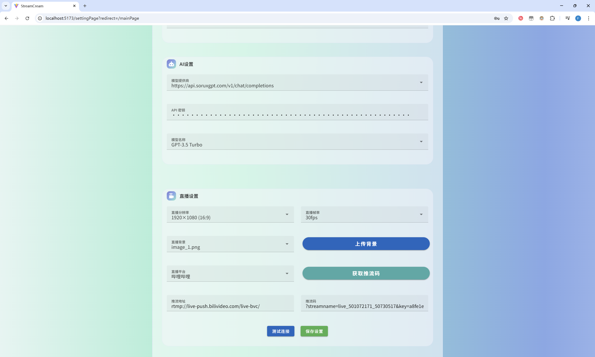

### 帮助页
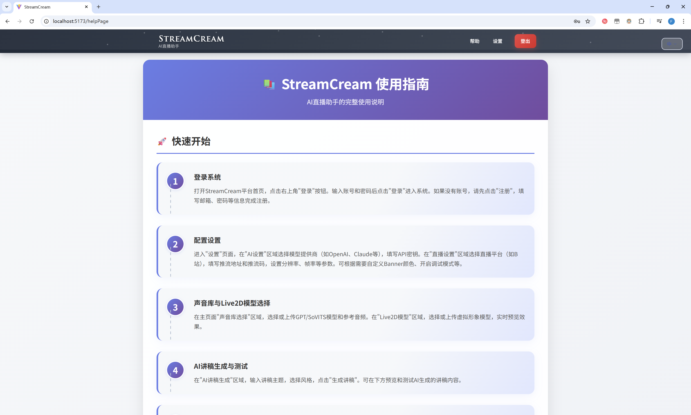
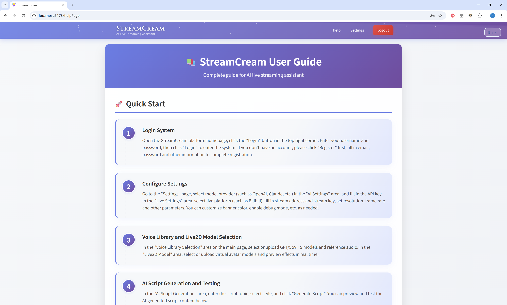

### 直播推流码获取

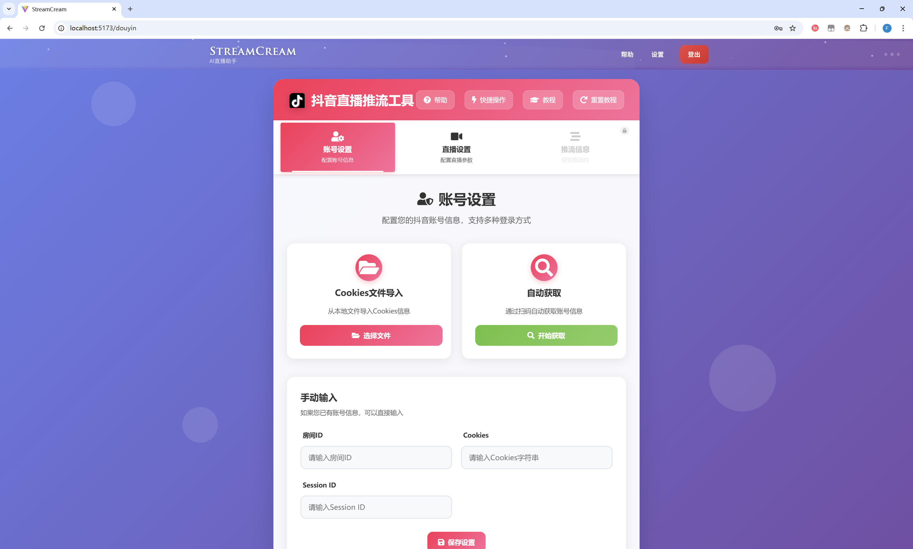
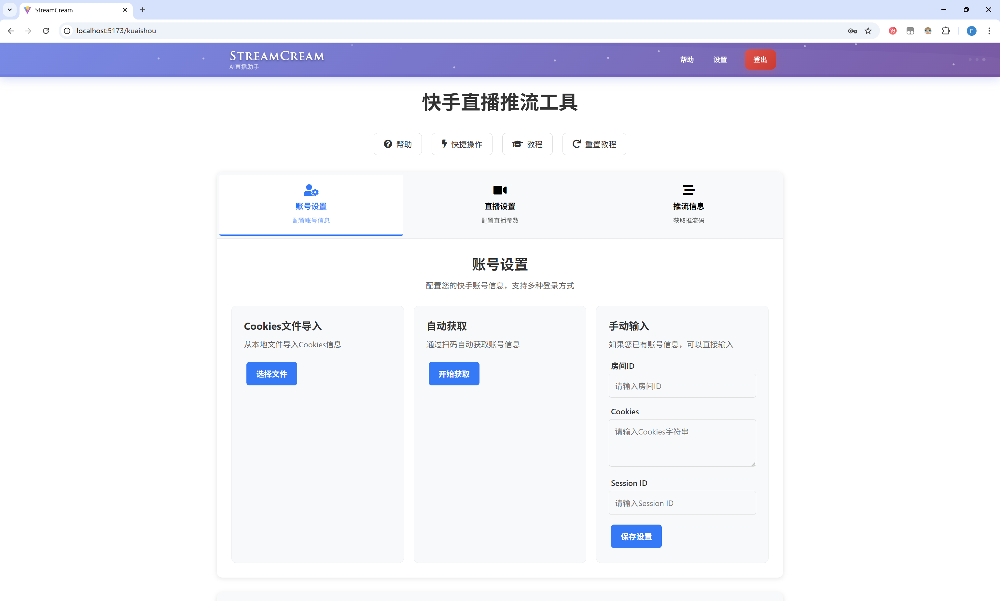

### 直播界面
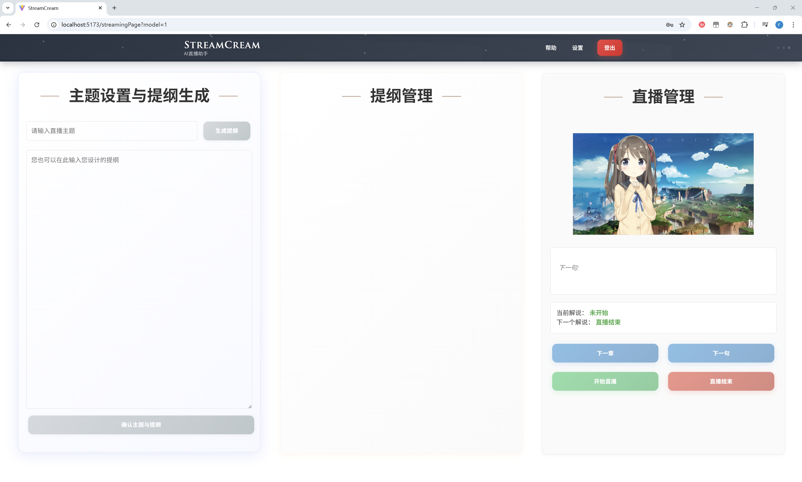

​        