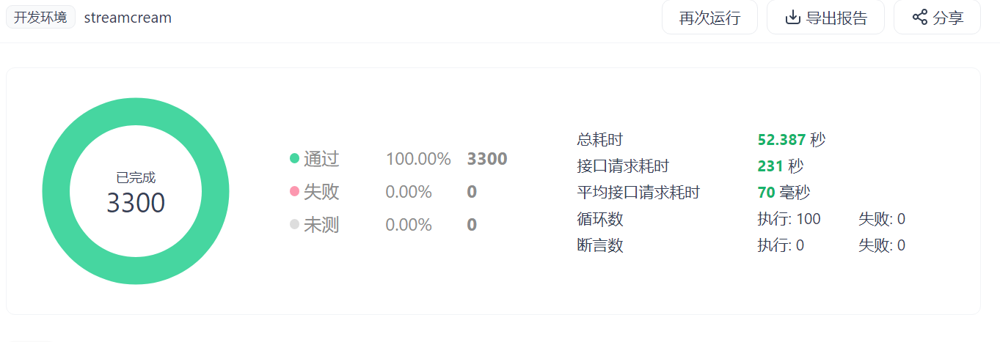
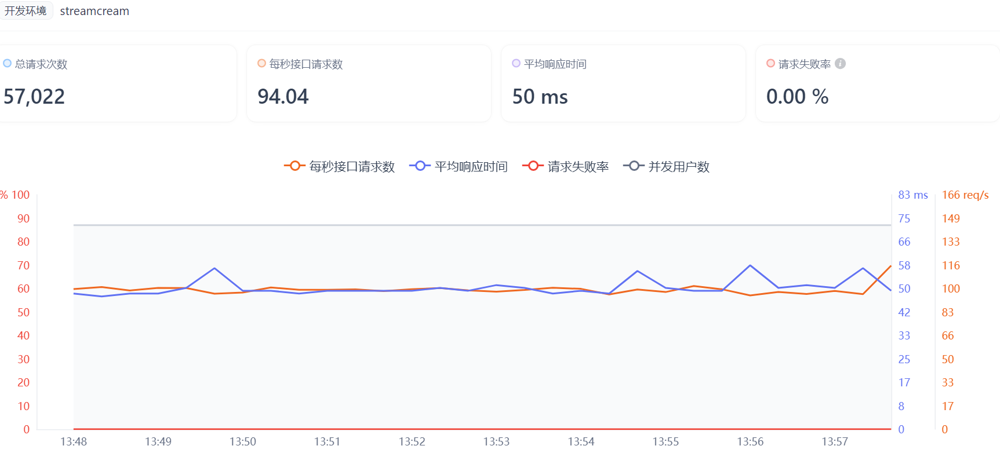
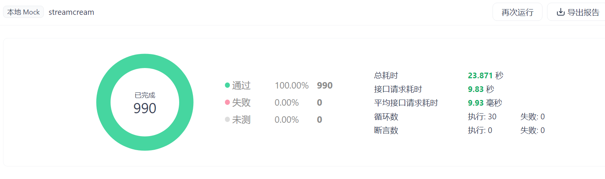

# StreamCream 接口管理文档

## 📋 目录
- [1. API设计规范](#1-api设计规范)
- [2. 数据结构定义](#2-数据结构定义)
- [3. 接口管理](#3-接口管理)
- [4. 数据Mock (Apifox)](#4-数据mock-apifox)
- [5. 测试套件](#5-测试套件)
- [6. 性能测试](#6-性能测试)
- [7. 测试结果展示](#7-测试结果展示)
- [8. YAML附件](#8-YAML附件)

---

## 1. API设计规范

### 1.1 基础规范

#### 1.1.1 请求规范
- **协议**: HTTP/HTTPS + WebSocket
- **编码**: UTF-8
- **格式**: JSON
- **认证**: JWT Bearer Token
- **CORS**: 支持跨域请求

#### 1.1.2 响应规范
```json
{
  "success": true/false,
  "message": "操作结果描述",
  "data": {}, // 具体数据
  "timestamp": "2024-01-01T00:00:00Z",
  "code": 200
}
```

#### 1.1.3 错误码规范
| 状态码 | 说明 | 示例 |
|--------|------|------|
| 200 | 成功 | 操作成功 |
| 400 | 请求错误 | 参数验证失败 |
| 401 | 未授权 | 令牌无效 |
| 403 | 禁止访问 | 权限不足 |
| 404 | 资源不存在 | 用户不存在 |
| 500 | 服务器错误 | 数据库连接失败 |

### 1.2 服务端口分配

| 服务名称 | 端口 | 协议 | 主要功能 | 状态 |
|----------|------|------|----------|------|
| Login Backend | 9080 | HTTP | 用户认证、设置管理 | ✅ 完整 |
| Stream TTS Backend | 5001 | HTTP | 语音合成服务 | ✅ 完整 |
| Streaming Backend | 8888 | WebSocket | 推流服务 | ✅ 完整 |
| GPT-SoVITS API | 9880 | HTTP | AI语音模型 | ✅ 完整 |

### 1.3 接口命名规范

#### 1.3.1 RESTful API
```
GET    /api/users          # 获取用户列表
GET    /api/users/{id}     # 获取特定用户
POST   /api/users          # 创建用户
PUT    /api/users/{id}     # 更新用户
DELETE /api/users/{id}     # 删除用户
```

#### 1.3.2 功能模块前缀
```
/api/auth/*          # 认证相关
/api/users/*         # 用户管理
/api/preferences/*   # 偏好设置
/api/tts/*          # 语音合成
/api/streaming/*    # 推流服务
/api/files/*        # 文件管理
/gpt-sovits/*       # GPT-SoVITS AI模型
/control/*          # 系统控制
```

---

## 2. 数据结构定义

### 2.1 用户相关数据结构

#### 2.1.1 User 模型
```typescript
interface User {
  id: number;                    // 用户ID
  username: string;              // 用户名 (3-20字符)
  email: string;                 // 邮箱地址
  password_hash: string;         // 密码哈希
  email_verified: boolean;       // 邮箱验证状态
  email_verification_code?: string;  // 邮箱验证码
  email_verification_expires?: Date; // 验证码过期时间
  reset_password_code?: string;      // 重置密码验证码
  reset_password_expires?: Date;     // 重置密码验证码过期时间
  created_at: Date;             // 创建时间
  settings?: UserSetting[];     // 用户设置
  streams?: Stream[];           // 推流记录
}
```

#### 2.1.2 UserSetting 模型
```typescript
interface UserSetting {
  id: number;                   // 设置ID
  user_id: number;              // 用户ID
  preferences: {                // 偏好设置
    debugMode?: boolean;        // 调试模式
    bannerColor?: string;       // 横幅颜色
    aiSettings?: {              // AI设置
      provider?: string;        // 提供商URL
      apiKey?: string;          // API密钥
      modelName?: string;       // 模型名称
      temperature?: number;     // 温度参数
      maxTokens?: number;       // 最大令牌数
    };
    liveSettings?: {            // 直播设置
      resolution?: string;      // 分辨率
      fps?: string;             // 帧率
      bgPreference?: string;    // 背景偏好
      platformPreference?: string; // 平台偏好
    };
  };
  created_at: Date;             // 创建时间
  updated_at: Date;             // 更新时间
}
```

#### 2.1.3 Stream 模型
```typescript
interface Stream {
  id: number;                   // 推流ID
  user_id: number;              // 用户ID
  title: string;                // 推流标题
  description?: string;         // 推流描述
  stream_key: string;           // 推流密钥
  is_live: boolean;             // 是否正在直播
  start_time?: Date;            // 开始时间
  end_time?: Date;              // 结束时间
  created_at: Date;             // 创建时间
}
```

### 2.2 语音合成相关数据结构

#### 2.2.1 TTSRequest 请求结构
```typescript
interface TTSRequest {
  text: string;                 // 要合成的文本
  voice?: string;               // 语音类型 (可选)
  language?: string;            // 语言 (默认zh)
  speed?: number;               // 语速 (0.5-2.0)
  pitch?: number;               // 音调 (-12-12)
}
```

#### 2.2.2 TTSResponse 响应结构
```typescript
interface TTSResponse {
  audio_url: string;            // 音频文件URL
  text: string;                 // 原始文本
  duration: number;             // 音频时长(秒)
  file_size: number;            // 文件大小(字节)
  format: string;               // 音频格式
}
```

#### 2.2.3 MouthTimeline 口型时间轴
```typescript
interface MouthTimeline {
  start: number;                // 开始时间(秒)
  end: number;                  // 结束时间(秒)
  vowel: string;                // 元音类型
  char: string;                 // 对应字符
  mouth_open: number;           // 嘴部开合度 (0-1)
  mouth_shape: string;          // 嘴部形状
}
```

### 2.3 推流相关数据结构

#### 2.3.1 StreamConfig 推流配置
```typescript
interface StreamConfig {
  rtmp_url: string;             // RTMP服务器地址
  stream_key: string;           // 推流密钥
  resolution: string;           // 分辨率 (1920x1080)
  fps: number;                  // 帧率 (30/60)
  bitrate: number;              // 比特率 (kbps)
  audio_codec: string;          // 音频编码 (aac)
  video_codec: string;          // 视频编码 (h264)
}
```

#### 2.3.2 StreamStatus 推流状态
```typescript
interface StreamStatus {
  is_connected: boolean;        // 是否已连接
  is_streaming: boolean;        // 是否正在推流
  start_time?: Date;            // 开始时间
  duration: number;             // 推流时长(秒)
  bytes_sent: number;           // 已发送字节数
  frames_sent: number;          // 已发送帧数
  errors: string[];             // 错误信息
}
```

### 2.4 GPT-SoVITS相关数据结构

#### 2.4.1 TTSRequest GPT-SoVITS请求
```typescript
interface TTSRequest {
  text: string;                 // 要合成的文本
  text_lang: string;            // 文本语言 (zh/en)
  ref_audio_path: string;       // 参考音频路径
  aux_ref_audio_paths?: string[]; // 辅助参考音频路径
  prompt_lang: string;          // 提示文本语言
  prompt_text?: string;         // 提示文本
  top_k?: number;               // top k采样 (默认5)
  top_p?: number;               // top p采样 (默认1)
  temperature?: number;         // 采样温度 (默认1)
  text_split_method?: string;   // 文本分割方法 (默认cut0)
  batch_size?: number;          // 批处理大小 (默认1)
  batch_threshold?: number;     // 批处理阈值 (默认0.75)
  split_bucket?: boolean;       // 是否分割到多个桶 (默认true)
  speed_factor?: number;        // 速度因子 (默认1.0)
  fragment_interval?: number;   // 片段间隔 (默认0.3)
  seed?: number;                // 随机种子 (默认-1)
  media_type?: string;          // 媒体类型 (默认wav)
  streaming_mode?: boolean;     // 流式模式 (默认false)
  parallel_infer?: boolean;     // 并行推理 (默认true)
  repetition_penalty?: number;  // 重复惩罚 (默认1.35)
  sample_steps?: number;        // 采样步数 (默认32)
  super_sampling?: boolean;     // 超采样 (默认false)
}
```

#### 2.4.2 ModelGroup 模型组
```typescript
interface ModelGroup {
  name: string;                 // 模型组名称
  gpt_weights: string;          // GPT权重文件路径
  sovits_weights: string;       // SoVITS权重文件路径
  ref_audio: string;            // 参考音频文件路径
}
```

#### 2.4.3 SystemStatus 系统状态
```typescript
interface SystemStatus {
  gpt_weights: string;          // 当前GPT权重文件
  sovits_weights: string;       // 当前SoVITS权重文件
  ref_audio: string;            // 当前参考音频文件
  model_pair: string;           // 当前模型对名称
}
```

---

## 3. 接口管理

### 3.1 接口文档管理

#### 3.1.1 文档工具
- **主要工具**: OpenAPI 3.0.3 (Swagger)
- **辅助工具**: Apifox (接口测试)
- **文档地址**: `/api-docs` (Swagger UI)

### 3.2 接口监控

#### 3.2.1 监控指标
- **响应时间**: 平均响应时间 < 500ms
- **成功率**: 接口成功率 > 99%
- **错误率**: 错误率 < 1%
- **并发数**: 支持并发请求数

#### 3.2.2 监控工具
- **应用监控**: 自定义日志系统 + 控制台输出
- **日志管理**: 前端日志组件 + 后端print输出
- **进程监控**: Python subprocess + 进程状态检查
- **实时监控**: WebSocket连接状态 + 前端状态显示

### 3.3 接口安全

#### 3.3.1 认证机制
```typescript
// JWT Token 结构
interface JWTPayload {
  user_id: number;              // 用户ID
  token_id: string;             // 令牌唯一标识
  iat: number;                  // 签发时间
  exp: number;                  // 过期时间
  jti: string;                  // JWT ID
}
```

#### 3.3.2 权限控制
- **公开接口**: 注册、登录、健康检查
- **认证接口**: 需要JWT令牌

#### 3.3.3 安全措施
- **CORS**: 跨域请求控制
- **Rate Limiting**: 请求频率限制
- **Input Validation**: 输入验证
- **SQL Injection**: SQL注入防护

---

## 4. 数据Mock (Apifox)

### 4.1 Mock数据配置

#### 4.1.1 用户相关Mock数据

**用户注册响应**
```json
{
  "success": true,
  "message": "注册成功，验证码已发送到邮箱",
  "data": {
    "user_id": 12345,
    "email": "test@example.com",
    "verification_expires": "2024-01-01T00:10:00Z"
  },
  "timestamp": "2024-01-01T00:00:00Z",
  "code": 200
}
```

**用户登录响应**
```json
{
  "success": true,
  "message": "登录成功",
  "data": {
    "token": "eyJhbGciOiJIUzI1NiIsInR5cCI6IkpXVCJ9...",
    "user": {
      "id": 12345,
      "username": "testuser",
      "email": "test@example.com",
      "email_verified": true
    }
  },
  "timestamp": "2024-01-01T00:00:00Z",
  "code": 200
}
```

**用户偏好设置**
```json
{
  "success": true,
  "data": {
    "debugMode": false,
    "bannerColor": "default",
    "aiSettings": {
      "provider": "https://api.openai.com/v1/chat/completions",
      "apiKey": "sk-...",
      "modelName": "gpt-4o",
      "temperature": 0.7,
      "maxTokens": 1000
    },
    "liveSettings": {
      "resolution": "1920x1080",
      "fps": "30",
      "bgPreference": "default",
      "platformPreference": "bilibili"
    }
  }
}
```

#### 4.1.2 语音合成Mock数据

**语音合成响应**
```json
{
  "audio_url": "/static/audio/speech_1704067200.wav",
  "text": "大家好，欢迎来到我的直播间",
  "duration": 3.6,
  "file_size": 57600,
  "format": "wav"
}
```

**口型时间轴**
```json
[
  {
    "start": 0.0,
    "end": 0.3,
    "vowel": "a",
    "char": "大",
    "mouth_open": 0.8,
    "mouth_shape": "a"
  },
  {
    "start": 0.3,
    "end": 0.6,
    "vowel": "a",
    "char": "家",
    "mouth_open": 0.7,
    "mouth_shape": "a"
  },
  {
    "start": 0.6,
    "end": 0.9,
    "vowel": "h",
    "char": "好",
    "mouth_open": 0.6,
    "mouth_shape": "h"
  }
]
```

#### 4.1.3 推流相关Mock数据

**推流配置**
```json
{
  "rtmp_url": "rtmp://live-push.bilivideo.com/live-bvc",
  "stream_key": "abc123def456",
  "resolution": "1920x1080",
  "fps": 30,
  "bitrate": 4000,
  "audio_codec": "aac",
  "video_codec": "h264"
}
```

**推流状态**
```json
{
  "is_connected": true,
  "is_streaming": true,
  "start_time": "2024-01-01T00:00:00Z",
  "duration": 3600,
  "bytes_sent": 1073741824,
  "frames_sent": 108000,
  "errors": []
}
```

#### 4.1.4 GPT-SoVITS相关Mock数据

**TTS合成响应**
```json
{
  "success": true,
  "message": "语音合成成功",
  "data": {
    "audio_url": "/gpt-sovits/audio/speech_1704067200.wav",
    "text": "大家好，欢迎来到我的直播间",
    "duration": 3.6,
    "file_size": 57600,
    "format": "wav",
    "model_used": "example_model"
  },
  "timestamp": "2024-01-01T00:00:00Z",
  "code": 200
}
```

**模型列表响应**
```json
{
  "success": true,
  "data": {
    "models": [
      {
        "name": "example_model",
        "gpt_weights": "userdatas/tts/GPT_weights/example_model-e15.ckpt",
        "sovits_weights": "userdatas/tts/SoVITS_weights/example_model_e8_s2184.pth",
        "ref_audio": "userdatas/tts/ref_audio/example.wav"
      }
    ],
    "current_model": "example_model"
  }
}
```

**系统状态响应**
```json
{
  "success": true,
  "data": {
    "gpt_weights": "userdatas/tts/GPT_weights/example_model-e15.ckpt",
    "sovits_weights": "userdatas/tts/SoVITS_weights/example_model_e8_s2184.pth",
    "ref_audio": "userdatas/tts/ref_audio/example.wav",
    "model_pair": "example_model"
  }
}
```

### 4.2 Apifox项目配置

#### 4.2.1 项目结构
```
StreamCream API
├── 认证服务 (9080)
│   ├── 用户注册
│   ├── 用户登录
│   ├── 邮箱验证
│   └── 密码重置
├── 语音合成 (5001)
│   ├── 文本转语音
│   ├── 口型生成
│   └── 音频管理
├── 推流服务 (8888)
│   ├── WebSocket连接
│   └── 推流状态
├── GPT-SoVITS (9880)
│   ├── 语音合成
│   ├── 模型管理
│   ├── 音频上传
│   └── 系统控制
└── 文件管理
    ├── 背景上传
    └── 音频文件
```

#### 4.2.2 环境变量配置
```json
// 开发环境
{
  "base_url": "http://localhost:9080",
  "tts_url": "http://localhost:5001",
  "streaming_url": "ws://localhost:8888",
  "gpt_sovits_url": "http://localhost:9880",
  "token": "{{auth_token}}"
}

// 测试环境
{
  "base_url": "http://test-api.streamcream.com",
  "tts_url": "http://test-tts.streamcream.com",
  "streaming_url": "ws://test-streaming.streamcream.com",
  "gpt_sovits_url": "http://test-gpt.streamcream.com",
  "token": "{{auth_token}}"
}
```

---

## 5. 测试套件

### 1. 用户与鉴权测试
- 注册新用户，校验唯一性
- 正确用户名密码登录，返回 token
- 错误用户名/密码登录，返回错误码
- token 过期/无效访问受保护接口，返回未授权
- 校验 token 有效性接口

### 2. 偏好设置接口测试
- 获取偏好设置，返回正确数据
- 修改偏好设置，数据写入数据库
- 非法参数校验（如空字符串、格式错误）

### 3. 背景图片管理测试
- 上传背景图片，返回文件名
- 获取最新背景图片，返回图片流
- 上传无效文件类型，返回错误

### 4. TTS 语音合成与管理测试
- 生成演讲文本，topic 合理返回内容
- 合成语音，返回音频url
- 获取音频文件，返回音频流
- 合成空文本/无效参数，返回错误

### 5. WebSocket 推流测试
- WebSocket 连接建立，首条消息为 JSON，返回正常
- 缺少 rtmp_url/stream_key，返回错误提示
- 持续推送二进制流，后端 ffmpeg 正常启动并推流
- 断开连接后，ffmpeg 进程被关闭

### 6. GPT-SoVITS 语音合成后端测试
- TTS 合成接口，合法文本合成返回音频流
- TTS 合成接口，空文本/异常参数返回错误
- TTS 合成接口，测试不同 media_type、streaming_mode
- 设置参考音频，切换后合成结果变化
- 查询当前参考音频，返回正确路径
- 列出可用参考音频，返回完整列表
- 切换GPT/SoVITS模型，合成结果变化
- 查询当前状态，返回完整信息

---

## 6. 性能测试

### 6.1 性能指标

**响应时间要求**
- 登录接口: < 200ms
- 用户信息查询: < 100ms
- 偏好设置读写: < 150ms
- 语音合成: < 5s
- 文件上传: < 10s
- GPT-SoVITS合成: < 30s
- 模型切换: < 10s

**并发性能要求**
- 支持100个并发用户
- 数据库连接池: 20个连接
- 文件上传: 10MB限制
- WebSocket连接: 50个并发
- GPT-SoVITS推理: 5个并发

### 6.2 压力测试

#### 6.2.1 测试工具
- **Apifox**: 接口功能测试、压力测试、自动化测试
- **浏览器开发者工具**: 前端性能测试

#### 6.2.2 测试场景
```javascript
// Apifox测试计划
{
  "name": "StreamCream接口测试",
  "scenarios": [
    {
      "name": "用户认证测试",
      "requests": [
        "/api/auth/register",
        "/api/auth/login",
        "/api/auth/verify-token"
      ]
    },
    {
      "name": "偏好设置测试",
      "requests": [
        "/api/preferences",
        "/api/files/upload-background"
      ]
    },
    {
      "name": "语音合成测试",
      "requests": [
        "/api/tts/synthesize",
        "/gpt-sovits/tts"
      ]
    }
  ],
  "settings": {
    "iterations": 10,
    "concurrency": 5,
    "delay": 1000
  }
}
```

### 6.3 监控指标

#### 6.3.1 系统指标
- CPU使用率 < 80%
- 内存使用率 < 85%
- 磁盘I/O < 70%
- 网络带宽 < 80%

#### 6.3.2 应用指标
- 接口成功率 > 99%
- 平均响应时间 < 500ms
- 错误率 < 1%
- 并发连接数 < 1000

#### 6.3.3 实际监控实现
```python
# 后端进程监控 (start_all_backends.py)
def monitor_processes():
    for name, process in processes:
        if process.poll() is not None:
            print(f'警告: {name} 已退出，状态码: {process.returncode}')

# 前端日志监控 (DouyinStream.vue)
function addLog(message, type = 'info') {
    const logEntry = {
        message,
        type,
        timestamp: new Date(),
        timeString: timestamp.toLocaleTimeString()
    };
    logs.value.unshift(logEntry);
    console.log(`[${type.toUpperCase()}] ${message}`);
}

# WebSocket连接监控 (BroadcastInterface.vue)
this.wsConnection.onopen = () => {
    console.log('WebSocket连接已建立');
    this.isConnected = true;
};

this.wsConnection.onerror = (error) => {
    console.error('WebSocket连接错误:', error);
    this.isConnected = false;
};
```

---

## 7. 测试结果展示

### 7.1 接口功能测试报告

[查看完整HTML报告](assests/api.assests/apifox_test_report.html)



> **说明**：上图为Apifox自动化接口功能测试的结果截图，涵盖所有主要接口的通过率、响应时间等核心指标。点击上方链接可查看完整的HTML测试报告。

---

### 7.2 性能测试报告



> **说明**：上图为Apifox压力测试/性能测试的结果截图，展示了并发、响应时间、错误率等性能指标。点击上方链接可查看完整的HTML测试报告。

---
### 7.3 本地mock测试报告

[查看完整HTML报告](assests/api.assests/mock_test_report.html)



---

## 8. YAML附件

### 8.1 完整API文档

本项目使用OpenAPI 3.0.3规范定义所有接口，完整的YAML文档如下：

```yaml
# 完整API文档 (api-documentation-complete.yaml)
# 包含所有后端服务的接口定义
# 支持Swagger UI和Apifox导入使用

openapi: 3.0.3
info:
  title: StreamCream API
  description: |
    StreamCream项目完整API文档
    包含用户认证、语音合成、推流服务、GPT-SoVITS等所有接口
    
    服务端口分布：
    - 用户认证服务: 9080
    - 语音合成服务: 5001  
    - 推流服务: 8888
    - GPT-SoVITS服务: 9880
    
  version: 1.0.0
  contact:
    name: StreamCream开发团队
    email: support@streamcream.com

servers:
  - url: http://localhost:9080
    description: 用户认证服务
  - url: http://localhost:5001  
    description: 语音合成服务
  - url: http://localhost:8888
    description: 推流服务
  - url: http://localhost:9880
    description: GPT-SoVITS服务

# 完整接口定义请参考: api-documentation.yaml
```

> **使用说明**：
> 1. 可直接导入Swagger UI查看接口文档
> 2. 可导入Apifox进行接口测试和管理
> 3. 支持代码生成和Mock数据配置
> 4. 包含所有服务的完整接口定义
