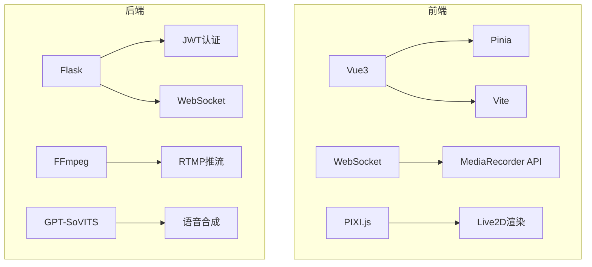
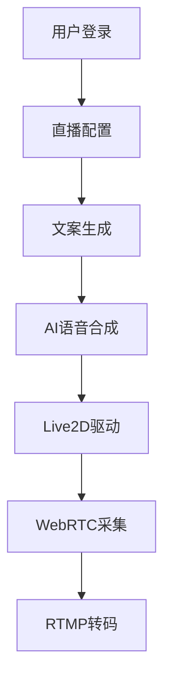

# StreamCream概要设计文档

## 1. 系统概述

StreamCream是一个全栈AI直播系统，主要功能包括：
- 用户认证登录
- 实时推流直播
- Live2D虚拟主播驱动
- AI语音转换
- 智能文案生成

## 2. 系统架构

采用前后端分离架构：

## 3. 技术栈

### 前端技术栈
- 框架: Vite + Vue 3 
- 状态管理: Pinia
- HTTP客户端: Axios
- 路由: Vue Router
- 样式: CSS3 + 响应式设计
- Live2D集成: pixi-live2d-display

### 后端技术栈
- 框架: Flask (Python)
- 数据库: MySQL + SQLAlchemy ORM
- 认证方式: JWT (JSON Web Token)
- 密码加密: Werkzeug Security
- 跨域处理: Flask-CORS
- 语音合成: GPT-SoVITS
- 推流处理: FFmpeg

## 4. 核心模块设计

### 4.1 登录模块
- 实现JWT认证
- 密码加密存储
- 跨域请求处理

### 4.2 语音转换模块
- 基于GPT-SoVITS的AI语音合成
- 零延迟语音流水线设计

### 4.3 直播推流模块
- WebSocket实时通信
- FFmpeg推流处理
- RTMP协议支持

### 4.4 文案生成模块
- 智能内容生成
- 内存优化策略
- 渲染性能优化

## 5. 数据流设计

## 6. 性能优化

- 内存管理：分块加载内容，定时清理音频缓存
- 渲染优化：虚拟滚动列表
- 网络优化：WebSocket长连接复用
        