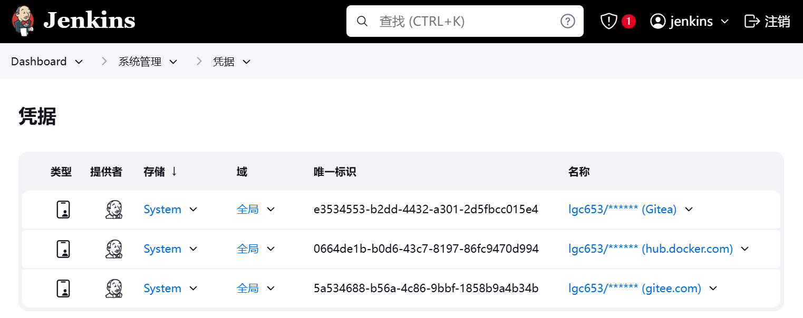
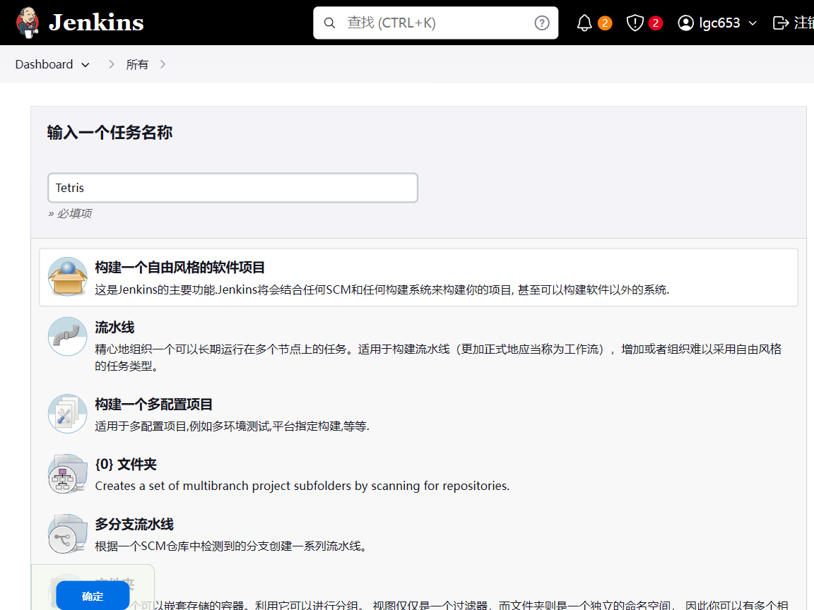
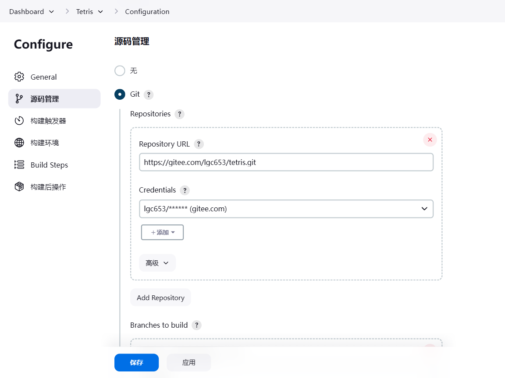
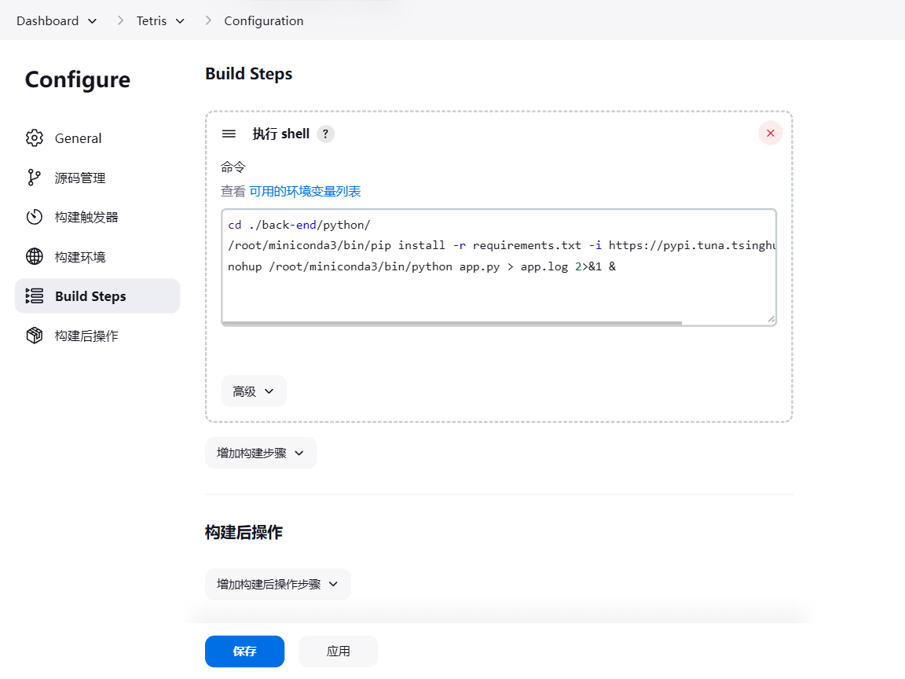
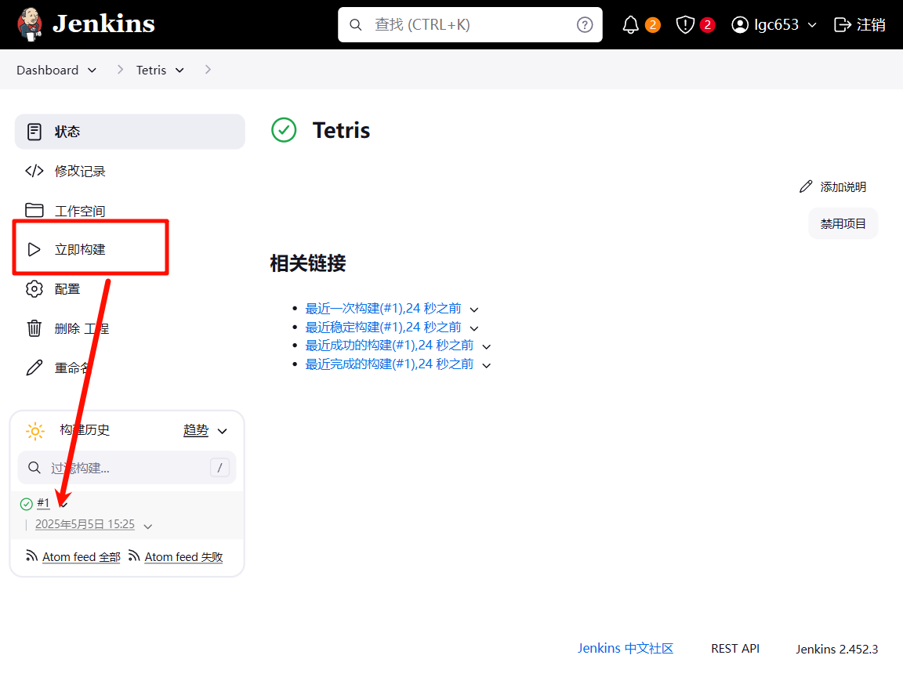
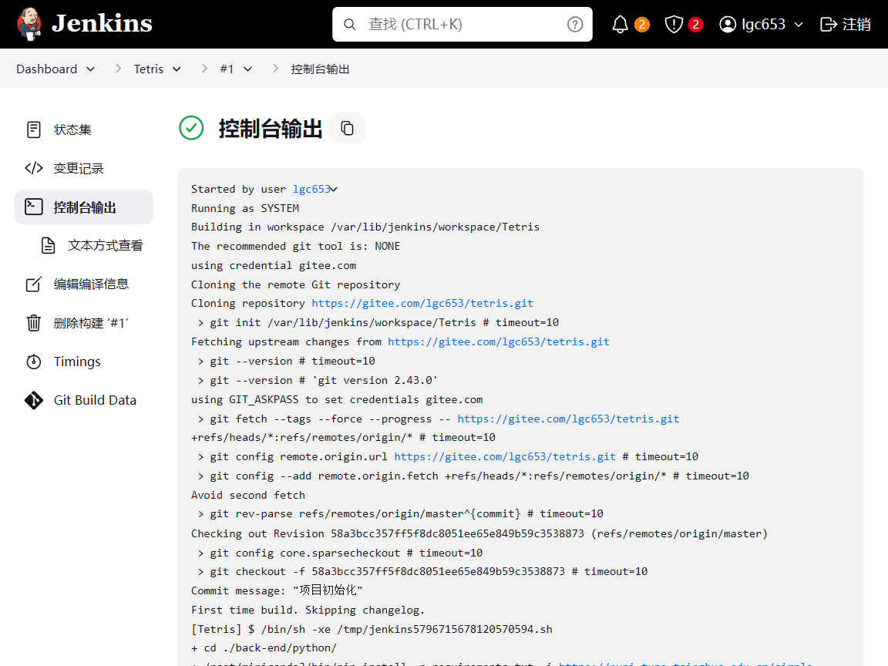
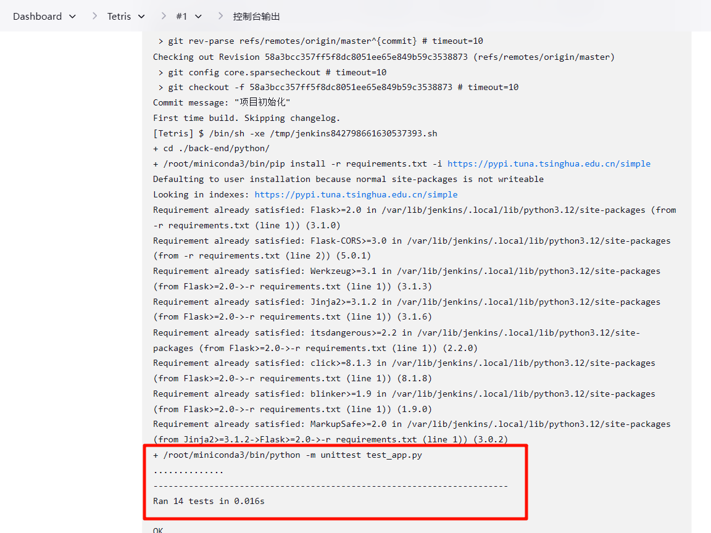

# CI&CD

## 搭建CI&CD环境

### 方案简介

该实验环境仅在ubuntu 24.04测试，ubuntu 24.04默认已经安装git和python

### 切换当前用户为超级用户

```sh
sudu su
```

### 安装Jenkins 

按https://pkg.origin.jenkins.io/debian-stable/方法安装

## Jenkins任务

### 配置凭证

登录各个系统的凭证（例如git），设置好后可以在项目中调用



### 创建项目

创建自由风格的软件项目Tetris



### 源码管理

配置源码仓库路径和凭证（刚才设置的）



### 编写构建脚本

ubuntu 24.04默认已经安装git和python，无需安装任何插件，直接使用系统自带的python和pip

**选择在“Build Steps”中选择“执行shell”**，填写以下代码（具体python、pip路径酌情修改）

```sh
cd ./back-end/python/
/root/miniconda3/bin/pip install -r requirements.txt -i https://pypi.tuna.tsinghua.edu.cn/simple
nohup /root/miniconda3/bin/python app.py > app.log 2>&1 &
```

* 首先进入python API的目录
* 通过`pip install -r requirements.txt`安装依赖，注意由于国内网络环境，这里使用了国内镜像
* `python app.py` 在后台运行，不阻塞 Jenkins 构建进程，并且在 Jenkins Job 结束后继续运行，你需要使用 `nohup` 命令，并结合 `&` 将进程放到后台。



源码管理和编写构建脚本步骤完成，点击保存即可

### 开始构建

点击“立即构建”开始构建



可以点击#1查看构建详情



也可以不断完善脚本，比如加上单元测试

```sh
cd ./back-end/python/
/root/miniconda3/bin/pip install -r requirements.txt -i https://pypi.tuna.tsinghua.edu.cn/simple
/root/miniconda3/bin/python -m unittest test_app.py
nohup /root/miniconda3/bin/python app.py > app.log 2>&1 &
```

可以看到单元测试已经被执行成功



### 测试接口

```sh
# 切换到jenkins
su - jenkins
# 进入到workspace
cd /var/lib/jenkins/workspace/Tetris/back-end/python
# 启动API
nohup /root/miniconda3/bin/python app.py > app.log 2>&1 &
# 测试API
## 添加数据
curl -X POST -H "Content-Type: application/json" -d '{
  "playerName": "玩家昵称",
  "score": 12345
}' http://localhost:5000/api/scores
## 查看列表
curl http://localhost:5000/api/scores
```

得到结果，测试成功

```sh
[
  {
    "playerName": "\u73a9\u5bb6\u6635\u79f0",
    "score": 12345,
    "timestamp": "2025-05-05T07:43:10Z"
  }
]
```

## Jenkins + C++ 后端

> **关于 Linux 环境下 CMakeLists.txt 的注意事项：**
> `README.md` 中提供的 `CMakeLists.txt` 包含 Windows 特定的配置（例如 `TDM_GCC_LIB_PATH`以及为 `ws2_32`、`wsock32` 使用的 `find_library`）。在 Linux CI 代理上构建时，这些 Windows 特定的部分应该：
>
> 1.  如果不需要，则移除。
> 2.  使用 `if(WIN32) ... endif()` 进行条件化处理。
> 3.  基于 vcpkg 的 `CMakeLists.txt` 通常更具可移植性，但请确保任何 Windows 特定的库链接（如 `WS2_32_LIBRARY`）也是有条件的。
>     Crow 和 Asio，当通过 vcpkg 在 Linux 上安装时，将链接到适当的 Linux 库（例如用于网络的 pthreads）。

### 前提条件

确保在您的 Jenkins 代理上安装了以下软件：

*   `git` (通常已预装)
*   `build-essential` (用于 g++, make 等): `sudo apt-get update && sudo apt-get install -y build-essential`
*   `cmake`: `sudo apt-get install -y cmake`

**Jenkins 任务配置步骤：**

1.  **创建或配置 Jenkins 项目：**
    *   与 Python 项目类似，创建一个“自由风格项目 (Freestyle project)”或使用现有项目。
    *   为其指定一个合适的名称，例如 `TetrisLeaderboardAPI-CPP-Backend`。

2.  **源码管理：**
    *   配置从您的 Git 仓库拉取代码，与 Python 项目类似。
    *   指定分支（例如 `main` 或 `master`）。

3.  **构建步骤 - 执行 shell：**
    添加一个“执行 shell (Execute shell)”构建步骤，并填入以下脚本。此脚本将：
    1.  导航到 C++ 项目目录。
    2.  设置 vcpkg（如果不存在则克隆，并进行引导）。
    3.  使用 vcpkg 和 Linux triplet 安装 C++ 依赖项（Crow, nlohmann/json, Asio）。
    4.  使用 CMake 配置项目，指向 vcpkg 工具链。
    5.  使用 `make` 构建项目。
    6.  停止任何先前运行的 C++ API 实例。
    7.  在后台运行编译好的 C++ 应用程序。

4.  **构建后操作 (可选)：**
    *   您可以添加步骤来归档构建产物（例如可执行文件或日志）。
    *   如果您有针对 C++ API 的自动化测试，可以添加这些测试步骤。

5.  **保存并运行：**
    *   保存 Jenkins 任务配置。
    *   点击“立即构建 (Build Now)”来测试 C++ 后端的 CI/CD 流水线。
    *   检查构建的“控制台输出 (Console Output)”以查看进度并排查任何问题。

这里为了避免环境造成的影响，我们修改CMakeLists.txt，是之完全**完全依赖 vcpkg**

```cmake
# CMake 最低版本要求 (Crow 可能需要更高版本，例如 3.15 或 3.18)
cmake_minimum_required(VERSION 3.15)

# 项目名称和语言
project(TetrisLeaderboardAPI LANGUAGES CXX)

# 设置 C++ 标准
set(CMAKE_CXX_STANDARD 17)
set(CMAKE_CXX_STANDARD_REQUIRED ON)
set(CMAKE_CXX_EXTENSIONS OFF)

# 查找通过 vcpkg 安装的包
# CMAKE_TOOLCHAIN_FILE 必须在配置 CMake 时通过命令行参数指定
# (你的 Jenkins 脚本已经做了这件事)
find_package(asio CONFIG REQUIRED)
find_package(Crow CONFIG REQUIRED)      # vcpkg 中的包名可能是 Crow 或 crowcpp，通常是 Crow
find_package(nlohmann_json CONFIG REQUIRED)

# --- 可执行文件 ---
add_executable(tetris_leaderboard_api main.cpp)

# --- 链接库 ---
# vcpkg 的导入目标 (asio::asio, Crow::Crow, nlohmann_json::nlohmann_json)
# 会自动处理包含目录和平台特定的链接需求。
target_link_libraries(tetris_leaderboard_api PRIVATE
    asio::asio
    Crow::Crow
    nlohmann_json::nlohmann_json
)

# 在 Windows 上，Crow/Asio 可能需要 Winsock。
# vcpkg 提供的 Asio 和 Crow 的 CMake 配置通常会自动处理这个。
# 只有在特定情况下 (例如某些 MinGW toolchain + vcpkg 版本组合) 可能需要显式链接。
if(WIN32 AND CMAKE_CXX_COMPILER_ID STREQUAL "GNU") # 只针对 MinGW on Windows 的特殊情况
    message(STATUS "MinGW on Windows detected, ensuring Winsock libraries are linked if needed by vcpkg targets.")
    # 通常 vcpkg 的 asio::asio 和 Crow::Crow 目标应该已经包含了这个依赖。
    # 如果仍然出现链接错误，可以尝试添加：
    # target_link_libraries(tetris_leaderboard_api PRIVATE ws2_32 wsock32)
endif()

# --- 可选：改善构建输出信息 ---
set(CMAKE_VERBOSE_MAKEFILE ON)

message(STATUS "已配置 TetrisLeaderboardAPI 项目使用 vcpkg。")
message(STATUS "源文件: ${CMAKE_SOURCE_DIR}/main.cpp")
```

创建`jenkins.sh`文件

```sh
#!/bin/bash
set -e # 如果任何命令以非零状态退出，则立即退出。

echo "--- 开始 C++ 后端 (TetrisLeaderboardAPI) CI/CD ---"

# 0. 安装必要的系统依赖 (如果尚未安装)
echo "正在检查并安装系统依赖: pkg-config, zip..."
sudo apt-get update -y
# DEBIAN_FRONTEND=noninteractive 避免在 CI 环境中出现交互式提示
sudo DEBIAN_FRONTEND=noninteractive apt-get install -y pkg-config zip build-essential cmake git

# 导航到工作空间内的 C++ 项目目录
CPP_PROJECT_DIR="./back-end/cpp/TetrisLeaderboardAPI" # <--- 根据你的实际项目结构调整
if [ ! -d "$CPP_PROJECT_DIR" ]; then
    echo "错误：C++ 项目目录 '$CPP_PROJECT_DIR' 未找到。"
    echo "当前工作目录是 $(pwd)，请确认路径 '$CPP_PROJECT_DIR' 相对于此路径是正确的。"
    ls -la # 列出当前目录内容以帮助调试
    exit 1
fi
cd "$CPP_PROJECT_DIR"
echo "已切换目录到 $(pwd)"

# 1. 设置 vcpkg (如果不存在则克隆，考虑缓存以提高效率)
echo "正在设置 vcpkg..."
VCPKG_DIR_NAME="vcpkg" # 定义vcpkg目录名，方便引用
if [ ! -d "$VCPKG_DIR_NAME" ]; then
    echo "克隆 vcpkg 仓库..."
    git clone https://github.com/microsoft/vcpkg.git "$VCPKG_DIR_NAME"
    cd "$VCPKG_DIR_NAME"
    # 运行 bootstrap 脚本
    echo "引导 vcpkg..."
    ./bootstrap-vcpkg.sh -disableMetrics
    cd .. # 返回到 CPP_PROJECT_DIR
else
    echo "vcpkg 目录已存在。尝试更新并重新引导..."
    cd "$VCPKG_DIR_NAME"
    echo "当前 vcpkg 目录: $(pwd)"

    # 检查当前分支状态
    current_branch_check=$(git rev-parse --abbrev-ref HEAD)
    if [ "$current_branch_check" = "HEAD" ]; then
        echo "vcpkg 处于 detached HEAD 状态。尝试切换到默认远程分支..."
        # 尝试获取远程的默认分支
        default_remote_branch_on_detached=$(git remote show origin | grep 'HEAD branch' | cut -d' ' -f5)
        if [ -z "$default_remote_branch_on_detached" ]; then
            echo "警告：无法确定远程 origin 的 HEAD 分支。将尝试使用 master。"
            default_remote_branch_on_detached="master" # 或者尝试 "main"
        fi
        echo "vcpkg 的远程默认分支似乎是: $default_remote_branch_on_detached"
        # 尝试切换到该分支
        if git show-ref --verify --quiet refs/heads/"$default_remote_branch_on_detached"; then
            git checkout "$default_remote_branch_on_detached"
        else
            echo "本地不存在分支 '$default_remote_branch_on_detached'，尝试从远程创建并跟踪..."
            git checkout -b "$default_remote_branch_on_detached" "origin/$default_remote_branch_on_detached" || {
                echo "错误：无法切换到或创建分支 '$default_remote_branch_on_detached'。请检查 vcpkg 仓库状态。"
                exit 1
            }
        fi
    fi

    # 确保本地分支跟踪远程分支
    echo "尝试从远程更新 vcpkg..."
    git fetch origin # 获取所有远程更新，但不合并
    
    # 获取当前所在分支或远程默认分支
    current_local_branch=$(git rev-parse --abbrev-ref HEAD)
    if [ "$current_local_branch" = "HEAD" ]; then # 如果仍然是detached HEAD（不太可能到这里了）
        default_remote_branch=$(git remote show origin | grep 'HEAD branch' | cut -d' ' -f5)
        if [ -z "$default_remote_branch" ]; then default_remote_branch="master"; fi
    else
        default_remote_branch=$current_local_branch
    fi
    echo "vcpkg 当前操作分支是: $default_remote_branch"
    
    # 将本地分支重置为远程分支的最新状态
    echo "将本地 vcpkg ($default_remote_branch) 重置到 origin/$default_remote_branch 的最新状态..."
    git reset --hard "origin/$default_remote_branch"

    # 更新子模块 (vcpkg 可能使用)
    # echo "更新 vcpkg 子模块..."
    # git submodule update --init --recursive

    # 运行 bootstrap 脚本
    echo "重新引导 vcpkg..."
    ./bootstrap-vcpkg.sh -disableMetrics
    cd .. # 返回到 CPP_PROJECT_DIR
fi
export VCPKG_ROOT=$(pwd)/$VCPKG_DIR_NAME # 确保路径正确
# 对于 Linux Jenkins 代理，使用 Linux triplet
export VCPKG_DEFAULT_TRIPLET=x64-linux
echo "VCPKG_ROOT 设置为 $VCPKG_ROOT"
echo "VCPKG_DEFAULT_TRIPLET 设置为 $VCPKG_DEFAULT_TRIPLET"

# 2. 使用 vcpkg 安装依赖项
# 这些是 C++ 项目 README 中提到的库
# Asio 是 Crow 的依赖项，vcpkg 会自动处理。
echo "正在通过 vcpkg 安装依赖项: crow, nlohmann-json, asio..."
# 清理任何可能失败的先前安装 (可选，但有时有帮助)
# $VCPKG_ROOT/vcpkg remove crow nlohmann-json asio --triplet $VCPKG_DEFAULT_TRIPLET --recurse || echo "没有旧包需要移除，或者移除时出错。"
# 重新安装
$VCPKG_ROOT/vcpkg install crow nlohmann-json asio --triplet $VCPKG_DEFAULT_TRIPLET

# 3. 使用 CMake 配置和构建
echo "正在使用 CMake 配置 C++ 项目..."
mkdir -p build
cd build

# 确保您的 CMakeLists.txt 与 Linux 构建兼容。
# CMAKE_TOOLCHAIN_FILE 告诉 CMake 使用 vcpkg 查找包。
# VCPKG_TARGET_TRIPLET 指定 vcpkg 的目标体系结构。
cmake .. -DCMAKE_BUILD_TYPE=Release \
         -DCMAKE_TOOLCHAIN_FILE=$VCPKG_ROOT/scripts/buildsystems/vcpkg.cmake \
         -DVCPKG_TARGET_TRIPLET=$VCPKG_DEFAULT_TRIPLET
         # 如果需要，可以添加 -G "Unix Makefiles"，但在 Linux 上通常默认即可

echo "正在使用 make 构建 C++ 项目..."
make -j$(nproc) # 使用所有可用的处理器核心以加快编译速度

cd .. # 返回到 C++ 项目根目录 (TetrisLeaderboardAPI/)
echo "构建完成。可执行文件应位于 $(pwd)/build/tetris_leaderboard_api"

# 4. 停止任何先前运行的 C++ API 实例
# 使用 pkill 按名称查找并终止进程。
# 名称 'tetris_leaderboard_api' 来自 CMakeLists.txt 中的 add_executable(tetris_leaderboard_api main.cpp)
echo "尝试停止任何先前运行的 'tetris_leaderboard_api' 实例..."
pkill -f ./build/tetris_leaderboard_api || echo "'tetris_leaderboard_api' 进程未找到或已停止。"
sleep 2 # 等待片刻以确保进程终止

# 5. 运行 C++ 应用程序
# 可执行文件是 'tetris_leaderboard_api' (在 CMakeLists.txt 中定义)，位于 'build' 目录下。
# 从项目根目录运行它，以便它可以按代码中的预期在当前工作目录找到/创建 tasks.json。
echo "正在启动 C++ TetrisLeaderboardAPI 服务器..."
nohup ./build/tetris_leaderboard_api > tetris_leaderboard_api_server.log 2>&1 &

# 检查进程是否已启动 (可选, 基本检查)
sleep 5 # 给服务器一点启动时间
if pgrep -f "./build/tetris_leaderboard_api"; then
    echo "C++ TetrisLeaderboardAPI 服务器已成功启动。PID: $(pgrep -f "./build/tetris_leaderboard_api")"
    echo "请检查 '$(pwd)/tetris_leaderboard_api_server.log' 文件以获取日志。"
else
    echo "错误：C++ TetrisLeaderboardAPI 服务器启动失败。请检查 '$(pwd)/tetris_leaderboard_api_server.log' 和构建日志。"
    # 可选: 输出日志文件内容，以便在 Jenkins 中轻松调试
    if [ -f "tetris_leaderboard_api_server.log" ]; then
        echo "--- tetris_leaderboard_api_server.log 内容 ---"
        cat tetris_leaderboard_api_server.log
        echo "--- 日志内容结束 ---"
    fi
    exit 1
fi

echo "--- C++ 后端 (TetrisLeaderboardAPI) CI/CD 脚本执行完毕 ---"
```

```sh
# 测试
cd /var/lib/jenkins/workspace/Tetris
cp ./back-end/cpp/TetrisLeaderboardAPI/CMakeLists.ubuntu.txt ./back-end/cpp/TetrisLeaderboardAPI/CMakeLists.txt
chmod +x ./back-end/cpp/TetrisLeaderboardAPI/jenkins.sh
./back-end/cpp/TetrisLeaderboardAPI/jenkins.sh
```

### 测试 C++ API

在 Jenkins 任务成功构建并运行 C++ `task_api` 可执行文件后，它应该在 8080 端口上监听（如 `main.cpp` 中所定义）。您可以从 Jenkins 代理机器或任何可以访问该机器的网络中的其他机器使用 `curl` 进行测试：

```sh
curl -X POST -H "Content-Type: application/json" -d '{
  "playerName": "玩家昵称",
  "score": 12345
}' http://localhost:5000/api/scores
## 查看列表
curl http://localhost:5000/api/scores
```

```json
{"playerName":"玩家昵称","score":12345,"timestamp":"2025-05-26T04:33:44Z"}[{"playerName":"玩家昵称","score":12345,"timestamp":"2025-05-26T04:33:44Z"}]
```

如果您在 JSON 请求体中发送非 ASCII 字符（如中文），请确保 `Content-Type` 包含 `charset=utf-8`，因为 C++ 应用程序已设置为处理 UTF-8。

这为使用 Jenkins 在 Ubuntu 上将 C++ 后端集成到 CI/CD 流水线提供了一套全面的步骤。如果您的项目结构或 Jenkins 设置有所不同，请记得调整路径和配置。
