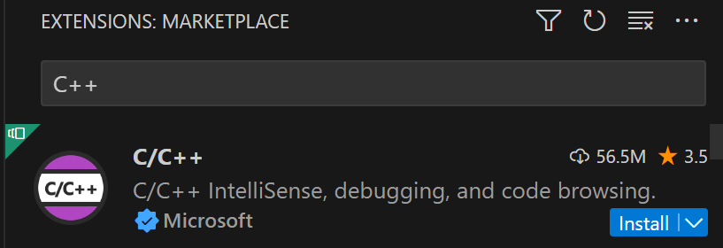
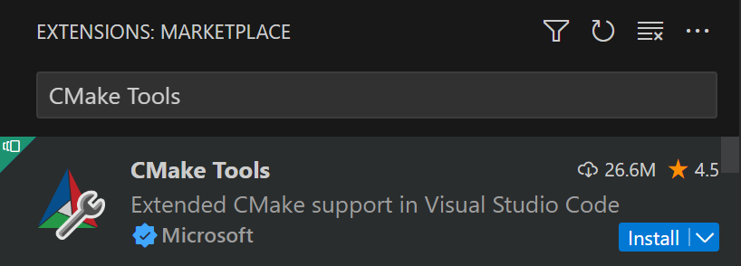
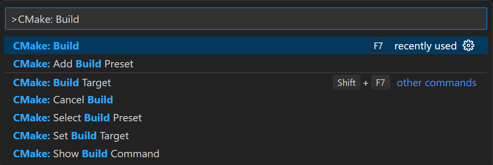
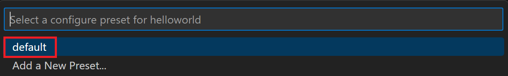
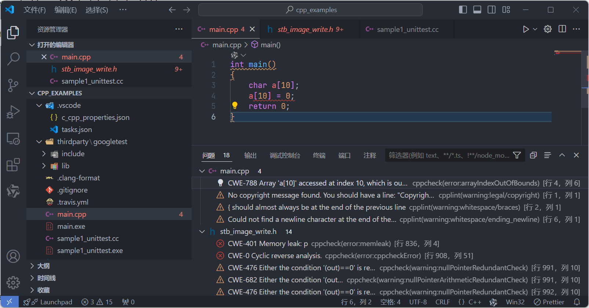

# C++项目脚手架

## 概述

一个面向DevOps的C++项目脚手架，旨在加速开发流程并确保代码质量，通常集成了以下核心特性：

### 项目初始化与依赖管理
- **高效CLI工具**：利用vcpkg这一强大的命令行界面，不仅能够迅速搭建出标准化的项目目录结构及基础配置文件，还扮演着包管理器的角色。开发者能够便捷地安装、更新和管理项目所需的C++库依赖，确保开发环境的一致性和可复用性。

### 代码风格统一
- **Clang-Format集成**：为了维护代码的可读性和一致性，脚手架内置了Clang-Format配置。该工具能够自动格式化C++代码，遵循预设的编码规范，减少因代码风格差异带来的审查摩擦，提升团队协作效率。

### 静态代码分析
- **Cppcheck深度扫描**：集成Cppcheck这一静态分析工具，对项目源代码进行全面而深入的检查。它能够在编译前识别潜在的错误、未使用的变量、内存泄漏等问题，增强代码的健壮性和安全性，提前规避运行时错误。

### 开发环境配置 - Visual Studio Code优化
- **针对VS Code的优化**：考虑到Visual Studio Code的广泛使用，此脚手架特别优化了与之的集成体验。提供定制化的插件建议、任务配置以及调试配置文件，确保开发者能够快速启动开发环境，享受流畅的编写、构建、调试流程。

综上所述，该C++项目脚手架通过整合vcpkg、Clang-Format和Cppcheck等工具，不仅简化了项目初始化和依赖管理的复杂度，还强化了代码质量和开发效率，为DevOps实践提供了坚实的基础。

## Visual Studio Code 扩展

导航到“扩展”视图并安装 [C++ 扩展](https://marketplace.visualstudio.com/items?itemName=ms-vscode.cpptools)。 此操作将启用 C++ IntelliSense 和代码导航。



安装 [CMake 工具扩展](https://marketplace.visualstudio.com/items?itemName=ms-vscode.cmake-tools)。 这将在 Visual Studio Code 中启用 CMake 支持。



## 配置

### vcpkg

#### 设置 vcpkg

```sh
git clone https://github.com/microsoft/vcpkg.git
# bootstrap-vcpkg.bat 脚本的主要功能是下载预编译的、官方签名的 vcpkg.exe 可执行文件。 这比从源代码编译 vcpkg 更快更简单。
cd vcpkg && bootstrap-vcpkg.bat
```

配置环境变量

```sh
set "VCPKG_ROOT=D:\Dev\vcpkg\"
set PATH=%VCPKG_ROOT%;%PATH%
```

> 设置 `VCPKG_ROOT` 可帮助 Visual Studio 查找 vcpkg 实例。 将它添加到 `PATH` 确保可以直接从 shell 运行 vcpkg 命令。

#### 创建项目

运行以下命令来创建 vcpkg 清单文件 (`vcpkg.json`)：

```sh
vcpkg new --application
```

[`vcpkg new`](https://learn.microsoft.com/zh-cn/vcpkg/commands/new) 命令在项目的目录中添加一个 `vcpkg.json` 文件和一个 `vcpkg-configuration.json` 文件。

添加 `fmt` 包作为依赖项：

```sh
vcpkg add port fmt
```

`vcpkg.json` 现在应包含：

```json
{
  "dependencies": [
    "fmt"
  ]
}
```

这是清单文件。 vcpkg 读取清单文件，以了解要安装和与 MSBuild 集成的依赖项，从而提供项目所需的依赖项。

生成的 `vcpkg-configuration.json` 文件引入了一个基线，用于对项目的依赖项设置最低版本约束。但建议将 `vcpkg-configuration.json` 文件保留在源代码管理之下，以确保不同开发环境中的版本一致性。

然后执行安装依赖命令，vcpkg就会根据vcpkg.json把依赖安装到`VCPKG_ROOT`的`packages`目录下

```sh
vcpkg install --triplet x64-mingw-dynamic
```

> 我使用的是TDM-GCC-64，所以`triplet=x64-mingw-dynamic`

1. **搜索 fmt 库：** vcpkg 会在已知的软件包列表中搜索名为 "fmt" 的库。
2. **下载源代码：** 如果找到，vcpkg 会下载 fmt 库的源代码。
3. **构建库：** vcpkg 会使用你选择的编译器（例如 TDM-GCC-64）构建 fmt 库。
4. **安装库：** vcpkg 会将构建好的库文件安装到你的系统中。

安装完成后，你就可以在你的 C++ 项目中使用 fmt 库了。

#### 设置项目文件

创建包含以下内容的 `CMakeLists.txt` 文件：

```cmake
cmake_minimum_required(VERSION 3.10)
list(APPEND CMAKE_PREFIX_PATH "./vcpkg_installed/x64-mingw-dynamic") # 替换为你的实际路径

project(HelloWorld)

find_package(fmt CONFIG REQUIRED)

add_executable(HelloWorld main.cpp)

target_link_libraries(HelloWorld PRIVATE fmt::fmt)
```

- `cmake_minimum_required(VERSION 3.10)`：指定生成项目所需的 CMake 最低版本为 3.10。 如果系统上安装的 CMake 版本低于此版本，则将生成错误。
- `project(HelloWorld)`：将项目的名称设置为 "HelloWorld."。
- `find_package(fmt CONFIG REQUIRED)`：使用 `fmt` 库的 CMake 配置文件查找该库。 `REQUIRED` 关键字确保在找不到包时生成错误。
- `add_executable(HelloWorld main.cpp)`：添加从源文件 `main.cpp` 生成的名为 "HelloWorld," 的可执行目标。
- `target_link_libraries(HelloWorld PRIVATE fmt::fmt)`：指定 `HelloWorld` 可执行文件应链接到 `fmt` 库。 `PRIVATE` 关键字表明 `fmt` 仅在生成 `HelloWorld` 时需要，不应传播到其他依赖项目。

> 如果提示find_package找不到fmt-config.cmake，追加`CMAKE_PREFIX_PATH`的配置

要允许 CMake 项目系统识别 vcpkg 提供的 C++ 库，需要提供 `vcpkg.cmake` 工具链文件。 要自动执行此操作，请在包含以下内容的 "helloworld" 目录中创建一个 `CMakePresets.json` 文件：

```json
{
    "version": 8,
    "configurePresets": [
        {
            "name": "TDM-GCC-64",
            "displayName": "GCC 10.3.0 x86_64-w64-mingw32",
            "description": "使用编译器: C = D:\\Dev\\TDM-GCC-64\\bin\\gcc.exe, CXX = D:\\Dev\\TDM-GCC-64\\bin\\g++.exe",
            "binaryDir": "${sourceDir}/out/build/${presetName}",
            "generator": "MinGW Makefiles",
            "cacheVariables": {
                "CMAKE_INSTALL_PREFIX": "${sourceDir}/out/install/${presetName}",
                "CMAKE_C_COMPILER": "D:/Dev/TDM-GCC-64/bin/gcc.exe",
                "CMAKE_CXX_COMPILER": "D:/Dev/TDM-GCC-64/bin/g++.exe",
                "CMAKE_BUILD_TYPE": "Debug"
            },
            "environment": {
                "VCPKG_ROOT": "D:\\Dev\\vcpkg\\"
            }
        }
    ]
}
```

* **name**: 预设的内部名称，用于在命令行中引用此预设。
* **displayName**: 在用户界面中显示的更友好的名称。
* **description**: 对预设的简短描述，说明了使用的编译器路径。
* **binaryDir**: 构建输出目录的路径模板。`{sourceDir}`会被替换为源代码目录，`{presetName}`会被替换为预设的名称。这里指定的路径可能有误，通常不会重复包含`sourceDir`和`out/build`多次。
* **generator**: 指定生成器类型，这里是`MinGW Makefiles`，意味着将使用MinGW的make工具来驱动构建过程。
* cacheVariables
  - `CMAKE_INSTALL_PREFIX`: 安装目录的路径模板，用于安装生成的库或可执行文件等。
  - `CMAKE_C_COMPILER`: 指定C编译器的路径，这里是TDM-GCC 64位版本的gcc.exe。
  - `CMAKE_CXX_COMPILER`: 指定C++编译器的路径，对应于g++.exe。
  - `CMAKE_BUILD_TYPE`: 构建类型，设置为"Debug"，意味着会包含调试信息，适合开发和调试阶段。
* environment
  - `VCPKG_ROOT`: 环境变量设置，指定了vcpkg包管理器的根目录。vcpkg用于简化C/C++库的获取和集成过程。

> 要在环境变量或者这里通过environment指定`VCPKG_ROOT`，否则`CMakeLists`.txt中的`find_package(fmt CONFIG REQUIRED)`就会报错，因为他不知道去哪里查找依赖

编写代码

```sh
#include <fmt/core.h>

int main()
{
    fmt::print("Hello World!\n");
    return 0;
}
```

#### 追加测试

```sh
vcpkg add port gtest
vcpkg install --triplet x64-mingw-dynamic
```

修改`CMakeLists.txt` 文件：

```cmake
cmake_minimum_required(VERSION 3.10)

project(HelloWorld)

find_package(GTest REQUIRED)
find_package(fmt REQUIRED)

add_executable(HelloWorld main.cpp)

target_link_libraries(HelloWorld PRIVATE fmt::fmt)


add_executable(HelloWorldTests tests/main_test.cpp)

target_link_libraries(HelloWorldTests PRIVATE GTest::gtest_main fmt::fmt)
```

tests\main_test.cpp

```cpp
#include <gtest/gtest.h>
#include <iostream>

int add(int a, int b)
{
    return a + b;
}

int sub(int a, int b)
{
    return a - b;
}

TEST(testcase, test_add)
{
    EXPECT_EQ(add(1, 2), 3);
    EXPECT_EQ(sub(1, 2), -1);
}

int main(int argc, char** argv)
{
    std::cout << "run google test --> " << std::endl << std::endl;
    testing::InitGoogleTest(&argc, argv);
    return RUN_ALL_TESTS();
}
```

#### 生成并运行该项目

通过导航到**视图 > 命令面板**中的命令面板来运行 `CMake: Build` 项目命令



选择 `default` CMake 预设。 此操作将启用 vcpkg 工具链。



执行

> 执行时如果提示dll找不到，拷贝到目录即可，文件在`\vcpkg_installed\x64-mingw-dynamic\bin\`目录中
>
> * libfmt.dll
> * libfmtd.dll
> * libgtest_main.dll
> * libgtest.dll

```sh
C:\Dev\archives\cpp_helloworld\out\build\TDM-GCC-64\HelloWorld.exe
Hello World!
```

```sh
C:\Dev\archives\cpp_helloworld\out\build\TDM-GCC-64\HelloWorldTests.exe
run google test -->

[==========] Running 1 test from 1 test suite.
[----------] Global test environment set-up.
[----------] 1 test from testcase
[ RUN      ] testcase.test_add
[       OK ] testcase.test_add (0 ms)
[----------] 1 test from testcase (4 ms total)

[----------] Global test environment tear-down
[==========] 1 test from 1 test suite ran. (17 ms total)
[  PASSED  ] 1 test.
```

### Clang-Format

> 良好的编码风格是一种优化和改进软件开发过程的关键因素, 对于构建可维护、可扩展和高质量的软件至关重要。

clang-format 是一个开源的代码格式化工具, 它可以帮助程序员自动调整源代码的格式, 以符合指定的编码风格规范。通过配置简单易懂的格式化选项, clang-format 可以在保持代码功能不变的情况下, 自动处理缩进、空格、括号、逗号等细节, 提高代码的可读性和一致性。无论是个人项目还是团队协作, clang-format 都是一个强大的工具, 能够减轻代码审查和格式化的工作量, 使代码维护更加高效。

我们可以在项目根目录添加`.clang-format`文件，这里给出一个例子，配置后Visual Studio Code中选择格式化代码，或者配置保存时自动格式化代码即可。

```json
{
    "editor.formatOnSave": true
}
```

`.clang-format`文件示例

```ini
---
# 语言: None, Cpp, Java, JavaScript, ObjC, Proto, TableGen, TextProto
Language: Cpp
# BasedOnStyle:	LLVM
# 访问说明符(public、private等)的偏移
AccessModifierOffset: -2
# 开括号(开圆括号、开尖括号、开方括号)后的对齐: Align, DontAlign, AlwaysBreak(总是在开括号后换行)
AlignAfterOpenBracket: Align
# 连续赋值时，对齐所有等号
AlignConsecutiveAssignments: true
# 连续声明时，对齐所有声明的变量名
AlignConsecutiveDeclarations: true

AlignEscapedNewlines: Right

# 左对齐逃脱换行(使用反斜杠换行)的反斜杠
#AlignEscapedNewlinesLeft:	true
# 水平对齐二元和三元表达式的操作数
AlignOperands: true
# 对齐连续的尾随的注释
AlignTrailingComments: true

# 允许函数声明的所有参数在放在下一行
AllowAllParametersOfDeclarationOnNextLine: false
# 允许短的块放在同一行
AllowShortBlocksOnASingleLine: true
# 允许短的case标签放在同一行
AllowShortCaseLabelsOnASingleLine: true
# 允许短的函数放在同一行: None, InlineOnly(定义在类中), Empty(空函数), Inline(定义在类中，空函数), All
AllowShortFunctionsOnASingleLine: Empty
# 允许短的if语句保持在同一行
AllowShortIfStatementsOnASingleLine: false
# 允许短的循环保持在同一行
AllowShortLoopsOnASingleLine: false

# 总是在定义返回类型后换行(deprecated)
AlwaysBreakAfterDefinitionReturnType: None
# 总是在返回类型后换行: None, All, TopLevel(顶级函数，不包括在类中的函数),
#   AllDefinitions(所有的定义，不包括声明), TopLevelDefinitions(所有的顶级函数的定义)
AlwaysBreakAfterReturnType: None
# 总是在多行string字面量前换行
AlwaysBreakBeforeMultilineStrings: false
# 总是在template声明后换行
AlwaysBreakTemplateDeclarations: false
# false表示函数实参要么都在同一行，要么都各自一行
BinPackArguments: true
# false表示所有形参要么都在同一行，要么都各自一行
BinPackParameters: false
# 大括号换行，只有当BreakBeforeBraces设置为Custom时才有效
BraceWrapping:
  # class定义后面
  AfterClass: false
  # 控制语句后面
  AfterControlStatement: false
  # enum定义后面
  AfterEnum: false
  # 函数定义后面
  AfterFunction: true
  # 命名空间定义后面
  AfterNamespace: false
  # ObjC定义后面
  AfterObjCDeclaration: false
  # struct定义后面
  AfterStruct: true
  # union定义后面
  AfterUnion: true

  AfterExternBlock: false
  # catch之前
  BeforeCatch: true
  # else之前
  BeforeElse: true
  # 缩进大括号
  IndentBraces: false
  SplitEmptyFunction: true
  SplitEmptyRecord: true
  SplitEmptyNamespace: true

# 在二元运算符前换行: None(在操作符后换行), NonAssignment(在非赋值的操作符前换行), All(在操作符前换行)
BreakBeforeBinaryOperators: None
# 在大括号前换行: Attach(始终将大括号附加到周围的上下文), Linux(除函数、命名空间和类定义，与Attach类似),
#   Mozilla(除枚举、函数、记录定义，与Attach类似), Stroustrup(除函数定义、catch、else，与Attach类似),
#   Allman(总是在大括号前换行), GNU(总是在大括号前换行，并对于控制语句的大括号增加额外的缩进), WebKit(在函数前换行), Custom
#   注：这里认为语句块也属于函数
BreakBeforeBraces: Custom
# 在三元运算符前换行
BreakBeforeTernaryOperators: false

# 在构造函数的初始化列表的逗号前换行
BreakConstructorInitializersBeforeComma: false
BreakConstructorInitializers: BeforeColon
# 每行字符的限制，0表示没有限制
ColumnLimit: 80
# 描述具有特殊意义的注释的正则表达式，它不应该被分割为多行或以其它方式改变
CommentPragmas: "^ IWYU pragma:"
CompactNamespaces: false
# 构造函数的初始化列表要么都在同一行，要么都各自一行
ConstructorInitializerAllOnOneLineOrOnePerLine: false
# 构造函数的初始化列表的缩进宽度
ConstructorInitializerIndentWidth: 4
# 延续的行的缩进宽度
ContinuationIndentWidth: 4
# 去除C++11的列表初始化的大括号{后和}前的空格
Cpp11BracedListStyle: true
# 继承最常用的指针和引用的对齐方式
DerivePointerAlignment: false
# 关闭格式化
DisableFormat: false
# 自动检测函数的调用和定义是否被格式为每行一个参数(Experimental)
ExperimentalAutoDetectBinPacking: false
# 需要被解读为foreach循环而不是函数调用的宏
ForEachMacros: [foreach, Q_FOREACH, BOOST_FOREACH]
# 对#include进行排序，匹配了某正则表达式的#include拥有对应的优先级，匹配不到的则默认优先级为INT_MAX(优先级越小排序越靠前)，
#   可以定义负数优先级从而保证某些#include永远在最前面
IncludeCategories:
  - Regex: '^"(llvm|llvm-c|clang|clang-c)/'
    Priority: 2
  - Regex: '^(<|"(gtest|isl|json)/)'
    Priority: 3
  - Regex: ".*"
    Priority: 1
# 缩进case标签
IndentCaseLabels: true

IndentPPDirectives: AfterHash
# 缩进宽度
IndentWidth: 4
# 函数返回类型换行时，缩进函数声明或函数定义的函数名
IndentWrappedFunctionNames: false
# 保留在块开始处的空行
KeepEmptyLinesAtTheStartOfBlocks: false
# 开始一个块的宏的正则表达式
MacroBlockBegin: ""
# 结束一个块的宏的正则表达式
MacroBlockEnd: ""
# 连续空行的最大数量
MaxEmptyLinesToKeep: 1
# 命名空间的缩进: None, Inner(缩进嵌套的命名空间中的内容), All
NamespaceIndentation: Inner
# 使用ObjC块时缩进宽度
ObjCBlockIndentWidth: 4
# 在ObjC的@property后添加一个空格
ObjCSpaceAfterProperty: false
# 在ObjC的protocol列表前添加一个空格
ObjCSpaceBeforeProtocolList: true

# 在call(后对函数调用换行的penalty
PenaltyBreakBeforeFirstCallParameter: 19
# 在一个注释中引入换行的penalty
PenaltyBreakComment: 300
# 第一次在<<前换行的penalty
PenaltyBreakFirstLessLess: 120
# 在一个字符串字面量中引入换行的penalty
PenaltyBreakString: 1000
# 对于每个在行字符数限制之外的字符的penalty
PenaltyExcessCharacter: 1000000
# 将函数的返回类型放到它自己的行的penalty
PenaltyReturnTypeOnItsOwnLine: 60

# 指针和引用的对齐: Left, Right, Middle
PointerAlignment: Left
# 允许重新排版注释
ReflowComments: true
# 允许排序#include
SortIncludes: true

# 在C风格类型转换后添加空格
SpaceAfterCStyleCast: false

SpaceAfterTemplateKeyword: true

# 在赋值运算符之前添加空格
SpaceBeforeAssignmentOperators: true
# 开圆括号之前添加一个空格: Never, ControlStatements, Always
SpaceBeforeParens: ControlStatements
# 在空的圆括号中添加空格
SpaceInEmptyParentheses: false
# 在尾随的评论前添加的空格数(只适用于//)
SpacesBeforeTrailingComments: 2
# 在尖括号的<后和>前添加空格
SpacesInAngles: false
# 在容器(ObjC和JavaScript的数组和字典等)字面量中添加空格
SpacesInContainerLiterals: false
# 在C风格类型转换的括号中添加空格
SpacesInCStyleCastParentheses: false
# 在圆括号的(后和)前添加空格
SpacesInParentheses: false
# 在方括号的[后和]前添加空格，lamda表达式和未指明大小的数组的声明不受影响
SpacesInSquareBrackets: false
# 标准: Cpp03, Cpp11, Auto
Standard: Cpp11
# tab宽度
TabWidth: 4
# 使用tab字符: Never, ForIndentation, ForContinuationAndIndentation, Always
UseTab: Never
```

### Cppcheck

Cppcheck是一个用于C/C++代码的静态分析工具，它可以帮助开发者检测代码中的错误。Cppcheck可以检测出许多类型的错误，包括语法错误、未使用的函数、内存泄漏、未初始化的变量等。此外，Cppcheck还支持用户自定义规则，这使得开发者可以根据自己的需求定制Cppcheck的行为。

1. 从Cppcheck的GitHub页面下载最新版本源码，链接：https://github.com/danmar/cppcheck
2. 可以点击“Releases”选项，然后下载最新版本的Cppcheck的Windows安装程序。双击下载的安装程序文件，然后按照提示进行安装。安装完成后，你可以在开始菜单中找到Cppcheck，或者在命令行中输入cppcheck来运行它。
3. 也可以下载源码根据Readme中的提示，自行编译。
4. vscode下载插件cpp-check-lint

```json
/* cppcheck配置 */
"cpp-check-lint.--enable": true,   //启用插件
"cpp-check-lint.cppcheck.--executable": "C:\\Program Files\\Cppcheck\\cppcheck.exe",  //cppcheck路径
"cpp-check-lint.cppcheck.--inline-suppr": false,  //取消内联
"cpp-check-lint.cppcheck.--language=": "c", //使用c语言进行检查
"cpp-check-lint.cppcheck.--onsave": false, //在文件保存时立刻检查该文件
"cpp-check-lint.cppcheck.--quick_fix": false,
"cpp-check-lint.cpplint.--enable": false, //关闭无用的cpplint
```

> 默认情况也就是配置一下`executable`，也可以把`cppcheck.exe`加入path

配置完他会自动检测你当前打开的文件，也可以通过右键菜单触发



也可以通过命令行调用，比如

```sh
# 检查文件
cppcheck file1.c
# 检查目录
cppcheck path
```

### .gitignore

`.gitignore` 文件是用于告诉Git哪些文件或目录不应该被版本控制系统跟踪和提交的。它的设计原则主要包括以下几点：

1. **明确性**：`.gitignore` 中的规则应该是明确且具体的，确保能够准确地匹配到你希望忽略的文件或目录。

2. **层次性**：Git在读取`.gitignore`时会遵循一定的优先级顺序。本地（即特定目录下的）`.gitignore`规则优先于更外层目录或全局`.gitignore`的规则。这意味着你可以为不同目录设置不同的忽略策略。

3. **通配符使用**：支持使用通配符来定义模式匹配规则，如`*`代表任意字符序列，`?`代表任意单个字符，`[abc]`代表a、b、c中的任意一个字符，`[^abc]`代表除了a、b、c之外的任意字符等。这使得你可以灵活地指定忽略模式。

4. **排除规则**：通过在模式前加`!`来表示例外，即如果某个文件或目录原本应该被忽略，但通过例外规则可以使其重新被包含进来。

5. **注释与空白行**：支持以`#`开始的注释行，用于解释为什么某些文件或目录被忽略。空白行则可以用来提高可读性。

6. **路径规范**：在编写规则时，可以使用相对路径（相对于`.gitignore`文件的位置）或绝对路径。不过，通常推荐使用相对路径，以保持规则的可移植性。

7. **性能考量**：虽然不是直接原则，但在编写`.gitignore`时应考虑性能影响。过于复杂的规则或大量的文件匹配可能会减慢Git的运行速度，尤其是在大型项目中。

遵循这些原则，可以帮助你有效地管理项目中的文件，避免敏感信息或生成的临时文件被意外提交，同时保持版本库的整洁和高效。

```ini
*.o
*.obj
*.exe
out/*
vcpkg_installed/*
build/*
```

