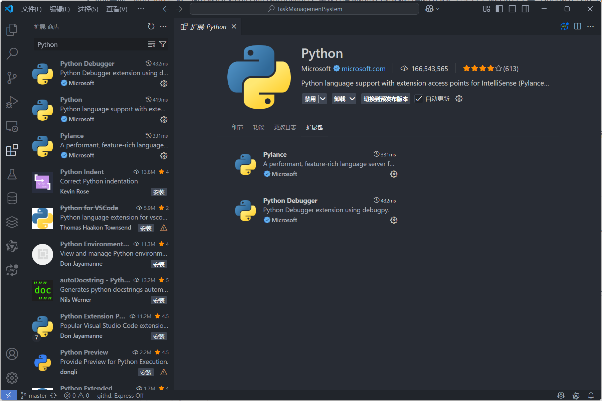
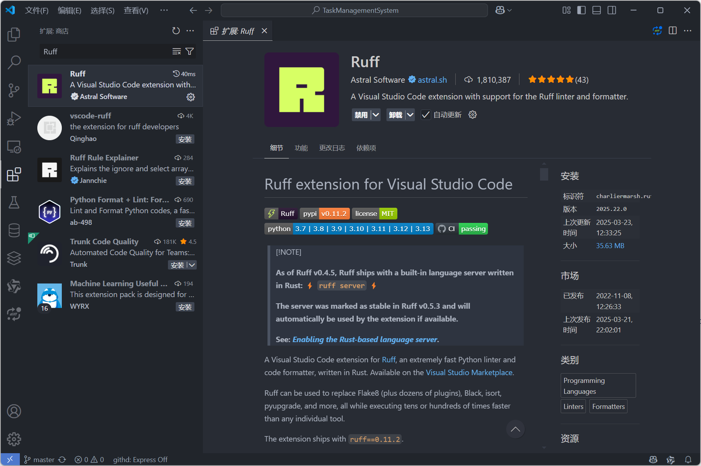

# Python项目脚手架

## 概述

这是一个面向Python开发者的项目脚手架，特别针对在Visual Studio Code (VS Code) 环境下的开发流程进行了优化。它旨在通过集成现代化工具，加速项目启动、规范开发流程、保障代码质量，并促进团队协作。其核心特性包括：

### 项目初始化与环境管理
- **标准化目录结构**：提供一个清晰、可扩展的基础项目结构。
- **虚拟环境管理**：支持使用Python内置的 `venv` 模块或 `Miniconda/Anaconda` 来创建和管理隔离的Python环境，确保项目依赖的纯净性与一致性。

### 依赖管理
- **Pip与requirements.txt**：采用Python官方推荐的 `pip` 包管理器，并通过 `requirements.txt` 文件精确记录和管理项目依赖，方便环境复现和协作。

### 代码风格统一与质量检查
- **Ruff集成**：利用 `Ruff` 这一高性能的Python Linter和Formatter，实现代码风格的自动化检查与格式化。它整合了多种流行工具（如Flake8, isort, Black等）的功能，速度极快，有助于维持代码库的一致性和可读性。

### 自动化测试
- **Unittest框架**：集成Python标准库中的 `unittest` 测试框架，支持编写和运行单元测试、集成测试，确保代码功能的正确性和稳定性。

### 开发环境配置 - Visual Studio Code优化
- **针对VS Code的优化**：考虑到VS Code作为主流Python IDE的广泛应用，此脚手架特别优化了其开发体验。提供推荐的VS Code扩展、配置文件 (`settings.json`) 示例，以及调试和测试的便捷配置，使开发者能够快速搭建高效的开发环境，享受流畅的编码、调试和测试流程。

综上所述，该Python项目脚手架通过整合 `venv`/`conda`、`pip`、`Ruff` 和 `unittest` 等工具，并针对VS Code进行优化，不仅简化了项目初始化、环境和依赖管理的复杂度，还强化了代码质量控制和自动化测试，为Python项目开发提供了坚实的基础。

## Visual Studio Code 扩展

为了在VS Code中获得最佳的Python开发体验，建议安装以下核心扩展：

1.  **Python 扩展 (ms-python.python)**：由Microsoft官方提供，是进行Python开发的基础。它提供了包括IntelliSense（Pylance）、代码导航、调试、Jupyter Notebook支持、环境管理、测试支持等在内的丰富功能。
    
    *   导航到VS Code侧边栏的“扩展”视图（快捷键 `Ctrl+Shift+X`），搜索 `Python`，找到Microsoft发布的扩展并点击“安装”。
    
    

2.  **Ruff 扩展 (charliermarsh.ruff)**：官方的Ruff扩展，可以在VS Code中实时显示Ruff的诊断信息（Linting），并允许使用Ruff作为格式化工具（Formatter）。
    
    *   在“扩展”视图中搜索 `Ruff`，找到 `charliermarsh.ruff` 并安装。
    
    

## 配置

### 项目结构与虚拟环境

一个推荐的基础项目结构如下：

```
your_project_name/
├── .venv/                   # 虚拟环境目录 (由 venv 创建)
├── my_package/              # 你的主要Python包代码
│   ├── __init__.py
│   └── module1.py
├── tests/                   # 存放测试代码的目录
│   ├── __init__.py
│   └── test_module1.py
├── .gitignore               # Git忽略配置文件
├── pyproject.toml           # 项目配置文件 (用于Ruff等工具)
└── requirements.txt         # 项目依赖文件
```

**创建虚拟环境 (使用 `venv`)**：

在项目根目录下打开终端，运行以下命令：

```bash
# Windows
python -m venv .venv

# Linux / macOS
python3 -m venv .venv
```

这会创建一个名为 `.venv` 的目录，包含独立的Python解释器和pip。

**激活虚拟环境**：

在进行后续操作前，务必激活虚拟环境：

```bash
# Windows (Command Prompt/PowerShell)
.venv\Scripts\activate

# Linux / macOS (Bash/Zsh)
source .venv/bin/activate
```

激活后，终端提示符前通常会显示 `(.venv)`。

**(可选) 使用 Miniconda/Anaconda**：

如果你偏好使用conda，可以创建一个conda环境：

```bash
conda create --name your_env_name python=3.x  # x替换为你需要的Python版本
conda activate your_env_name
```

### 依赖管理 (pip + requirements.txt)

**安装依赖**：

将项目需要的库添加到 `requirements.txt` 文件中，每行一个包，可以指定版本：

```txt
# requirements.txt
requests>=2.25.0
numpy
pandas==1.3.5
ruff  # 建议将开发工具也加入，或单独创建 requirements-dev.txt
```

然后使用pip安装所有依赖：

```bash
pip install -r requirements.txt
```

**添加新依赖**：

```bash
pip install new_package
```

**更新 `requirements.txt`**：

安装完新包或更新包后，更新 `requirements.txt` 文件以反映当前环境的依赖：

```bash
pip freeze > requirements.txt
```

> **注意**: `pip freeze` 会列出环境中所有已安装的包，包括依赖的依赖。对于更精确的顶级依赖管理，可以考虑手动维护 `requirements.txt` 或使用 `pip-tools` 等工具。

### 代码风格统一 (Ruff)

**安装 Ruff**：

如果尚未通过 `requirements.txt` 安装，可以单独安装：

```bash
pip install ruff
```

**配置 Ruff (`pyproject.toml`)**：

在项目根目录创建或编辑 `pyproject.toml` 文件，添加 `[tool.ruff]` 部分进行配置。以下是一个示例配置：

```toml
# pyproject.toml

[build-system]
requires = ["setuptools>=61.0"]
build-backend = "setuptools.build_meta"

[project]
name = "your_project_name"
version = "0.1.0"
# 其他项目元数据...

[tool.ruff]
# 选择启用的规则代码 (例如 E=pycodestyle errors, F=pyflakes, W=pycodestyle warnings, I=isort)
# 更多规则集: https://docs.astral.sh/ruff/rules/
select = ["E", "F", "W", "I", "B", "C4", "UP"]
ignore = []  # 可以忽略特定的规则

# 设置行长限制
line-length = 88

# 排除检查的目录或文件
exclude = [
    ".venv",
    "build",
    "dist",
    "__pycache__",
    "docs",
    "*.egg-info",
]

# 允许自动修复 (用于 `ruff --fix`)
fixable = ["A", "B", "C", "D", "E", "F", "G", "I", "N", "Q", "S", "T", "W", "ANN", "ARG", "BLE", "COM", "DJ", "DTZ", "EM", "ERA", "EXE", "FBT", "ICN", "INP", "ISC", "NPY", "PD", "PGH", "PIE", "PL", "PT", "PTH", "PYI", "RET", "RSE", "RUF", "SIM", "SLF", "TCH", "TID", "TRY", "UP", "YTT"]
unfixable = []

[tool.ruff.format]
# Ruff Formatter 配置 (类似 Black)
quote-style = "double"
indent-style = "space"
skip-magic-trailing-comma = false
line-ending = "auto"

[tool.ruff.lint]
# Lint 特定配置 (如果需要)

[tool.ruff.lint.isort]
# isort 相关配置 (Ruff 内置)
known-first-party = ["my_package"] # 指定你的项目包名
```

**在 VS Code 中使用 Ruff**：

安装 Ruff 扩展后，VS Code 会自动使用 `pyproject.toml` 的配置。
*   **Linting**: 代码中的问题会实时高亮显示。
*   **Formatting**: 可以通过右键菜单选择“格式化文档”或配置保存时自动格式化（见下文 VS Code 设置）。

**命令行使用 Ruff**：

```bash
# 检查代码问题
ruff check .

# 检查并尝试自动修复问题
ruff check . --fix

# 格式化代码
ruff format .
```

### 自动化测试 (unittest)

**编写测试**：

在 `tests/` 目录下创建测试文件，通常以 `test_` 开头。测试类继承自 `unittest.TestCase`，测试方法以 `test_` 开头。

```python
# tests/test_module1.py
import unittest
# 假设 my_package/module1.py 中有一个 add 函数
try:
    # 尝试相对导入 (如果 tests 是包的一部分且项目已安装或在 PYTHONPATH 中)
    from ..my_package.module1 import add
except ImportError:
    # 如果上述导入失败 (常见于直接运行脚本时)，尝试修改 sys.path
    import sys
    import os
    # 将项目根目录添加到 sys.path
    project_root = os.path.abspath(os.path.join(os.path.dirname(__file__), '..'))
    sys.path.insert(0, project_root)
    from my_package.module1 import add

class TestModule1(unittest.TestCase):

    def test_add_positive_numbers(self):
        self.assertEqual(add(2, 3), 5, "Should be 5")

    def test_add_negative_numbers(self):
        self.assertEqual(add(-1, -1), -2, "Should be -2")

    def test_add_mixed_numbers(self):
        self.assertEqual(add(-5, 5), 0, "Should be 0")

if __name__ == '__main__':
    unittest.main() # 允许直接运行此文件进行测试
```

**运行测试**：

*   **从命令行运行**：
    在项目根目录下（确保虚拟环境已激活）：
    ```bash
    python -m unittest discover tests
    # 或者更详细的输出
    python -m unittest discover -v tests
    ```
    这里的 `tests` 是包含测试文件的目录。`-p` 参数可以指定匹配模式（默认为 `test*.py`）。

*   **在 VS Code 中运行**：
    安装 Python 扩展后，VS Code 的测试资源管理器（通常在侧边栏，图标类似烧瓶）会自动发现 `unittest` 测试。
    1.  打开测试资源管理器。
    2.  可能需要点击“配置 Python 测试”或“启用和配置测试”，选择 `unittest` 框架，并指定测试目录（通常是 `.` 或 `tests`）。
    3.  之后，你可以在测试资源管理器中看到所有测试，并单独或批量运行它们，查看结果。

    [此处应有图片：VS Code 测试资源管理器显示 unittest 测试的截图]
    *(预留图片位置：vscode-testing-explorer.png)*

### VS Code 配置 (`.vscode/settings.json`)

在项目根目录下创建 `.vscode` 文件夹，并在其中创建 `settings.json` 文件，以配置 VS Code 在此项目中的行为。

```json
// .vscode/settings.json
{
    // --- Python 配置 ---
    // 建议让 VS Code 自动检测虚拟环境中的 Python 解释器。
    // 如果需要手动指定 (不推荐，除非自动检测失败):
    // "python.defaultInterpreterPath": ".venv/bin/python", // Linux/macOS
    // "python.defaultInterpreterPath": ".venv\\Scripts\\python.exe", // Windows

    // --- Ruff 配置 ---
    "[python]": {
        // 设置 Ruff 为默认格式化器
        "editor.defaultFormatter": "charliermarsh.ruff",
        // 启用保存时自动格式化
        "editor.formatOnSave": true,
        // 启用保存时执行代码操作 (如自动修复、组织导入)
        "editor.codeActionsOnSave": {
            "source.fixAll": "explicit", // 使用 Ruff 的 fixAll 功能
            "source.organizeImports": "explicit" // 使用 Ruff 的 organizeImports 功能
        }
    },
    // 启用 Ruff 作为 Linter
    "ruff.lint.run": "onSave", // 或 "onType"

    // --- Unittest 配置 ---
    // 配置 VS Code 的测试发现
    "python.testing.unittestArgs": [
        "-v", // 详细输出
        "-s", // 测试查找的起始目录 (相对于工作区根目录)
        "./tests", // 指定测试文件所在的目录
        "-p", // 测试文件匹配模式
        "test_*.py"
    ],
    "python.testing.pytestEnabled": false, // 禁用 pytest (如果同时安装了)
    "python.testing.unittestEnabled": true // 启用 unittest
}
```

> **说明**：
> *   `python.defaultInterpreterPath` 通常不需要设置，VS Code 的 Python 扩展会自动检测 `.venv` 或 conda 环境。
> *   `editor.formatOnSave` 和 `editor.codeActionsOnSave` 极大地提高了开发效率，确保代码提交前符合规范。
> *   `python.testing.*` 配置帮助 VS Code 正确发现和运行你的 `unittest` 测试。

### .gitignore

为了保持版本库的整洁，避免提交不必要的文件（如虚拟环境、缓存文件、编译产物、IDE配置等），需要配置 `.gitignore` 文件。

一个适用于 Python 项目的 `.gitignore` 示例：

```gitignore
# Byte-compiled / optimized / DLL files
__pycache__/
*.py[cod]
*$py.class

# C extensions
*.so

# Distribution / packaging
.Python
build/
develop-eggs/
dist/
downloads/
eggs/
.eggs/
lib/
lib64/
parts/
sdist/
var/
wheels/
pip-wheel-metadata/
share/python-wheels/
*.egg-info/
.installed.cfg
*.egg
MANIFEST

# PyInstaller
# Usually these files are written by a python script from a template
# before PyInstaller builds the exe, so as to inject date/other infos into it.
*.manifest
*.spec

# Installer logs
pip-log.txt
pip-delete-this-directory.txt

# Unit test / coverage reports
htmlcov/
.tox/
.nox/
.coverage
.coverage.*
.cache
nosetests.xml
coverage.xml
*.cover
*.py,cover
.hypothesis/
.pytest_cache/
cover/

# Translations
*.mo
*.pot
*.po

# Django stuff:
*.log
local_settings.py
db.sqlite3
db.sqlite3-journal

# Flask stuff:
instance/
.webassets-cache

# Scrapy stuff:
.scrapy

# Sphinx documentation
docs/_build/

# PyBuilder
target/

# Jupyter Notebook
.ipynb_checkpoints

# IPython
profile_default/
ipython_config.py

# pyenv
.python-version

# pipenv
# According to pypa/pipenv#598, it is recommended to include Pipfile.lock in version control.
# Pipfile

# PEP 582; used by PDM, Flit and potentially other packaging tools.
__pypackages__/

# Celery stuff
celerybeat-schedule
celerybeat.pid

# SageMath parsed files
*.sage.py

# Environments
.env
.venv
venv/
env/
ENV/
env.bak/
venv.bak/

# Spyder project settings
.spyderproject
.spyproject

# Rope project settings
.ropeproject

# mkdocs documentation
/site

# mypy
.mypy_cache/
.dmypy.json
dmypy.json

# Pyre type checker
.pyre/

# pytype static analysis results
.pytype/

# Cython debug symbols
cython_debug/

# VS Code settings specific to the user, not the project
.vscode/*
!.vscode/settings.json
!.vscode/tasks.json
!.vscode/launch.json
!.vscode/extensions.json

# OS generated files
.DS_Store
Thumbs.db
```

> **注意**：这个 `.gitignore` 示例比较全面。你可以根据项目实际情况进行删减。特别注意 `.vscode/` 部分，通常我们希望共享项目级的设置 (`settings.json`, `launch.json` 等)，但忽略用户级的状态文件。
