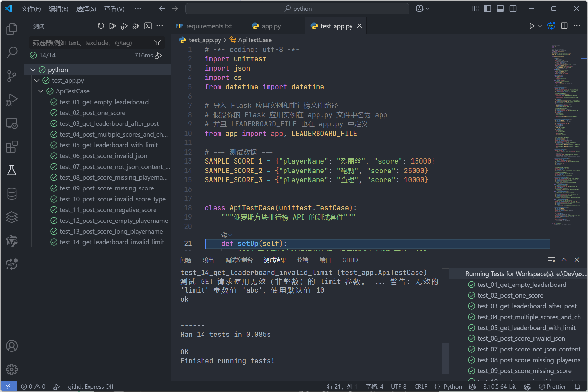
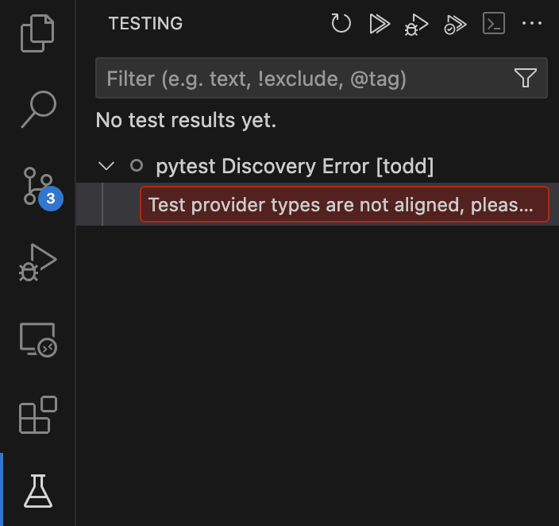

# 单元测试

## Python Flask 实现的 API

我们来使用 Python 内建的 `unittest` 模块为之前的 Flask API 编写单元测试。

### 创建测试文件

在与 `app.py` 相同的目录下，创建一个名为 `test_app.py` 的新文件。

### 编写测试代码

```python
# -*- coding: utf-8 -*-
import unittest
import json
import os
from datetime import datetime

# 导入 Flask 应用实例和排行榜文件路径
# 假设你的 Flask 应用实例在 app.py 文件中名为 app
# 并且 LEADERBOARD_FILE 也在 app.py 中定义
from app import app, LEADERBOARD_FILE

# --- 测试数据 ---
SAMPLE_SCORE_1 = {"playerName": "爱丽丝", "score": 15000}
SAMPLE_SCORE_2 = {"playerName": "鲍勃", "score": 25000}
SAMPLE_SCORE_3 = {"playerName": "查理", "score": 10000}


class ApiTestCase(unittest.TestCase):
    """俄罗斯方块排行榜 API 的测试套件"""

    def setUp(self):
        """在每个测试方法运行前执行：设置测试客户端和环境。"""
        # 配置应用为测试模式
        app.config["TESTING"] = True
        app.config["DEBUG"] = False
        # 使用 Flask 应用上下文创建一个测试客户端
        self.client = app.test_client()

        # --- 管理排行榜文件以实现隔离测试 ---
        self.backup_file_path = LEADERBOARD_FILE + ".bak"  # 备份文件名
        # 如果存在真实的排行榜文件，则备份它
        if os.path.exists(LEADERBOARD_FILE):
            os.rename(LEADERBOARD_FILE, self.backup_file_path)
        # 确保每个测试开始时都有一个干净的、空的排行榜文件
        with open(LEADERBOARD_FILE, "w", encoding="utf-8") as f:
            json.dump([], f)  # 写入一个空列表

    def tearDown(self):
        """在每个测试方法运行后执行：清理环境。"""
        # 删除测试期间使用的排行榜文件
        if os.path.exists(LEADERBOARD_FILE):
            os.remove(LEADERBOARD_FILE)
        # 如果存在备份文件，则恢复原始的排行榜文件
        if os.path.exists(self.backup_file_path):
            os.rename(self.backup_file_path, LEADERBOARD_FILE)

    def _post_score(self, data):
        """辅助方法：用于发送提交分数的 POST 请求。"""
        return self.client.post(
            "/api/scores",
            data=json.dumps(data),  # 将 Python 字典转为 JSON 字符串
            content_type="application/json",
        )  # 设置请求头

    def _get_scores(self, limit=None):
        """辅助方法：用于发送获取排行榜的 GET 请求。"""
        url = "/api/scores"
        if limit is not None:
            url += f"?limit={limit}"  # 添加 limit 查询参数
        return self.client.get(url)

    # --- 测试用例 ---
    # 测试方法的名称通常以 test_ 开头

    def test_01_get_empty_leaderboard(self):
        """测试获取空的排行榜。"""
        response = self._get_scores()
        self.assertEqual(response.status_code, 200, "获取空排行榜状态码应为 200")
        self.assertEqual(
            response.content_type, "application/json", "响应内容类型应为 JSON"
        )
        self.assertEqual(response.get_json(), [], "空排行榜应返回空列表")

    def test_02_post_one_score(self):
        """测试提交一个有效的得分记录。"""
        response = self._post_score(SAMPLE_SCORE_1)
        self.assertEqual(
            response.status_code, 201, "成功提交得分状态码应为 201 Created"
        )
        self.assertEqual(
            response.content_type, "application/json", "响应内容类型应为 JSON"
        )
        data = response.get_json()
        self.assertEqual(
            data["playerName"], SAMPLE_SCORE_1["playerName"], "返回的玩家名称应匹配"
        )
        self.assertEqual(data["score"], SAMPLE_SCORE_1["score"], "返回的分数应匹配")
        self.assertIn("timestamp", data, "返回的数据应包含时间戳")
        # 验证时间戳格式是否大致符合 ISO 8601 (基本检查)
        try:
            # Flask 返回的可能是带 Z 或 +00:00 的 UTC 时间
            timestamp_str = data["timestamp"].replace("Z", "+00:00")
            datetime.fromisoformat(timestamp_str)
        except ValueError:
            self.fail("时间戳格式无效，应为 ISO 8601 格式")

    def test_03_get_leaderboard_after_post(self):
        """测试提交一个得分后获取排行榜。"""
        self._post_score(SAMPLE_SCORE_1)  # 先提交一个分数
        response = self._get_scores()
        self.assertEqual(response.status_code, 200, "获取排行榜状态码应为 200")
        data = response.get_json()
        self.assertEqual(len(data), 1, "排行榜中应有一条记录")
        self.assertEqual(
            data[0]["playerName"],
            SAMPLE_SCORE_1["playerName"],
            "记录中的玩家名称应匹配",
        )
        self.assertEqual(
            data[0]["score"], SAMPLE_SCORE_1["score"], "记录中的分数应匹配"
        )
        self.assertIn("timestamp", data[0], "记录中应包含时间戳")

    def test_04_post_multiple_scores_and_check_order(self):
        """测试提交多个得分并验证排行榜的排序（降序）。"""
        self._post_score(SAMPLE_SCORE_1)  # 15000
        self._post_score(SAMPLE_SCORE_2)  # 25000 (最高分)
        self._post_score(SAMPLE_SCORE_3)  # 10000

        response = self._get_scores()
        self.assertEqual(response.status_code, 200)
        data = response.get_json()
        self.assertEqual(len(data), 3, "排行榜中应有三条记录")
        # 检查是否按分数降序排列
        self.assertEqual(
            data[0]["playerName"],
            SAMPLE_SCORE_2["playerName"],
            "第一名应是 Bob (25000)",
        )
        self.assertEqual(
            data[1]["playerName"],
            SAMPLE_SCORE_1["playerName"],
            "第二名应是 Alice (15000)",
        )
        self.assertEqual(
            data[2]["playerName"],
            SAMPLE_SCORE_3["playerName"],
            "第三名应是 Charlie (10000)",
        )

    def test_05_get_leaderboard_with_limit(self):
        """测试 GET 请求中的 limit 参数是否生效。"""
        self._post_score(SAMPLE_SCORE_1)  # 15000
        self._post_score(SAMPLE_SCORE_2)  # 25000
        self._post_score(SAMPLE_SCORE_3)  # 10000

        response = self._get_scores(limit=2)  # 请求前 2 名
        self.assertEqual(response.status_code, 200)
        data = response.get_json()
        self.assertEqual(len(data), 2, "使用 limit=2 时应返回两条记录")
        # 检查返回的是否是分数最高的两条记录，且已排序
        self.assertEqual(
            data[0]["playerName"], SAMPLE_SCORE_2["playerName"], "第一条记录应是 Bob"
        )
        self.assertEqual(
            data[1]["playerName"], SAMPLE_SCORE_1["playerName"], "第二条记录应是 Alice"
        )

    def test_06_post_score_invalid_json(self):
        """测试提交非法的 JSON 数据。"""
        response = self.client.post(
            "/api/scores", data="这不是一个有效的 JSON", content_type="application/json"
        )
        # 主要断言状态码是 400
        self.assertEqual(
            response.status_code, 400, "提交无效 JSON 应返回 400 Bad Request"
        )
        # 具体的错误信息可能依赖于 Flask/Werkzeug 版本
        # self.assertIn('Failed to decode JSON', data['error']) # 可以添加更具体的错误信息检查

    def test_07_post_score_not_json_content_type(self):
        """测试提交数据时没有设置正确的 Content-Type 头。"""
        response = self.client.post(
            "/api/scores", data=json.dumps(SAMPLE_SCORE_1)
        )  # 缺少 content_type='application/json'
        self.assertEqual(response.status_code, 400, "缺少 JSON Content-Type 应返回 400")
        data = response.get_json()
        self.assertIn("error", data)
        self.assertEqual(
            data["error"], "Request must be JSON", "错误信息应指明需要 JSON 请求"
        )

    def test_08_post_score_missing_playername(self):
        """测试提交缺少 playerName 字段的数据。"""
        response = self._post_score({"score": 500})
        self.assertEqual(response.status_code, 400, "缺少 playerName 应返回 400")
        data = response.get_json()
        self.assertEqual(data["error"], "Invalid input data", "错误类型应为无效输入")
        self.assertIn("playerName", data["details"], "错误详情中应包含 playerName")

    def test_09_post_score_missing_score(self):
        """测试提交缺少 score 字段的数据。"""
        response = self._post_score({"playerName": "无分数者"})
        self.assertEqual(response.status_code, 400, "缺少 score 应返回 400")
        data = response.get_json()
        self.assertEqual(data["error"], "Invalid input data")
        self.assertIn("score", data["details"], "错误详情中应包含 score")

    def test_10_post_score_invalid_score_type(self):
        """测试提交 score 字段为非整数类型的数据。"""
        response = self._post_score({"playerName": "测试", "score": "不是数字"})
        self.assertEqual(response.status_code, 400, "score 类型错误应返回 400")
        data = response.get_json()
        self.assertEqual(data["error"], "Invalid input data")
        self.assertIn("score", data["details"])
        self.assertIn(
            "integer", data["details"]["score"], "错误信息应提示需要整数"
        )  # 检查错误消息片段

    def test_11_post_score_negative_score(self):
        """测试提交 score 字段为负数的数据。"""
        response = self._post_score({"playerName": "负分玩家", "score": -100})
        self.assertEqual(response.status_code, 400, "负数 score 应返回 400")
        data = response.get_json()
        self.assertEqual(data["error"], "Invalid input data")
        self.assertIn("score", data["details"])
        self.assertIn(
            "non-negative", data["details"]["score"], "错误信息应提示需要非负数"
        )  # 检查错误消息片段

    def test_12_post_score_empty_playername(self):
        """测试提交 playerName 字段为空字符串或仅包含空格的数据。"""
        response = self._post_score({"playerName": "   ", "score": 100})  # 仅包含空格
        self.assertEqual(response.status_code, 400, "空 playerName 应返回 400")
        data = response.get_json()
        self.assertEqual(data["error"], "Invalid input data")
        self.assertIn("playerName", data["details"])
        self.assertIn(
            "non-empty", data["details"]["playerName"], "错误信息应提示需要非空字符串"
        )

    def test_13_post_score_long_playername(self):
        """测试提交 playerName 字段超过最大长度限制的数据。"""
        long_name = "a" * 51  # 在 app.py 中设置的最大长度是 50
        response = self._post_score({"playerName": long_name, "score": 100})
        self.assertEqual(response.status_code, 400, "过长的 playerName 应返回 400")
        data = response.get_json()
        self.assertEqual(data["error"], "Invalid input data")
        self.assertIn("playerName", data["details"])
        self.assertIn(
            "50 characters", data["details"]["playerName"], "错误信息应提示长度限制"
        )

    def test_14_get_leaderboard_invalid_limit(self):
        """测试 GET 请求使用无效（非整数）的 limit 参数。"""
        self._post_score(SAMPLE_SCORE_1)
        self._post_score(SAMPLE_SCORE_2)
        # 当前 app.py 的实现中，如果 limit 无效，会使用默认值 10，并返回 200 OK
        response = self._get_scores(limit="abc")  # 无效 limit
        self.assertEqual(
            response.status_code, 200, "无效 limit 应返回 200 OK (使用默认值)"
        )
        data = response.get_json()
        self.assertIsInstance(data, list, "响应应为列表")
        # 检查是否返回了可用的分数（最多为默认 limit）
        self.assertEqual(len(data), 2, "应返回所有已提交的分数 (因为少于默认 limit)")

        response_zero = self._get_scores(limit="0")  # limit 为 0
        self.assertEqual(
            response_zero.status_code, 200, "limit=0 应返回 200 OK (使用默认值)"
        )
        data_zero = response_zero.get_json()
        self.assertIsInstance(data_zero, list)
        # 当前实现中，0 或负数 limit 也会使用默认值 10
        self.assertEqual(len(data_zero), 2, "limit=0 时应返回所有已提交的分数")


# --- 运行测试 ---
if __name__ == "__main__":
    # 这使得你可以直接通过 `python test_app.py` 来运行测试
    unittest.main()

```

### 如何运行测试

1.  确保你位于包含 `app.py` 和 `test_app.py` 的目录下。
2.  确保你的 Flask 应用 **没有** 在单独的进程中运行。测试运行器会自己创建应用实例。
3.  在你的终端或命令行中运行测试：
    ```bash
    python -m unittest test_app.py
    ```
    或者，如果你的环境设置正确，可以直接运行：
    ```bash
    python test_app.py
    ```

### 代码解释

1.  **导入 (Imports):** 导入了 `unittest` 模块、处理 JSON 和文件的 `json`、`os` 模块、处理时间的 `datetime`，以及最重要的，从你的 `app.py` 文件中导入 Flask 应用实例 `app` 和排行榜文件名 `LEADERBOARD_FILE`。
2.  **`ApiTestCase` 测试类:** 定义了我们的测试套件，它继承自 `unittest.TestCase`。
3.  **`setUp()` 方法:**
    *   这个方法在 **每个** 测试方法（以 `test_` 开头的函数）运行 **之前** 被调用。
    *   `app.config['TESTING'] = True`: 将 Flask 应用设置为测试模式。这会改变错误处理方式，并提供一些便利的测试功能。
    *   `self.client = app.test_client()`: 创建一个测试客户端。这个客户端可以模拟向你的应用发送 HTTP 请求，而无需启动一个真正的 Web 服务器。
    *   **文件管理:** 这是测试隔离的关键。为了防止测试互相干扰或影响你实际的排行榜数据，`setUp` 会：
        *   备份当前的 `leaderboard.json` 文件（如果存在）。
        *   创建一个全新的、空的 `leaderboard.json` 文件供当前测试使用。
4.  **`tearDown()` 方法:**
    *   这个方法在 **每个** 测试方法运行 **之后** 被调用。
    *   它负责清理工作：删除测试过程中使用的 `leaderboard.json` 文件，并从备份中恢复原始的文件（如果之前备份过）。这确保了测试环境的一致性。
5.  **辅助方法 (`_post_score`, `_get_scores`):** 这两个方法简化了在测试中发送 POST 和 GET 请求的代码，使其更易读。
6.  **测试方法 (`test_...`)**
    *   每个以 `test_` 开头的方法都是一个独立的测试用例，用于测试 API 的某个特定方面。
    *   使用 `self.client.get(...)` 和 `self.client.post(...)` 来模拟 HTTP 请求。
    *   `self.assertEqual(response.status_code, ...)`: 检查 HTTP 响应的状态码是否符合预期（例如，200 表示成功，201 表示资源创建成功，400 表示客户端请求错误）。
    *   `self.assertEqual(response.content_type, 'application/json')`: 验证响应的内容类型是否为 JSON。
    *   `response.get_json()`: 解析响应体中的 JSON 数据，将其转换为 Python 对象（通常是字典或列表）。
    *   使用各种 `assert` 方法（如 `assertEqual`, `assertIn`, `assertIsInstance`, `fail` 等）来比较实际的响应数据与期望值或期望格式。
    *   测试覆盖了：API 的初始空状态、成功提交单个和多个分数、排行榜的排序、`limit` 参数的功能，以及各种无效输入（如格式错误、缺少字段、无效值）的错误处理情况。
7.  **运行测试 (`if __name__ == '__main__': ...`)**: 这是 Python 的标准写法，允许你通过在命令行直接运行 `python test_app.py` 来启动 `unittest` 的测试运行器。

### 代码覆盖率

可以使用 coverage 工具来衡量测试的代码覆盖率。例如：

```bash
pip install coverage
coverage run -m unittest test_app.py
coverage report -m
```

```
Name          Stmts   Miss  Cover   Missing
-------------------------------------------
app.py           78     12    85%   21, 27, 32-35, 37-41, 58-60, 149, 157
test_app.py     143      3    98%   94-95, 271
-------------------------------------------
TOTAL           221     15    93%
```

### IDE集成

使用Visual Studio Code的测试功能即可

**.vscode\settings.json**

```json
{
    "python.testing.unittestArgs": [
        "-v",
        "-s",
        ".",
        
        "-p",
        "test_*.py"
    ],
    "python.testing.pytestEnabled": false,
    "python.testing.unittestEnabled": true
}
```



> 如果提示`Test provider types are not aligned`
>
> 
>
> **"developer: relaod window"**：Ctrl+P and type `reloadWindow` to refresh

## C++ (Crow) 实现的 API

为了对 C++/Crow 实现的俄罗斯方块排行榜 API 进行单元测试，我们可以使用 C++ 的主流测试框架，例如 **Google Test (gtest)**。以下是如何使用 Google Test 对代码中的核心功能进行单元测试的示例。

### 设置 Google Test 环境

1. **安装 Google Test**

   *   **使用 vcpkg (推荐):**
       如果你正在使用 vcpkg 包管理器（如之前的 README 和 CMakeLists.txt 所示），可以通过 vcpkg 安装 Google Test。请确保使用与你项目构建时相同的 triplet（例如 `x64-mingw-dynamic`）。
       
       ```bash
       # 在 vcpkg 目录下运行
       vcpkg install gtest --triplet x64-mingw-dynamic
       ```
       vcpkg 会处理下载、编译和安装。
       
   *   **手动安装 (例如 Linux 包管理器):**
       *   如果你使用的是 Linux，可以通过包管理器安装（但版本可能较旧）：
           ```bash
           sudo apt update
           sudo apt install libgtest-dev cmake
           ```
       *   然后需要手动编译 Google Test 库：
           ```bash
           cd /usr/src/googletest
           sudo cmake .
           sudo make
           # 将编译好的库文件复制到系统库目录
           sudo cp lib/*.a /usr/lib
           cd ~ # 返回主目录
           ```
       *   对于其他系统或手动从源码编译，请参考 Google Test 的官方文档。

2.  **在项目中集成 Google Test**
    *   关键在于修改 `CMakeLists.txt` 文件，添加对 Google Test 的查找和链接。我们将在下面的 `CMakeLists.txt` 部分展示具体配置。

### 编写单元测试

1.  **创建测试目录和文件:**
    在你的项目根目录 (`TetrisLeaderboardAPI/`) 下创建一个名为 `tests` 的子目录，并在其中创建一个名为 `leaderboard_api_tests.cpp` 的文件。

    ```
    TetrisLeaderboardAPI/
    ├── CMakeLists.txt
    ├── main.cpp
    ├── leaderboard.json
    ├── tests/
    │   └── leaderboard_api_tests.cpp  # <--- 新增的测试文件
    └── ... (include/ 目录或 vcpkg 依赖项)
    ```

2.  **`tests/leaderboard_api_tests.cpp` 代码:**

    这个文件包含 Google Test 的测试套件。我们将使用一个测试夹具（Test Fixture）类 `LeaderboardApiTest` 来处理每个测试用例运行前后的设置（`SetUp`）和清理（`TearDown`）工作，特别是管理用于测试的 `leaderboard.json` 文件，以确保测试之间的隔离性。

    ```cpp
    #include <gtest/gtest.h>          // Google Test 框架头文件
    #include "nlohmann/json.hpp"      // JSON 处理库
    
    #include <string>                 // 字符串处理
    #include <vector>                 // 动态数组
    #include <fstream>                // 文件流操作 (ifstream, ofstream)
    #include <iostream>               // 输入输出流 (用于打印错误信息)
    #include <filesystem>             // 文件系统操作 (需要 C++17)
    #include <mutex>                  // 互斥锁 (虽然测试中不直接模拟并发，但函数可能需要)
    #include <algorithm>              // 算法 (如 std::sort)
    #include <limits>                 // 用于获取数值类型的极限值
    #include <regex>                  // 正则表达式 (用于时间戳验证)
    #include <chrono>                 // 时间处理
    #include <iomanip>                // I/O 格式化 (如 std::setw, std::setfill)
    #include <sstream>                // 字符串流
    
    // 使用 nlohmann::json 简化 JSON 操作
    using json = nlohmann::json;
    // 使用 std::filesystem 简化文件系统操作
    namespace fs = std::filesystem;
    
    // --- 配置 (与 main.cpp 保持一致或用于测试) ---
    // 为测试使用一个单独的文件名，避免覆盖实际数据
    const std::string TEST_LEADERBOARD_FILE = "test_leaderboard.json";
    const size_t MAX_LEADERBOARD_SIZE = 100; // 与 main.cpp 中的限制保持一致
    
    // --- 辅助函数 (原型声明或直接复制实现) ---
    // 最佳实践是将这些函数放在共享的头文件 (.h) 中，并链接其实现 (.cpp 或 .o 文件)。
    // 为简化示例，这里假设这些函数可用，或者在下面重新实现它们。
    
    // 函数前向声明 (假设实现在别处或下面提供)
    json loadScoresFromFile(const std::string& filename);
    bool saveScoresToFile(const std::string& filename, const json& scores_data);
    std::string getCurrentTimestampISO8601(); // 假设这个函数存在且行为正确
    
    // --- 测试夹具 (Test Fixture) ---
    // 测试夹具类，用于共享设置和清理逻辑
    class LeaderboardApiTest : public ::testing::Test {
    protected:
        // 可选：整个测试套件运行前的设置 (如果需要)
        // static void SetUpTestSuite() {}
    
        // 可选：整个测试套件运行后的清理 (如果需要)
        // static void TearDownTestSuite() {}
    
        // 每个 TEST_F 测试用例运行前的设置
        void SetUp() override {
            // 确保每个测试开始前都有一个干净的状态
            fs::remove(TEST_LEADERBOARD_FILE); // 如果测试文件存在，则删除
            fs::remove(TEST_LEADERBOARD_FILE + ".bak"); // 清理可能的备份文件
    
            // 创建一个空的排行榜文件作为大多数测试的初始状态
            json empty_array = json::array();
            saveTestScores(empty_array); // 使用下面的 saveTestScores 保存空数组
        }
    
        // 每个 TEST_F 测试用例运行后的清理
        void TearDown() override {
            // 清理测试生成的文件
            fs::remove(TEST_LEADERBOARD_FILE);
            fs::remove(TEST_LEADERBOARD_FILE + ".bak"); // 以防万一
        }
    
        // --- 核心逻辑的重新实现或访问 ---
        // 在测试夹具中重新实现加载/保存逻辑，强制使用测试文件名
    
        // 从测试文件加载分数
        json loadTestScores() {
            json scores_data = json::array(); // 默认空数组
            std::ifstream file(TEST_LEADERBOARD_FILE); // 打开测试文件
            if (file.is_open()) {
                try {
                    file >> scores_data; // 尝试从文件流解析 JSON
                    // 确保解析结果是 JSON 数组
                    if (!scores_data.is_array()) {
                        std::cerr << "测试警告: " << TEST_LEADERBOARD_FILE << " 内容不是有效的 JSON 数组，重置为空数组。" << std::endl;
                        scores_data = json::array();
                    }
                } catch (json::parse_error& e) {
                    // 文件内容为空或无效 JSON 时会抛出异常
                    // 通过 peek() 检查是否真的到达文件末尾（空文件）
                    if (file.peek() != std::ifstream::traits_type::eof()) {
                        // 文件非空但解析失败
                        std::cerr << "测试加载错误: 解析 " << TEST_LEADERBOARD_FILE << " 失败: " << e.what() << std::endl;
                    }
                    // 对于空文件或解析错误，都返回空数组
                    scores_data = json::array();
                }
                file.close(); // 关闭文件
            }
            // 如果文件打不开，也返回空数组
            return scores_data;
        }
    
        // 将分数保存到测试文件
        bool saveTestScores(const json& scores_data) {
            // 确保要保存的是数组
            if (!scores_data.is_array()) {
                 std::cerr << "测试保存错误: 尝试保存非数组数据到 " << TEST_LEADERBOARD_FILE << std::endl;
                 return false;
            }
            // 以截断模式打开文件（清空原有内容）
            std::ofstream file(TEST_LEADERBOARD_FILE, std::ios::trunc);
            if (file.is_open()) {
                try {
                    // 使用 setw(4) 输出带缩进的美化 JSON
                    file << std::setw(4) << scores_data << std::endl;
                    file.close(); // 关闭文件
                    // 检查写入操作是否成功（流状态是否良好）
                    return file.good();
                } catch (const std::exception& e) {
                    // 捕获可能的序列化或写入异常
                    std::cerr << "测试保存错误: 写入 " << TEST_LEADERBOARD_FILE << " 时发生异常: " << e.what() << std::endl;
                    file.close(); // 尝试关闭文件
                    return false;
                }
            } else {
                 std::cerr << "测试保存错误: 无法打开 " << TEST_LEADERBOARD_FILE << " 进行写入。" << std::endl;
                 return false;
            }
        }
    
        // 模拟 POST /api/scores 的核心处理逻辑，用于测试数据操作
        // 成功时返回新创建的记录，失败时返回空 JSON 对象 {}
        json simulatePostScore(const json& score_input) {
            // --- 输入验证 (简化版，模拟 main.cpp 中的检查) ---
            bool valid = true;
            if (!score_input.contains("playerName") || !score_input["playerName"].is_string()) {
                valid = false;
            } else {
                std::string name = score_input["playerName"].get<std::string>();
                if (name.empty() || std::all_of(name.begin(), name.end(), ::isspace) || name.length() > 50) {
                    valid = false;
                }
            }
            if (!score_input.contains("score") || !score_input["score"].is_number_integer() || score_input["score"].get<int>() < 0) {
                valid = false;
            }
    
            if (!valid) {
                // std::cout << "模拟 POST 验证失败: " << score_input.dump() << std::endl; // 调试信息
                return json::object(); // 返回空对象表示验证失败
            }
    
            // --- 处理分数 ---
            json scores = loadTestScores(); // 加载当前测试数据
            if (!scores.is_array()) {
                 std::cerr << "模拟 POST 错误: 加载测试数据失败。" << std::endl;
                 return json::object(); // 加载失败
            }
    
            // 创建新记录
            json new_score_record;
            new_score_record["playerName"] = score_input["playerName"];
            new_score_record["score"] = score_input["score"];
            new_score_record["timestamp"] = getCurrentTimestampISO8601(); // 使用实际的时间戳函数
    
            scores.push_back(new_score_record); // 添加到内存中的列表
    
            // 排序 (降序)
            std::sort(scores.begin(), scores.end(), [](const json& a, const json& b) {
                // 安全地获取分数，处理可能的类型错误或字段缺失
                int score_a = 0, score_b = 0;
                if (a.is_object() && a.contains("score") && a["score"].is_number()) score_a = a["score"];
                if (b.is_object() && b.contains("score") && b["score"].is_number()) score_b = b["score"];
                return score_a > score_b; // 降序排序
            });
    
            // 限制排行榜大小
            if (scores.size() > MAX_LEADERBOARD_SIZE) {
                // 从末尾（分数最低的）开始删除多余的记录
                scores.erase(scores.begin() + MAX_LEADERBOARD_SIZE, scores.end());
            }
    
            // 保存更新后的数据到测试文件
            if (saveTestScores(scores)) {
                return new_score_record; // 成功，返回新创建的记录
            } else {
                 std::cerr << "模拟 POST 错误: 保存测试数据失败。" << std::endl;
                 return json::object(); // 保存失败
            }
        }
    
        // 模拟 GET /api/scores 的核心处理逻辑
        json simulateGetScores(int limit = 10) {
            json scores = loadTestScores(); // 加载测试数据
            if (!scores.is_array()) {
                 std::cerr << "模拟 GET 错误: 加载测试数据失败。" << std::endl;
                 return json::array(); // 加载失败返回空数组
            }
    
            // 复制到 vector 中进行排序（更安全，避免迭代器失效）
            std::vector<json> sorted_scores_vec;
            for(const auto& score_item : scores) {
                // 确保是包含有效分数的对象
                if (score_item.is_object() && score_item.contains("score") && score_item["score"].is_number()) {
                    sorted_scores_vec.push_back(score_item);
                } else {
                     std::cerr << "模拟 GET 警告: 跳过无效的排行榜记录: " << score_item.dump() << std::endl;
                }
            }
    
            // 排序 (降序)
            std::sort(sorted_scores_vec.begin(), sorted_scores_vec.end(), [](const json& a, const json& b) {
                // 使用 value() 提供默认值，更安全
                int score_a = a.value("score", std::numeric_limits<int>::min());
                int score_b = b.value("score", std::numeric_limits<int>::min());
                return score_a > score_b; // 降序
            });
    
            // 应用 limit (如果 limit > 0)
            if (limit > 0 && sorted_scores_vec.size() > static_cast<size_t>(limit)) {
                sorted_scores_vec.resize(limit); // 截断 vector
            }
    
            // 将处理后的 vector 转换回 JSON 数组并返回
            return json(sorted_scores_vec);
        }
    
        // 辅助函数：检查时间戳格式是否有效
        static bool isValidTimestamp(const std::string& ts) {
            // 基本的 ISO 8601 UTC 格式检查 (YYYY-MM-DDTHH:MM:SSZ)
            static const std::regex iso8601_regex("\\d{4}-\\d{2}-\\d{2}T\\d{2}:\\d{2}:\\d{2}Z");
            return std::regex_match(ts, iso8601_regex);
        }
    };
    
    // --- 测试用例 ---
    // 使用 TEST_F 宏来定义属于 LeaderboardApiTest 夹具的测试用例
    
    // 测试：获取空的排行榜
    TEST_F(LeaderboardApiTest, GetEmptyLeaderboard) {
        json result = simulateGetScores();
        // 断言结果是数组类型
        ASSERT_TRUE(result.is_array()) << "结果应为 JSON 数组";
        // 断言数组为空
        ASSERT_TRUE(result.empty()) << "初始排行榜应为空";
    }
    
    // 测试：提交一个有效的得分记录
    TEST_F(LeaderboardApiTest, PostOneValidScore) {
        json input = {{"playerName", "玩家一"}, {"score", 15000}};
        json created_record = simulatePostScore(input);
    
        // 断言模拟提交操作成功（返回非空对象）
        ASSERT_FALSE(created_record.empty()) << "模拟提交应成功并返回记录";
        // 检查返回记录的内容
        ASSERT_EQ(created_record["playerName"], "玩家一");
        ASSERT_EQ(created_record["score"], 15000);
        ASSERT_TRUE(created_record.contains("timestamp")) << "记录应包含时间戳";
        // 检查时间戳格式
        ASSERT_TRUE(isValidTimestamp(created_record["timestamp"].get<std::string>()))
            << "时间戳 " << created_record["timestamp"] << " 格式无效";
    
        // 验证文件内容是否正确更新
        json scores_in_file = loadTestScores();
        ASSERT_EQ(scores_in_file.size(), 1) << "文件中应有一条记录";
        ASSERT_EQ(scores_in_file[0]["playerName"], "玩家一");
        ASSERT_EQ(scores_in_file[0]["score"], 15000);
        ASSERT_TRUE(scores_in_file[0].contains("timestamp"));
    }
    
    // 测试：提交一个得分后获取排行榜
    TEST_F(LeaderboardApiTest, GetLeaderboardAfterPost) {
        json input = {{"playerName", "Alice"}, {"score", 5000}};
        simulatePostScore(input); // 先提交一个分数
    
        json result = simulateGetScores(); // 获取排行榜
        ASSERT_EQ(result.size(), 1) << "获取时应返回一条记录";
        ASSERT_EQ(result[0]["playerName"], "Alice");
        ASSERT_EQ(result[0]["score"], 5000);
    }
    
    // 测试：提交多个得分并检查排序
    TEST_F(LeaderboardApiTest, PostMultipleScoresCheckOrder) {
        // 以不同顺序提交分数
        simulatePostScore({{"playerName", "Charlie"}, {"score", 10000}});
        simulatePostScore({{"playerName", "Alice"}, {"score", 15000}}); // 最高分
        simulatePostScore({{"playerName", "Bob"}, {"score", 12000}});
    
        json result = simulateGetScores(); // 获取（默认 limit 10）
        ASSERT_EQ(result.size(), 3) << "应返回三条记录";
        // 检查排序是否按分数降序
        EXPECT_EQ(result[0]["playerName"], "Alice") << "第一名应是 Alice (15000)";
        EXPECT_EQ(result[0]["score"], 15000);
        EXPECT_EQ(result[1]["playerName"], "Bob") << "第二名应是 Bob (12000)";
        EXPECT_EQ(result[1]["score"], 12000);
        EXPECT_EQ(result[2]["playerName"], "Charlie") << "第三名应是 Charlie (10000)";
        EXPECT_EQ(result[2]["score"], 10000);
    }
    
    // 测试：使用 limit 参数获取排行榜
    TEST_F(LeaderboardApiTest, GetLeaderboardWithLimit) {
        simulatePostScore({{"playerName", "D"}, {"score", 5000}});
        simulatePostScore({{"playerName", "A"}, {"score", 25000}}); // 最高
        simulatePostScore({{"playerName", "C"}, {"score", 15000}});
        simulatePostScore({{"playerName", "B"}, {"score", 20000}}); // 第二
    
        json result = simulateGetScores(2); // 获取前 2 名
        ASSERT_EQ(result.size(), 2) << "使用 limit=2 时应返回两条记录";
        // 检查返回的是否是分数最高的两条
        EXPECT_EQ(result[0]["playerName"], "A") << "第一条应是 A (25000)";
        EXPECT_EQ(result[1]["playerName"], "B") << "第二条应是 B (20000)";
    }
    
    // 测试：提交缺少 playerName 的数据
    TEST_F(LeaderboardApiTest, PostScoreMissingPlayerName) {
        json input = {{"score", 100}};
        json result = simulatePostScore(input);
        // 断言模拟提交失败（返回空对象）
        ASSERT_TRUE(result.empty()) << "缺少 playerName 时提交应失败";
        // 验证文件内容未被修改（仍为空）
        json scores_in_file = loadTestScores();
        ASSERT_TRUE(scores_in_file.empty()) << "文件内容应保持不变";
    }
    
    // 测试：提交缺少 score 的数据
    TEST_F(LeaderboardApiTest, PostScoreMissingScore) {
        json input = {{"playerName", "NoScore"}};
        json result = simulatePostScore(input);
        ASSERT_TRUE(result.empty()) << "缺少 score 时提交应失败";
        json scores_in_file = loadTestScores();
        ASSERT_TRUE(scores_in_file.empty());
    }
    
    // 测试：提交 score 类型无效（字符串）的数据
    TEST_F(LeaderboardApiTest, PostScoreInvalidScoreType) {
        json input = {{"playerName", "BadScore"}, {"score", "not a number"}};
        json result = simulatePostScore(input);
        ASSERT_TRUE(result.empty()) << "score 为非整数时提交应失败";
        json scores_in_file = loadTestScores();
        ASSERT_TRUE(scores_in_file.empty());
    }
    
    // 测试：提交负数 score 的数据
    TEST_F(LeaderboardApiTest, PostScoreNegativeScore) {
        json input = {{"playerName", "Negative"}, {"score", -100}};
        json result = simulatePostScore(input);
        ASSERT_TRUE(result.empty()) << "score 为负数时提交应失败";
        json scores_in_file = loadTestScores();
        ASSERT_TRUE(scores_in_file.empty());
    }
    
    // 测试：提交空的 playerName
    TEST_F(LeaderboardApiTest, PostScoreEmptyPlayerName) {
        json input = {{"playerName", ""}, {"score", 100}};
        json result = simulatePostScore(input);
        ASSERT_TRUE(result.empty()) << "playerName 为空字符串时提交应失败";
        json scores_in_file = loadTestScores();
        ASSERT_TRUE(scores_in_file.empty());
    }
    
    // 测试：提交过长的 playerName
    TEST_F(LeaderboardApiTest, PostScoreLongPlayerName) {
        std::string long_name(51, 'a'); // 创建一个 51 个 'a' 的字符串
        json input = {{"playerName", long_name}, {"score", 100}};
        json result = simulatePostScore(input);
        ASSERT_TRUE(result.empty()) << "playerName 过长时提交应失败";
        json scores_in_file = loadTestScores();
        ASSERT_TRUE(scores_in_file.empty());
    }
    
    // --- 可以添加更多测试用例，例如测试文件加载/保存失败的情况 ---
    
    // 测试：加载一个格式错误的 JSON 文件
    TEST_F(LeaderboardApiTest, LoadMalformedFile) {
        // 手动创建一个无效的 JSON 文件
        {
            std::ofstream bad_file(TEST_LEADERBOARD_FILE, std::ios::trunc);
            bad_file << "{ not json ]"; // 写入无效内容
            bad_file.close();
        }
        json result = loadTestScores();
        // 断言加载函数在这种情况下返回空数组
        ASSERT_TRUE(result.is_array()) << "加载无效文件应返回数组";
        ASSERT_TRUE(result.empty()) << "加载无效文件应返回空数组";
    }


    // --- 单独的测试套件或测试用例，用于测试辅助函数 ---
    
    // 使用 TEST 宏定义不依赖夹具的测试用例
    TEST(TimestampUtilTest, ISO8601FormatCheck) {
        std::string timestamp = getCurrentTimestampISO8601();
        // 使用之前夹具中定义的静态辅助函数进行检查
        EXPECT_TRUE(LeaderboardApiTest::isValidTimestamp(timestamp))
            << "生成的时间戳 '" << timestamp << "' 格式无效";
    }


    // --- 辅助函数的实现 (如果未放在共享位置) ---
    // 注意：将这些放在共享头文件和源文件中是更好的做法
    
    // getCurrentTimestampISO8601 的示例实现 (应与 main.cpp 一致)
    std::string getCurrentTimestampISO8601() {
        auto now = std::chrono::system_clock::now();
        auto itt = std::chrono::system_clock::to_time_t(now);
        std::ostringstream ss;
        // 使用 std::gmtime 获取 UTC 时间
        std::tm utc_tm = *std::gmtime(&itt);
        ss << std::setfill('0')
           << std::setw(4) << utc_tm.tm_year + 1900 << '-' // 年
           << std::setw(2) << utc_tm.tm_mon + 1 << '-'  // 月 (0-11 -> 1-12)
           << std::setw(2) << utc_tm.tm_mday << 'T'     // 日
           << std::setw(2) << utc_tm.tm_hour << ':'     // 时
           << std::setw(2) << utc_tm.tm_min << ':'      // 分
           << std::setw(2) << utc_tm.tm_sec << 'Z';     // 秒 + Z 表示 UTC
        return ss.str();
    }
    
    // loadScoresFromFile 和 saveScoresToFile 可以简单地调用夹具中的方法
    // 或者如果需要在夹具外部使用，则提供独立实现。
    // json loadScoresFromFile(const std::string& filename) { /* ... 实现 ... */ }
    // bool saveScoresToFile(const std::string& filename, const json& scores_data) { /* ... 实现 ... */ }
    
    ```

> 如果仅为快速验证可以把辅助函数的实现临时复制粘贴到 `tests/leaderboard_api_tests.cpp` 文件中，当然这**违反 DRY 原则**

### 更新 `CMakeLists.txt` 以包含测试

将以下内容添加到你的 `CMakeLists.txt` 文件末尾，或者整合到现有结构中。请确保替换 `[vcpkg 安装路径]` 和 `[TDM-GCC-64 lib 路径]` 为你的实际路径。

```cmake
# CMake 最低版本要求
cmake_minimum_required(VERSION 3.15) # 建议使用较新版本以获得更好的 vcpkg 和 C++17 支持

# 项目名称和语言
project(TetrisLeaderboardAPI LANGUAGES CXX)

# 设置 C++ 标准为 C++17
set(CMAKE_CXX_STANDARD 17)
set(CMAKE_CXX_STANDARD_REQUIRED ON)
set(CMAKE_CXX_EXTENSIONS OFF) # 避免使用编译器特定的扩展

# --- 使用 vcpkg ---
# 设置 vcpkg triplet (根据你的环境修改, 例如 x64-windows, x64-linux)
set(VCPKG_TARGET_TRIPLET "x64-mingw-dynamic" CACHE STRING "Vcpkg target triplet")
# 设置 vcpkg 工具链文件路径 (如果不在环境变量或默认位置)
# 例如: set(CMAKE_TOOLCHAIN_FILE "D:/Dev/vcpkg/scripts/buildsystems/vcpkg.cmake" CACHE PATH "Vcpkg toolchain file")
# 推荐通过命令行传递 CMAKE_TOOLCHAIN_FILE 参数

# --- 查找 vcpkg 提供的包 ---
# 使用 CONFIG 模式查找 vcpkg 安装的包配置文件
find_package(asio CONFIG REQUIRED)
find_package(Crow CONFIG REQUIRED) # vcpkg 中的包名通常是 Crow
find_package(nlohmann_json CONFIG REQUIRED)

# --- 查找 Windows 特定的网络库 (仅当使用 MinGW 时通常需要) ---
# vcpkg 通常会处理依赖，但为保险起见，可以保留 Winsock 查找
set(WINSOCK_LIBS "") # 初始化为空
if(WIN32 AND CMAKE_CXX_COMPILER_ID MATCHES "GNU") # 仅在 Windows MinGW 环境下查找
    # !!! 修改为你的 TDM-GCC (或 MinGW) lib 路径 !!!
    set(MINGW_LIB_PATH "D:/Dev/TDM-GCC-64/x86_64-w64-mingw32/lib")
    message(STATUS "正在搜索 Winsock 库路径: ${MINGW_LIB_PATH}")
    find_library(WS2_32_LIBRARY ws2_32 HINTS ${MINGW_LIB_PATH} REQUIRED)
    find_library(WSOCK32_LIBRARY wsock32 HINTS ${MINGW_LIB_PATH} REQUIRED)
    message(STATUS "找到 ws2_32 库: ${WS2_32_LIBRARY}")
    message(STATUS "找到 wsock32 库: ${WSOCK32_LIBRARY}")
    set(WINSOCK_LIBS ${WS2_32_LIBRARY} ${WSOCK32_LIBRARY})
endif()

# --- 主要的可执行文件 (API 服务器) ---
add_executable(tetris_leaderboard_api main.cpp)

# --- 链接库到 API 服务器 ---
target_link_libraries(tetris_leaderboard_api PRIVATE
    asio::asio          # vcpkg 提供的 Asio 目标
    Crow::Crow          # vcpkg 提供的 Crow 目标
    nlohmann_json::nlohmann_json # vcpkg 提供的 nlohmann_json 目标
    ${WINSOCK_LIBS}     # 链接 Winsock 库 (如果需要)
)
# 为 C++17 文件系统库添加链接（如果需要）
if (CMAKE_VERSION VERSION_GREATER_EQUAL 3.14 AND CMAKE_CXX_STANDARD GREATER_EQUAL 17)
    # 对于较新的 CMake 和 C++17，通常不需要显式链接 stdc++fs
    # 但如果遇到链接错误，可以尝试取消下面的注释
    # if (CMAKE_CXX_COMPILER_ID MATCHES "GNU|Clang")
    #     target_link_libraries(tetris_leaderboard_api PRIVATE stdc++fs)
    # endif()
endif()


# =======================================================
#  单元测试配置 (使用 GTest)
# =======================================================
# 添加一个选项，允许在配置时禁用测试构建
option(BUILD_TESTING "构建单元测试" ON)

if(BUILD_TESTING)
    message(STATUS "正在配置单元测试...")
    # 1. 启用 CMake 的测试功能 (CTest)，允许使用 ctest 命令运行测试
    enable_testing()

    # 2. 查找 GoogleTest 包 (vcpkg 应该已经安装)
    #    使用 CONFIG 模式查找 vcpkg 提供的配置文件
    #    REQUIRED 表示如果找不到 GTest，CMake 配置过程将失败
    find_package(GTest CONFIG REQUIRED)
    message(STATUS "找到 Google Test (GTest)")

    # 3. 创建测试可执行文件
    #    指定测试源文件位于 tests/ 目录下
    add_executable(run_tests tests/leaderboard_api_tests.cpp)

    # 4. 链接 GTest 和其他必要的库到测试可执行文件
    #    测试代码也需要 nlohmann_json 来处理 JSON 数据
    #    GTest::gtest 是核心库，GTest::gtest_main 提供了 main 函数入口点
    target_link_libraries(run_tests PRIVATE
        GTest::gtest
        GTest::gtest_main
        nlohmann_json::nlohmann_json # 测试代码也需要 JSON 库
    )
    # 为测试目标也添加文件系统库链接（如果需要）
    if (CMAKE_VERSION VERSION_GREATER_EQUAL 3.14 AND CMAKE_CXX_STANDARD GREATER_EQUAL 17)
        # if (CMAKE_CXX_COMPILER_ID MATCHES "GNU|Clang")
        #     target_link_libraries(run_tests PRIVATE stdc++fs)
        # endif()
    endif()

    # 5. (推荐) 将测试添加到 CTest 测试运行器
    #    这使得可以使用 `ctest` 命令来运行所有已发现的测试
    include(GoogleTest) # 包含 CMake 提供的 GoogleTest 模块
    # 自动发现 run_tests 可执行文件中的所有 GTest 测试用例
    gtest_discover_tests(run_tests)

    message(STATUS "单元测试已配置 (可执行文件: run_tests)")
else()
     message(STATUS "单元测试已禁用 (BUILD_TESTING=OFF)")
endif()

# --- 可选：改善构建输出信息 ---
set(CMAKE_VERBOSE_MAKEFILE ON)

# --- 输出最终信息 ---
message(STATUS "已配置 TetrisLeaderboardAPI 项目。")
message(STATUS "使用 vcpkg triplet: ${VCPKG_TARGET_TRIPLET}")
# ... 其他你可能想输出的信息 ...
```

### 运行测试

1.  **配置 CMake**
    *   在你的项目根目录下创建 `build` 目录并进入：
        ```bash
        mkdir build
        cd build
        ```
    *   运行 CMake 配置命令，**务必替换 `[vcpkg 安装路径]` 为你的实际路径**，并确保 `VCPKG_TARGET_TRIPLET` 正确：
        ```bash
        # 示例命令 (Windows, TDM-GCC/MinGW)
        cmake .. -G "MinGW Makefiles" -D CMAKE_TOOLCHAIN_FILE=[vcpkg 安装路径]/scripts/buildsystems/vcpkg.cmake -D VCPKG_TARGET_TRIPLET=x64-mingw-dynamic
        ```
        *   检查 CMake 输出，确保看到 "正在配置单元测试..." 和 "找到 Google Test (GTest)" 的消息。

2.  **构建项目**
    *   在 `build` 目录下运行构建命令（例如 `mingw32-make` 或 `make`）：
        ```bash
        mingw32-make
        ```
        这会编译你的 API 服务器 (`tetris_leaderboard_api.exe`) 和测试运行器 (`run_tests.exe`)。

3.  **执行测试**
    *   **方法一：直接运行测试可执行文件**
        在 `build` 目录下运行：
        ```bash
        .\run_tests.exe
        ```
    *   **方法二：使用 CTest** (推荐，特别是当测试集变大时)
        在 `build` 目录下运行：
        ```bash
        ctest
        ```
        或者，如果想在测试失败时看到详细输出：
        ```bash
        ctest --output-on-failure
        ```

4.  **查看测试结果**
    如果所有测试都通过了，你将看到类似以下的输出：
    ```
    [==========] Running N tests from M test suites.
    [----------] Global test environment set-up.
    [----------] N tests from LeaderboardApiTest / TimestampUtilTest
    [ RUN      ] LeaderboardApiTest.GetEmptyLeaderboard
    [       OK ] LeaderboardApiTest.GetEmptyLeaderboard (X ms)
    [ RUN      ] LeaderboardApiTest.PostOneValidScore
    [       OK ] LeaderboardApiTest.PostOneValidScore (Y ms)
    ... (其他测试用例) ...
    [ RUN      ] TimestampUtilTest.ISO8601FormatCheck
    [       OK ] TimestampUtilTest.ISO8601FormatCheck (Z ms)
    [----------] N tests from M test suites ran. (Total time ms)
    [  PASSED  ] N tests.
    ```
    如果存在失败的测试，输出会明确指出哪个测试用例失败以及失败的原因（例如断言失败）。

这个设置提供了一个使用 Google Test 对你的 C++/Crow API 的核心数据处理逻辑进行单元测试的完整框架。你可以根据需要添加更多的测试用例来覆盖边缘情况和更复杂的交互。