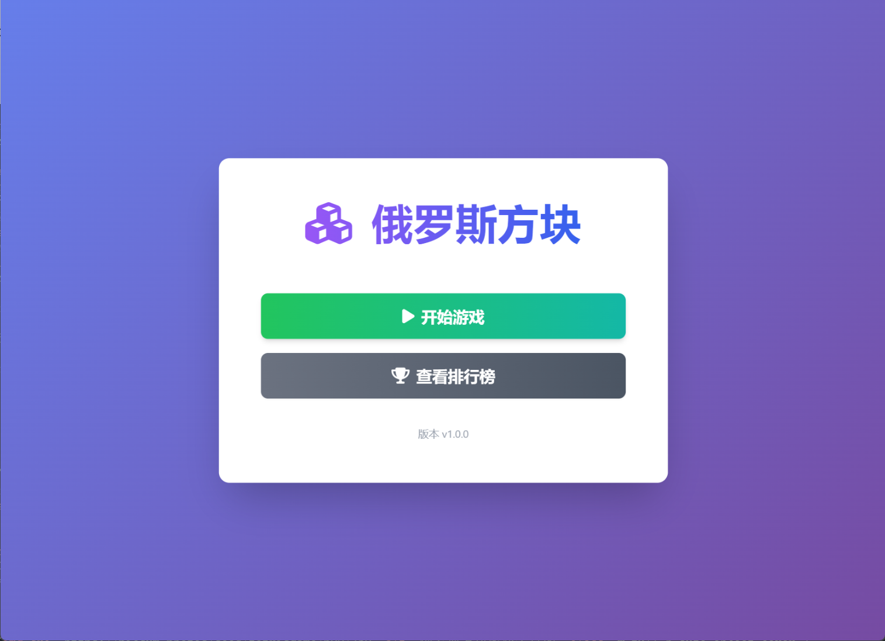
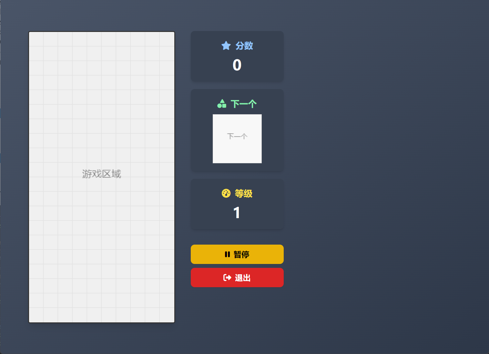
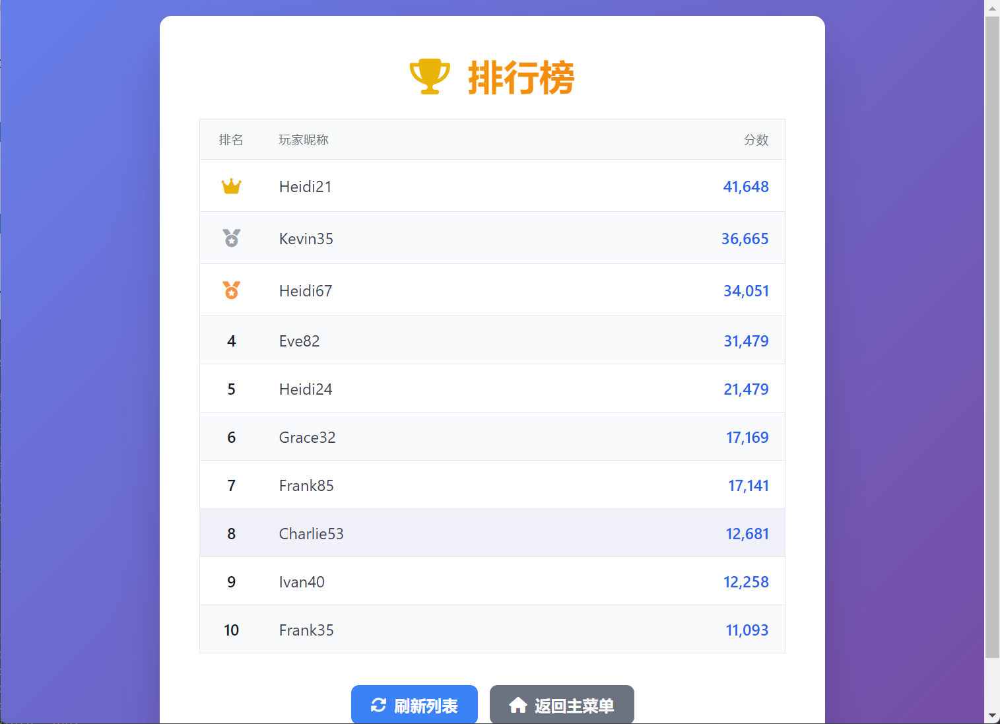

# 原型设计

*   `开始游戏 (Start Game)`: 玩家启动一个新的游戏会话。
*   `玩游戏 (Play Game)`: 玩家在游戏会话中进行操作（移动、旋转方块等）。
*   `提交分数 (Submit Score)`: 游戏结束后，玩家输入用户名并将分数提交到服务器。
*   `查看排行榜 (View Leaderboard)`: 玩家请求并查看历史高分排行榜。

## 开始游戏 (Start Game)

玩家启动一个新的游戏会话。

## 玩游戏 (Play Game)

玩家在游戏会话中进行操作（移动、旋转方块等）。

## 提交分数 (Submit Score)

游戏结束后，玩家输入用户名并将分数提交到服务器。

## 查看排行榜 (View Leaderboard)

玩家请求并查看历史高分排行榜。

