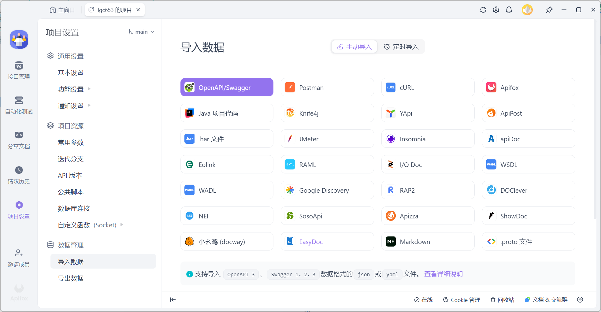
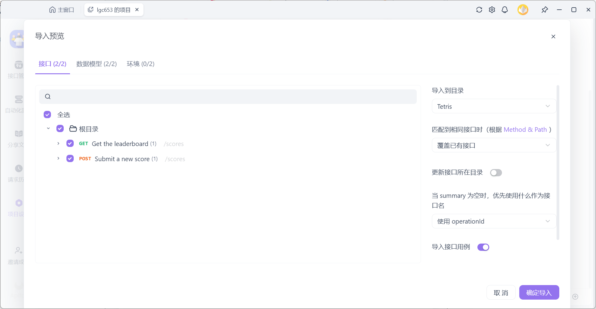
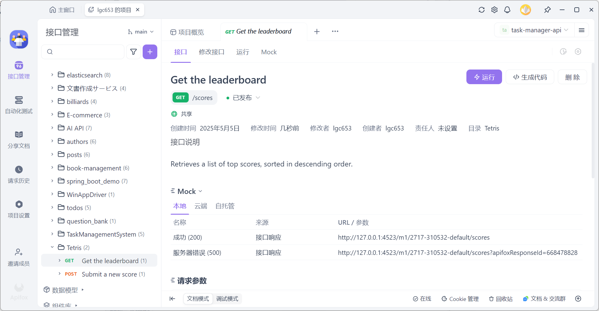
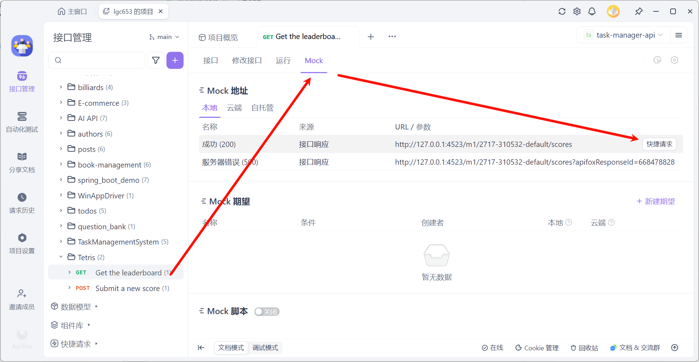
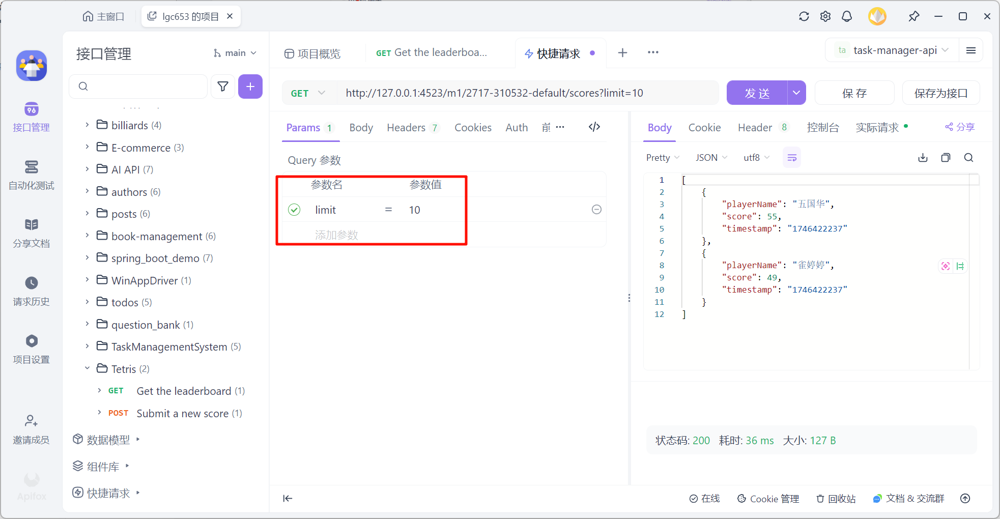
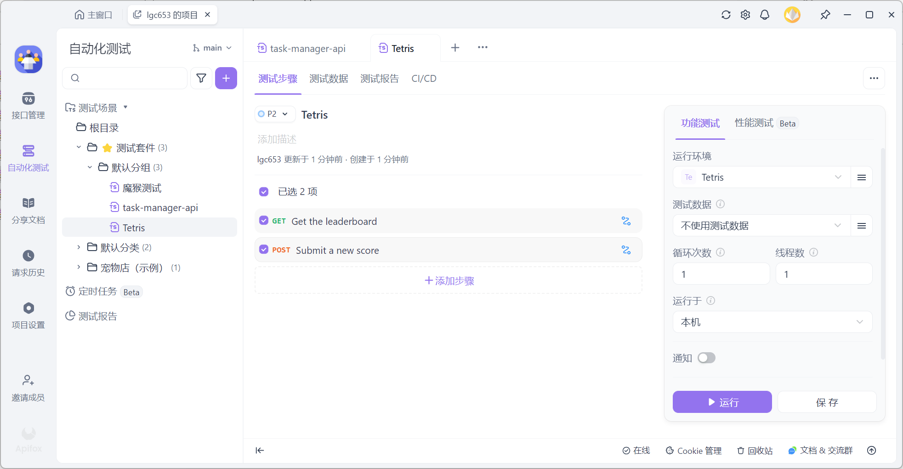
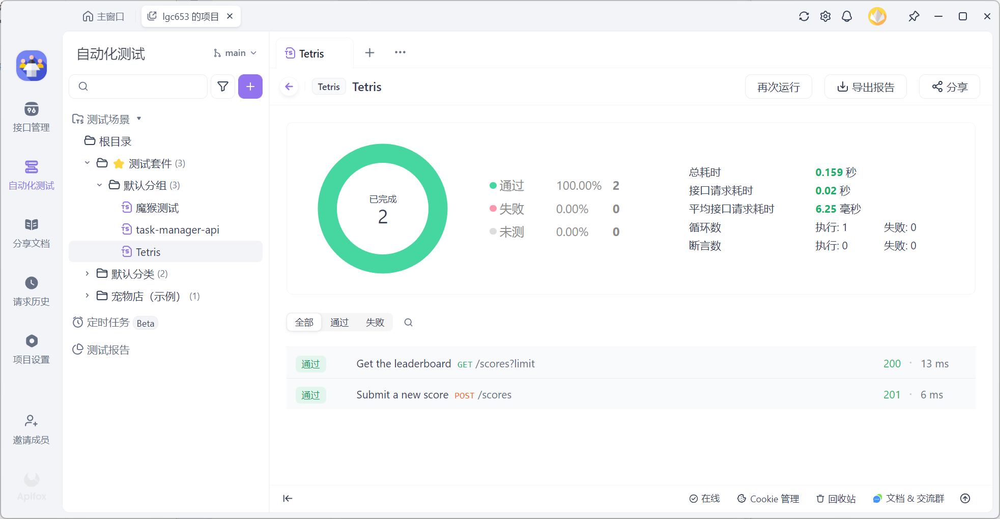
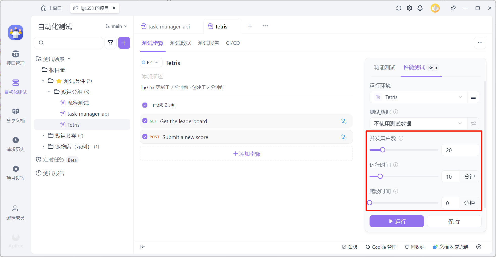

# 接口管理

## API 设计 (Swagger/OpenAPI 3.0)

使用 OpenAPI 规范定义 RESTful API。以下是核心接口定义（YAML 格式）：

```yaml
openapi: 3.0.0
info:
  title: Tetris Leaderboard API
  description: API for submitting scores and retrieving the leaderboard for the Tetris game.
  version: 1.0.0
servers:
  - url: http://localhost:5000/api # Base URL for Flask (example)
    description: Development server (Flask)
  - url: http://localhost:8080/api # Base URL for Crow (example)
    description: Development server (Crow)

paths:
  /scores:
    get:
      summary: Get the leaderboard
      description: Retrieves a list of top scores, sorted in descending order.
      operationId: getLeaderboard
      parameters:
        - name: limit
          in: query
          description: Maximum number of scores to return (e.g., top 10)
          required: false
          schema:
            type: integer
            default: 10
      responses:
        '200':
          description: A list of score records
          content:
            application/json:
              schema:
                type: array
                items:
                  $ref: '#/components/schemas/ScoreRecord'
        '500':
           description: Server error reading leaderboard data

    post:
      summary: Submit a new score
      description: Submits a player's score after a game ends.
      operationId: submitScore
      requestBody:
        required: true
        content:
          application/json:
            schema:
              $ref: '#/components/schemas/ScoreInput'
      responses:
        '201':
          description: Score submitted successfully
          content:
            application/json:
              schema:
                $ref: '#/components/schemas/ScoreRecord' # Return the submitted record with timestamp/id
        '400':
          description: Invalid input data (e.g., missing name or score)
        '500':
           description: Server error saving score data

components:
  schemas:
    ScoreRecord:
      type: object
      properties:
        playerName:
          type: string
          description: Name of the player
        score:
          type: integer
          description: Score achieved by the player
        timestamp:
          type: string
          format: date-time # ISO 8601 format
          description: Time when the score was submitted (generated by backend)
          readOnly: true
      required:
        - playerName
        - score
        - timestamp

    ScoreInput:
      type: object
      properties:
        playerName:
          type: string
          description: Name of the player (provided by user)
          maxLength: 50 # Example validation
        score:
          type: integer
          description: Score achieved by the player (sent from client)
          minimum: 0 # Example validation
      required:
        - playerName
        - score
```

## 数据结构

后台使用 JSON 文件进行物理存储，数据结构设计如下

```json
[
  {
    "playerName": "Player1",
    "score": 15000,
    "timestamp": "2023-10-27T10:30:00Z"
  },
  {
    "playerName": "TetrisMaster",
    "score": 25000,
    "timestamp": "2023-10-26T18:45:10Z"
  }
  // ... more records
]
```

## 接口管理

导入Apifox或其他API管理工具



点击“确认导入”



导入成功



## 数据Mock

数据Mock这里介绍两种方法，分别是使用Apifox和mock.js，可以参考本文档： [API Mock.md](api\API Mock.md) 

### Apifox

Apifox支持Mock数据，导入文档后即可实现Mock功能



> 注意填写limit参数



### Mock.js

下面是使用 Mock.js 为俄罗斯方块排行榜 API (`/api/scores`) 编写的模拟数据和接口代码。

这个脚本模拟了两个核心 API 端点：

1.  `GET /api/scores`: 获取排行榜（默认返回前 10 名，支持 `limit` 参数）。
2.  `POST /api/scores`: 提交新的分数记录。

```javascript
// 引入 Mock.js 库
// 在 Node.js 环境中: const Mock = require('mockjs');
// 在浏览器环境中，确保已通过 <script> 标签引入 Mock.js
// <script src="https://cdn.jsdelivr.net/npm/mockjs/dist/mock.min.js"></script>

// --- 辅助函数 ---

/**
 * 生成模拟的排行榜分数记录列表
 * @param {number} count - 要生成的基础记录数量
 * @returns {Array<object>} - 模拟的分数记录数组，按分数降序排列
 */
const generateMockScores = (count = 25) => {
  const data = Mock.mock({
    // 生成指定数量的记录
    [`scores|${count}`]: [
      {
        // 模拟玩家名称
        playerName: '@name',
        // 模拟分数 (例如，在 1000 到 50000 之间)
        'score|1000-50000': 1,
        // 模拟提交时间戳 (ISO 8601 格式)
        // Mock.js 的 @datetime('yyyy-MM-ddTHH:mm:ssZ') 接近 ISO 8601
        timestamp: '@datetime("yyyy-MM-ddTHH:mm:ssZ")',
      },
    ],
  });

  // 按分数降序排序
  const sortedScores = data.scores.sort((a, b) => b.score - a.score);
  return sortedScores;
};

// --- 模拟 API 接口 ---

// 存储模拟的排行榜数据 (在内存中模拟持久化)
// 注意：在真实的 Mock.js 使用场景中，每次请求通常会重新生成数据。
// 如果需要模拟持久化（添加后能在下次 GET 中看到），需要更复杂的处理，
// 但对于基本测试，每次 GET 生成最新模拟数据通常足够。
// 这里我们每次 GET 都生成新的，POST 仅模拟成功响应。
let leaderboardData = generateMockScores(50); // 生成一个基础数据集

// 1. 模拟 GET /api/scores - 获取排行榜
Mock.mock('/api/scores', 'get', (options) => {
  console.log('Mock GET /api/scores triggered', options);

  // 重新生成并排序模拟数据，以反映“最新”状态
  const allScores = generateMockScores(50);

  // 检查是否有 limit 查询参数
  let limit = 10; // 默认返回前 10 条
  const urlParams = new URLSearchParams(options.url.split('?')[1]); // 简单解析查询参数
  if (urlParams.has('limit')) {
    const parsedLimit = parseInt(urlParams.get('limit'), 10);
    if (!isNaN(parsedLimit) && parsedLimit > 0) {
      limit = parsedLimit;
    }
  }

  // 截取指定数量的最高分
  const topScores = allScores.slice(0, limit);

  // 返回成功的响应
  return Mock.mock({
    status: 200,
    message: 'Leaderboard fetched successfully',
    data: topScores, // 返回排序和截断后的数据
  });
});


// 2. 模拟 POST /api/scores - 提交新分数
Mock.mock('/api/scores', 'post', (options) => {
  console.log('Mock POST /api/scores triggered', options);

  let body;
  try {
    body = JSON.parse(options.body); // 获取并解析请求体
  } catch (e) {
    return Mock.mock({
      status: 400,
      message: 'Invalid JSON format in request body',
      data: null,
    });
  }

  // 基本验证
  if (!body || typeof body.playerName !== 'string' || typeof body.score !== 'number') {
    return Mock.mock({
      status: 400,
      message: 'Invalid input data: playerName (string) and score (number) are required.',
      data: null,
    });
  }

  // 创建模拟的新分数记录（包含后端生成的 timestamp）
  const newScoreRecord = {
    playerName: body.playerName,
    score: body.score,
    timestamp: Mock.mock('@datetime("yyyy-MM-ddTHH:mm:ssZ")'), // 生成当前时间戳
  };

  // --- 模拟持久化 (可选，简单示例) ---
  // 注意：这只是非常基础的内存模拟，刷新页面会丢失
  // leaderboardData.push(newScoreRecord);
  // leaderboardData.sort((a, b) => b.score - a.score);
  // console.log('Simulated leaderboard updated:', leaderboardData.slice(0, 10));
  // --- End of simulation ---

  // 返回创建成功的响应 (201 Created)
  return Mock.mock({
    status: 201,
    message: 'Score submitted successfully',
    data: newScoreRecord, // 返回创建的记录
  });
});

// --- 使用示例 (模拟前端调用) ---

// 在浏览器控制台或 Node.js 环境中运行以下代码来测试 Mock 接口

// 模拟调用 GET /api/scores?limit=5
fetch('/api/scores?limit=5')
  .then(response => response.json())
  .then(data => console.log('GET /api/scores?limit=5 Response:', data))
  .catch(error => console.error('GET Error:', error));

// 模拟调用 POST /api/scores
fetch('/api/scores', {
  method: 'POST',
  headers: {
    'Content-Type': 'application/json',
  },
  body: JSON.stringify({
    playerName: 'Mock User',
    score: Mock.Random.integer(1000, 60000), // 提交一个随机分数
  }),
})
  .then(response => response.json())
  .then(data => console.log('POST /api/scores Response:', data))
  .catch(error => console.error('POST Error:', error));

// 模拟调用 POST /api/scores (无效数据)
fetch('/api/scores', {
    method: 'POST',
    headers: {
      'Content-Type': 'application/json',
    },
    body: JSON.stringify({
      playerName: 'Bad Data User',
      // score is missing
    }),
  })
    .then(response => response.json())
    .then(data => console.log('POST /api/scores (Bad Data) Response:', data))
    .catch(error => console.error('POST (Bad Data) Error:', error));
```

**如何使用:**

1.  **环境:**
    *   **浏览器:** 确保在 HTML 文件中通过 `<script>` 标签引入了 Mock.js 库。将上述 JavaScript 代码放入另一个 `<script>` 标签或单独的 JS 文件中，并在 Mock.js 之后加载。
    *   **Node.js:** 使用 `npm install mockjs` 或 `yarn add mockjs` 安装库。将代码保存为 `.js` 文件，并在文件顶部使用 `const Mock = require('mockjs');`。然后可以使用 `node your_script.js` 运行。你需要安装 `node-fetch` (`npm install node-fetch`) 才能在 Node.js 中使用 `fetch` 示例。
2.  **集成:** 在你的前端 JavaScript 代码中，正常使用 `fetch` 或其他 HTTP 请求库（如 Axios）调用 `/api/scores` 接口。Mock.js 会自动拦截这些请求并返回模拟的响应。
3.  **测试:** 运行你的前端应用或执行示例 `fetch` 调用，检查浏览器控制台或 Node.js 输出来查看 Mock.js 是否按预期工作，以及返回的数据格式是否正确。

## 测试套件

如图使用Apifox建立测试套件



点击开始测试套件的测试



## 性能测试

如图设定参数进行性能测试



也可以使用ab或者JMeter进行性能测试，可以参考本文档： [性能测试.md](api\性能测试.md) 

