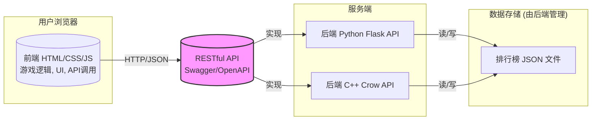

# 项目概要设计书：俄罗斯方块游戏

## 引言

### 项目背景

俄罗斯方块是一款经典的益智游戏，深受广大玩家喜爱。本项目旨在开发一个现代化的、基于 Web 的俄罗斯方块游戏，采用前后端分离架构，提供核心的游戏体验以及在线排行榜功能，同时探索不同技术栈（Python/Flask 和 C++/Crow）在后端实现上的差异。

### 项目目标

*   实现一个功能完整的俄罗斯方块游戏，包括基本玩法、计分、方块预览等。
*   实现游戏结束后的分数提交功能，允许用户输入昵称。
*   实现游戏排行榜功能，展示高分记录。
*   采用前后端分离架构，前端使用 HTML/CSS/JavaScript，后端提供 RESTful API。
*   后端 API 分别使用 Python (Flask) 和 C++ (Crow) 实现。
*   使用 JSON 文件作为简单的数据存储方案来持久化排行榜数据。
*   后端 API 使用 Swagger/OpenAPI 规范进行设计和文档化。

### 设计原则

*   **前后端分离:** 清晰界定前后端职责，前端负责游戏渲染和交互，后端负责数据持久化和排行榜逻辑。
*   **API 优先:** 先设计好后端 API 接口，再进行前后端实现。
*   **简洁核心:** 优先实现核心游戏玩法和排行榜功能。
*   **用户体验:** 提供流畅的游戏操作和清晰的界面反馈。
*   **技术探索:** 实践并对比 Python/Flask 和 C++/Crow 在构建简单 Web API 方面的特点。

## 系统架构

采用前后端分离架构：

*   **前端 (Client):** 纯 Web 前端，使用 HTML 构建结构，CSS 定义样式，JavaScript 实现游戏逻辑、渲染（如使用 Canvas API 或 DOM 操作）和与后端 API 的交互。
*   **后端 (Server):** 负责接收前端提交的分数，存储排行榜数据，并提供排行榜查询接口。通过 RESTful API 对外提供服务。
    *   实现方案 A: Python Flask
    *   实现方案 B: C++ Crow
*   **API:** 定义前后端交互的契约，使用 RESTful 风格，数据格式为 JSON。
*   **数据存储:** 后端负责管理排行榜数据。使用单个 JSON 文件存储分数记录列表。



## API 设计 (Swagger/OpenAPI 3.0)

使用 OpenAPI 规范定义 RESTful API。核心接口如下：

```yaml
openapi: 3.0.0
info:
  title: Tetris Leaderboard API
  description: API for submitting scores and retrieving the leaderboard for the Tetris game.
  version: 1.0.0
servers:
  - url: http://localhost:5000/api # Base URL for Flask (example)
    description: Development server (Flask)
  - url: http://localhost:8080/api # Base URL for Crow (example)
    description: Development server (Crow)

paths:
  /scores:
    get:
      summary: Get the leaderboard
      description: Retrieves a list of top scores, sorted in descending order.
      operationId: getLeaderboard
      parameters:
        - name: limit
          in: query
          description: Maximum number of scores to return (e.g., top 10)
          required: false
          schema:
            type: integer
            default: 10
      responses:
        '200':
          description: A list of score records
          content:
            application/json:
              schema:
                type: array
                items:
                  $ref: '#/components/schemas/ScoreRecord'
        '500':
           description: Server error reading leaderboard data

    post:
      summary: Submit a new score
      description: Submits a player's score after a game ends.
      operationId: submitScore
      requestBody:
        required: true
        content:
          application/json:
            schema:
              $ref: '#/components/schemas/ScoreInput'
      responses:
        '201':
          description: Score submitted successfully
          content:
            application/json:
              schema:
                $ref: '#/components/schemas/ScoreRecord' # Return the submitted record with timestamp/id
        '400':
          description: Invalid input data (e.g., missing name or score)
        '500':
           description: Server error saving score data

components:
  schemas:
    ScoreRecord:
      type: object
      properties:
        playerName:
          type: string
          description: Name of the player
        score:
          type: integer
          description: Score achieved by the player
        timestamp:
          type: string
          format: date-time # ISO 8601 format
          description: Time when the score was submitted (generated by backend)
          readOnly: true
      required:
        - playerName
        - score
        - timestamp

    ScoreInput:
      type: object
      properties:
        playerName:
          type: string
          description: Name of the player (provided by user)
          maxLength: 50 # Example validation
        score:
          type: integer
          description: Score achieved by the player (sent from client)
          minimum: 0 # Example validation
      required:
        - playerName
        - score
```

## 后端设计

### 通用职责

*   实现 `/scores` GET 和 POST 端点。
*   处理 HTTP 请求和响应。
*   解析和序列化 JSON 数据。
*   **读取排行榜数据:** 从指定的 JSON 文件加载现有分数记录。处理文件不存在或格式错误的情况。
*   **写入排行榜数据:**
    *   接收到新分数后，将其添加到分数列表中。
    *   （可选）保持排行榜有固定大小（如只保留前 100 名）。
    *   将更新后的完整分数列表写回 JSON 文件。需要考虑并发写入问题（虽然对于简单应用可能不频繁，但使用文件锁或写入临时文件再重命名是更健壮的方式）。
*   **排序排行榜:** 在处理 GET 请求时，对分数列表按 `score` 降序排序。
*   添加时间戳 (`timestamp`) 到新提交的分数记录。
*   进行基本的数据验证（如 `playerName` 和 `score` 是否存在）。
*   返回正确的 HTTP 状态码和 JSON 响应。
*   （可选）配置 CORS 允许前端访问。

### 实现方案 A: Python Flask

*   **框架:** Flask
*   **依赖:** Flask
*   **数据存储:** `leaderboard.json` 文件。
*   **主要步骤:**
    *   定义 Flask app。
    *   定义 `load_scores()` 和 `save_scores(scores)` 函数来处理 JSON 文件的读写（使用 `json` 模块和 `try...except` 处理 IO/JSONDecodeError）。考虑使用 `with open(...)`。
    *   实现 `@app.route('/api/scores', methods=['GET'])`：
        *   调用 `load_scores()`。
        *   使用 `sorted(scores, key=lambda x: x['score'], reverse=True)` 排序。
        *   根据 `request.args.get('limit')` 截取列表。
        *   使用 `jsonify()` 返回结果。
    *   实现 `@app.route('/api/scores', methods=['POST'])`：
        *   使用 `request.get_json()` 获取数据。
        *   验证 `playerName` 和 `score` 是否存在且有效。
        *   调用 `load_scores()`。
        *   创建新的 `ScoreRecord` 字典，添加 `timestamp` (使用 `datetime.utcnow().isoformat()`)。
        *   将新记录添加到列表中。
        *   （可选）排序并截断列表以维持大小限制。
        *   调用 `save_scores()` 将更新后的列表写回文件。
        *   使用 `jsonify()` 返回新创建的记录和 201 状态码。
    *   添加错误处理（如文件读写失败返回 500）。
    *   （可选）使用 `flask_cors` 扩展处理 CORS。

### 实现方案 B: C++ Crow

*   **框架:** Crow
*   **依赖:** Crow, nlohmann/json
*   **数据存储:** `leaderboard.json` 文件。
*   **主要步骤:**
    *   定义 `crow::SimpleApp`。
    *   定义 `load_scores()` 和 `save_scores(scores)` 函数（或类方法）：
        *   使用 `std::ifstream` 和 `std::ofstream` 读写文件。
        *   使用 `nlohmann::json::parse()` 和 `dump()` 处理 JSON。
        *   添加错误处理 (`try...catch` for exceptions)。
        *   **注意线程安全:** 如果 Crow 配置为多线程 (`.multithreaded()`)，对 `leaderboard.json` 的读写访问需要用 `std::mutex` 保护，防止并发冲突。
    *   实现 `CROW_ROUTE(app, "/api/scores").methods(crow::HTTPMethod::GET)`:
        *   加锁（如果需要）。
        *   调用 `load_scores()`。
        *   使用 `std::sort` 和 lambda 表达式排序 `nlohmann::json` 数组（或先转为 `std::vector<ScoreRecord>` 再排序）。
        *   根据查询参数 `limit` 截取。
        *   解锁。
        *   返回 `crow::response`，内容为 JSON 字符串。
    *   实现 `CROW_ROUTE(app, "/api/scores").methods(crow::HTTPMethod::POST)`:
        *   解析请求体 `req.body` 为 `nlohmann::json` 对象。
        *   验证 `playerName` 和 `score`。
        *   加锁。
        *   调用 `load_scores()`。
        *   创建新的 `nlohmann::json` 对象代表 `ScoreRecord`，添加 `timestamp`。
        *   添加到 JSON 数组中。
        *   （可选）排序并截断。
        *   调用 `save_scores()`。
        *   解锁。
        *   返回 `crow::response(201, new_record.dump())`。
    *   添加错误处理（返回 400 或 500 状态码）。
    *   （可选）添加 CORS 中间件或手动设置响应头。

## 前端设计

### 通用职责

*   使用 HTML 创建页面骨架（游戏区域容器、得分显示、下一块预览、按钮等）。
*   使用 CSS 美化界面，定义游戏区域、方块样式等。
*   **使用 JavaScript 实现核心游戏逻辑:**
    *   游戏主循环 (`setInterval` 或 `requestAnimationFrame`)。
    *   表示游戏区域状态（如二维数组）。
    *   生成随机的俄罗斯方块。
    *   处理用户键盘输入（左移、右移、旋转、加速下落）。
    *   方块移动、旋转的逻辑和碰撞检测（边界、其他方块）。
    *   方块锁定逻辑。
    *   检测并消除满行。
    *   计分逻辑。
    *   更新游戏状态（如速度随分数增加）。
    *   游戏结束判断和处理。
*   **渲染游戏画面:** 使用 Canvas API 绘制游戏区域、方块等，或者通过操作 DOM 元素来表示。
*   **与后端 API 交互:**
    *   游戏结束后，显示输入名称的表单。
    *   使用 `fetch` API 发送 POST 请求到 `/api/scores` 提交分数和玩家名称。
    *   使用 `fetch` API 发送 GET 请求到 `/api/scores` 获取排行榜数据。
    *   处理 API 请求的成功和失败（显示消息给用户）。
*   **显示排行榜:** 将获取到的排行榜数据格式化并显示在页面上。

### 界面布局 (概念)

*   **主游戏界面:**
    *   左/中：游戏区域 (`<canvas>` 或 `<div>`)。
    *   右侧：
        *   下一个方块预览区。
        *   当前得分。
        *   （可选）当前等级/速度。
        *   开始/暂停按钮。
*   **游戏结束弹窗/界面:**
    *   显示 "Game Over"。
    *   显示最终得分。
    *   输入框供玩家输入名称。
    *   "提交分数" 按钮。
    *   "重新开始" 按钮。
*   **排行榜界面 (可与游戏界面结合或单独页面):**
    *   显示排名、玩家名称、分数。
    *   "返回游戏" 或 "刷新" 按钮。

### 实现方案: HTML/CSS/JavaScript

*   **HTML:** 定义页面结构 (`index.html`)。
*   **CSS:** 样式 (`style.css`)。
*   **JavaScript (`game.js`, `api.js`, `ui.js` 等):**
    *   **游戏逻辑 (`game.js`):**
        *   常量定义（方块形状、颜色、游戏区域大小）。
        *   变量存储游戏状态（board, currentPiece, score, level, isGameOver）。
        *   函数：`startGame()`, `gameLoop()`, `spawnPiece()`, `movePiece()`, `rotatePiece()`, `checkCollision()`, `lockPiece()`, `clearLines()`, `updateScore()`, `draw()` (渲染函数)。
        *   事件监听器：`document.addEventListener('keydown', handleInput);`
    *   **UI 更新 (`ui.js` 或集成在 `game.js`):**
        *   更新得分显示、下一块预览。
        *   控制游戏结束界面、排行榜界面的显示/隐藏。
        *   渲染游戏区域（调用 `draw()`）。
    *   **API 交互 (`api.js`):**
        *   `submitScore(playerName, score)`: 使用 `fetch` 发送 POST 请求，处理 Promise。
        *   `getLeaderboard()`: 使用 `fetch` 发送 GET 请求，处理 Promise，返回排行榜数据。
    *   **主入口 (`main.js` 或 `index.html` 内的 `<script>`):** 初始化游戏，绑定按钮事件（开始、提交分数、查看排行榜）。

## 数据存储

*   **方案:** 单个 JSON 文件 (例如 `leaderboard.json`)。
*   **格式:** 一个包含多个 `ScoreRecord` 对象的 JSON 数组。
    ```json
    [
      {
        "playerName": "Player1",
        "score": 15000,
        "timestamp": "2023-10-27T10:30:00Z"
      },
      {
        "playerName": "TetrisMaster",
        "score": 25000,
        "timestamp": "2023-10-26T18:45:10Z"
      }
      // ... more records
    ]
    ```
*   **管理:** 由后端服务负责读写。启动时读取，提交新分数时读取、添加、写回。
*   **注意事项:**
    *   **并发:** 简单应用中，并发写入冲突概率低，但仍是潜在问题。后端实现时可考虑简单文件锁或更安全的写入模式。
    *   **性能:** 对于非常大的排行榜，每次读写整个文件效率会降低，但对于本项目的规模（如 Top 100）通常足够。
    *   **错误处理:** 需要处理文件不存在、损坏或无权限读写的情况。

## 技术选型总结

| 模块            | 方案 A (Python Backend) | 方案 B (C++ Backend) | 前端 (通用)        | 备注                          |
| :-------------- | :---------------------- | :------------------- | :----------------- | :---------------------------- |
| **后端**        | Flask                   | Crow                 | N/A                | 实现相同的 RESTful API        |
| **前端**        | N/A                     | N/A                  | HTML, CSS, JS      | 实现游戏逻辑和 UI，调用 API   |
| **API**         | RESTful (JSON)          | RESTful (JSON)       | RESTful (JSON)     | 使用 Swagger/OpenAPI 定义     |
| **HTTP Client** | N/A                     | N/A                  | `fetch` API (JS)   | 前端用于调用 API              |
| **JSON Lib**    | `json` module (Python)  | nlohmann/json (C++)  | `JSON` object (JS) | 用于前后端数据序列化/反序列化 |
| **数据存储**    | JSON 文件               | JSON 文件            | N/A                | 后端负责管理排行榜数据        |

## 关键考虑因素

*   **错误处理:** 前后端都需要处理错误。后端 API 应返回明确的错误码和信息；前端应能处理 API 错误并告知用户（如“提交分数失败”）。JS 游戏逻辑中的错误也应妥善处理，避免游戏崩溃。
*   **用户输入验证/清理:** 后端应对 `playerName` 进行基本的清理（如去除首尾空格）和长度限制，防止无效数据或简单注入。前端也应进行输入限制。
*   **游戏体验:** JavaScript 的性能对游戏流畅度至关重要。避免在游戏主循环中执行耗时操作。使用 `requestAnimationFrame` 通常比 `setInterval` 更适合游戏循环。
*   **并发（后端）:** 虽然 JSON 文件存储简单，但并发写入是其弱点。在高并发场景下需要更鲁棒的存储（数据库）或更复杂的并发控制。对于此项目，简单锁机制可能足够。
*   **部署:** 前端是静态文件（HTML/CSS/JS），可部署在任何 Web 服务器或 CDN 上。后端服务需要部署（如使用 Gunicorn/uWSGI + Nginx for Flask，或直接运行 Crow 可执行文件，可能也需要反向代理）。