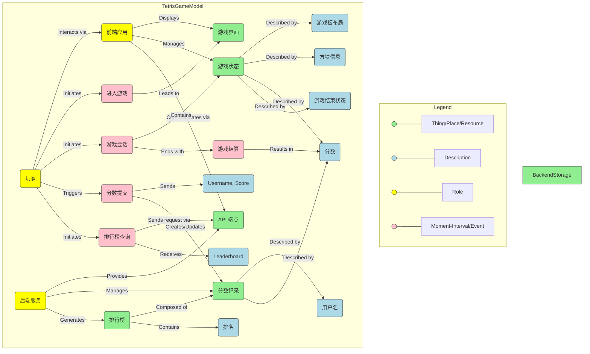
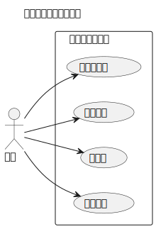

# 需求分析

## 四色建模 (Four-Color Modeling) 分析

四色建模是一种领域驱动设计（DDD）中用于分析和可视化核心业务概念及其关系的方法。它有助于识别关键对象、事件和角色。

*   **绿色 (Place-Thing / Reference Data):** 代表相对稳定、持久的实体或参考数据。这些是系统操作的核心对象或发生的地点/资源。
*   **蓝色 (Description / Classification):** 代表描述或分类绿色“事物”的属性或类型。它们为绿色对象提供更多细节。
*   **黄色 (Role):** 代表参与者（人、系统、组织）在特定交互或事件中扮演的角色。
*   **粉色 (Moment-Interval / Transaction):** 代表在特定时间点或时间段内发生的事件、操作或交易。它们通常涉及角色与事物的交互，并可能改变事物的状态。

**应用于俄罗斯方块游戏:**

1.  **核心事物/地点/资源 (Green):**
    *   `游戏状态 (Game State)`: 前端维护的游戏当前状况，包括游戏板布局、当前方块、下一个方块、分数、等级等。这是一个核心的操作对象，但其持久性仅限于单次游戏会话。
    *   `分数记录 (Score Record)`: 后端存储的单条玩家得分信息，包含用户名和分数。这是持久化的核心数据。
    *   `排行榜 (Leaderboard)`: 由多个 `分数记录` 构成的有序列表，由后端提供。
    *   `游戏界面 (Game Interface)`: 前端展示给玩家的视觉区域（HTML/Canvas）。
    *   `API 端点 (API Endpoint)`: 后端提供的用于交互的 URL 接口（例如 `/api/submit_score`, `/api/leaderboard`）。
    *   *(隐含)* `后端存储 (Backend Storage)`: 用于持久化 `分数记录` 的数据库或文件系统。

2.  **描述/分类 (Blue):**
    *   `分数 (Score)`: 描述 `游戏状态` 的结果，也是 `分数记录` 的核心数据。
    *   `用户名 (Username)`: 描述 `玩家` 身份，并作为 `分数记录` 的一部分。
    *   `游戏板布局 (Board Layout)`: 描述 `游戏状态` 中每个格子的状态。
    *   `方块类型/形状 (Block Type/Shape)`: 描述 `游戏状态` 中的当前或下一个方块。
    *   `方块位置/旋转 (Block Position/Rotation)`: 描述 `游戏状态` 中活动方块的具体状态。
    *   `游戏结束状态 (Game Over Status)`: 描述 `游戏状态` 是否已结束。
    *   `排名 (Rank)`: 描述 `分数记录` 在 `排行榜` 中的相对位置。
    *   `API 请求数据 (API Request Data)`: 描述提交分数时发送的数据结构 (`{username, score}`)。
    *   `API 响应数据 (API Response Data)`: 描述获取排行榜时返回的数据结构 (`[{rank, username, score}, ...]`)。

3.  **角色 (Yellow):**
    *   `玩家 (Player)`: 游戏的操作者，输入用户名，查看排行榜。
    *   `前端应用 (Frontend Application)`: 运行在浏览器中的 HTML+JS，负责游戏逻辑、界面渲染和与后端通信。
    *   `后端服务 (Backend Service)`: 运行在服务器上的 Python(Flask) 或 C++(Crow) 应用，处理 API 请求，管理分数数据。

4.  **时刻/间隔/事件 (Pink):**
    *   `游戏会话 (Game Session)`: 从玩家开始新游戏到游戏结束的整个时间段。
    *   `游戏结算 (Game Settlement)`: 游戏结束（Game Over）的特定时刻，确定最终分数。
    *   `分数提交 (Score Submission)`: 玩家输入用户名后，将分数和用户名通过 API 发送到后端的动作。
    *   `排行榜查询 (Leaderboard Query)`: 玩家请求查看排行榜，前端通过 API 从后端获取数据的动作。
    *   `进入游戏 (Enter Game)`: 用户加载并看到游戏初始界面的时刻。
    *   *(隐含)* `方块操作 (Block Manipulation)`: 游戏过程中的移动、旋转、下落等一系列小事件。
    *   *(隐含)* `消除行 (Line Clear)`: 游戏过程中消除一或多行的事件，通常伴随分数增加。

**模型图 (概念表示):**

**分析结论:**

*   核心持久化实体是 `分数记录 (Score Record)`，由 `用户名` 和 `分数` 描述。
*   `游戏状态 (Game State)` 是前端的核心操作对象，但其生命周期限于单次 `游戏会话 (Game Session)`。
*   `玩家 (Player)` 是主要的交互者，通过 `前端应用 (Frontend Application)` 与系统交互。
*   `后端服务 (Backend Service)` 负责处理持久化数据（分数记录）和提供 API。
*   系统的关键功能围绕 `游戏会话`、`游戏结算`、`分数提交` 和 `排行榜查询` 这些事件展开，这些事件驱动了前后端之间的交互。

## UML 用例图 (Use Case Diagram)

用例图从用户（Actor）的角度描述了系统的功能需求，展示了用户希望通过系统完成的目标（Use Case）。

**1. 参与者 (Actor):**

*   `玩家 (Player)`: 俄罗斯方块游戏的操作者和信息消费者。

**2. 用例 (Use Cases):**

根据项目需求，主要用例包括：

*   `开始游戏 (Start Game)`: 玩家启动一个新的游戏会话。
*   `玩游戏 (Play Game)`: 玩家在游戏会话中进行操作（移动、旋转方块等）。
*   `提交分数 (Submit Score)`: 游戏结束后，玩家输入用户名并将分数提交到服务器。
*   `查看排行榜 (View Leaderboard)`: 玩家请求并查看历史高分排行榜。

**3. (可选) 关系:**

*   `玩游戏 (Play Game)` 自然地发生在 `开始游戏 (Start Game)` 之后。
*   `提交分数 (Submit Score)` 通常在 `玩游戏 (Play Game)` 结束后被触发（如果玩家选择提交）。

**用例图:**

**图例说明:**

*   **Actor (玩家):** 使用系统的用户。
*   **Use Case (椭圆/文本):** 系统提供的功能。
*   **System Boundary (矩形):** 表示系统的范围。
*   **Association (箭头/直线):** 连接 Actor 和 Use Case，表示 Actor 使用该功能。
*   **(可选) Include/Extend/Generalization:** 用于表示用例间的关系（在此简化模型中未显式使用复杂关系）。`submitScore` 逻辑上跟随 `playGame` 结束。

**用例描述 (简要):**

*   **开始游戏 (Start Game):** 玩家选择开始一个新的游戏局，系统初始化游戏界面和状态。
*   **玩游戏 (Play Game):** 玩家通过控制输入（键盘）与游戏交互，移动、旋转、加速下落方块，系统根据规则更新游戏状态（方块、面板、分数、等级），直到游戏结束（Game Over）。
*   **提交分数 (Submit Score):** 游戏结束后，系统显示最终分数，玩家输入用户名，系统将用户名和分数通过 API 发送给后端服务进行记录。
*   **查看排行榜 (View Leaderboard):** 玩家请求查看排行榜，系统通过 API 从后端服务获取排名数据，并将其展示给玩家。

通过四色建模和用例图，我们对俄罗斯方块游戏的核心概念、用户交互和功能需求有了更清晰的理解，这为后续的前后端分离架构设计和 API 定义奠定了基础。

