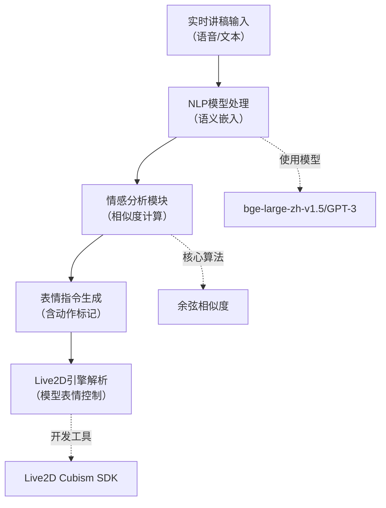

# StreamCream

AI 一站式全流程多平台虚拟直播解决方案

DeepSleep

## 用户系统：登录、注册与偏好保存

### 直播模块的挑战：直播平台的封闭性——推流码视如禁脔

为了使我们的成果具有极高的适用型，我们一举兼容了国内外数大直播平台，包括国内的抖音、B站、快手、小红书；国外的Youtube与Twitch等等。然而由于部分平台的商业化策略，用户只能在其自研的直播平台上进行直播，禁绝了互联网黄金时代的开放包容，使得本来开放的RTMP直播协议成为了其私家之通衢。因而我们在数大开源项目的基础上，采用网络抓包的方式一举将抖音快手B站的推流码一键式自动爬取工具嵌入网页，藏技术细节于简约幕后，使得用户免于烦扰在我方平台上一站式就可以完成直播的全过程。

